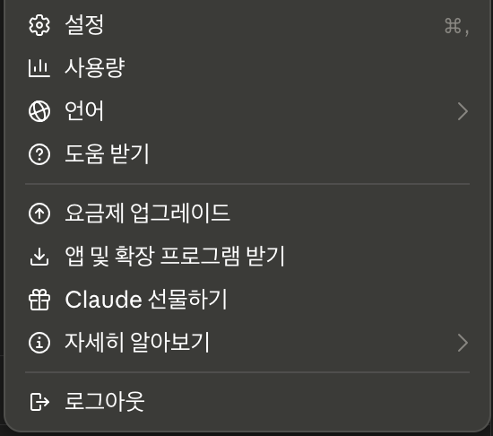
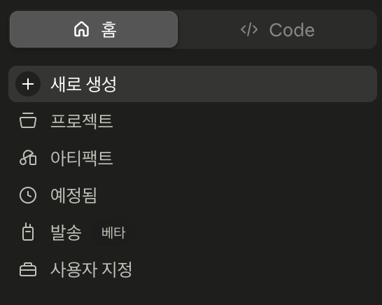
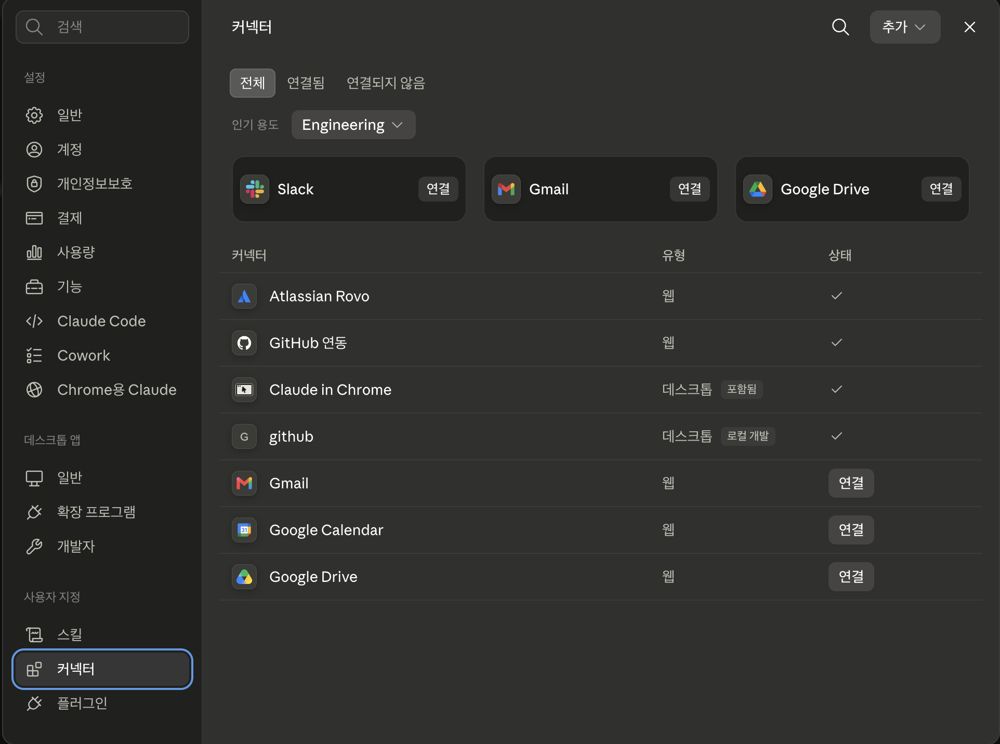
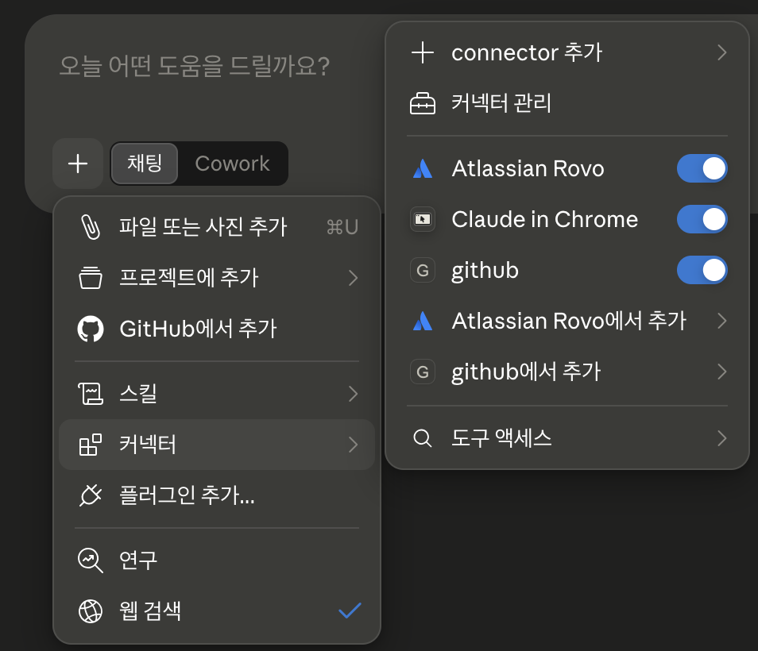

# 기본 커넥터 ― Atlassian·GitHub

> 설정 파일을 만지지 않고 **화면에서 로그인하고 승인하는 것만으로** 이미 쓰고 있는 서비스를 AI에 연결하는 방법입니다.

커넥터는 Claude가 미리 준비해 둔 연결 목록입니다. 목록에서 서비스를 고르고, 평소처럼 로그인한 뒤, 어떤 자료에 접근할지 확인하고 승인하면 연결이 끝납니다. 준비된 것을 고르고 연결하기만 하면 되어서 비개발자에게 가장 문턱이 낮은 방법입니다.

이 페이지에서는 **Atlassian**(Jira·Confluence)과 **GitHub**을 예로, 연결하고 해제하는 절차와 승인 화면에서 반드시 확인해야 할 것을 다룹니다. 업무 자료를 다루는 연결은 대개 Atlassian 쪽이 먼저이고, GitHub은 [연결할지부터 판단이 갈리는 도구](#github)라 뒤에 두었습니다.

---

## 커넥터는 새로 만드는 게 아닙니다 { #what-is-connector }

!!! info "1부에서 이미 나온 이야기입니다"
    1부 [기본 용어 ― 하네스는 결국 "내가 세팅하는 것들"](../basics.md#model-harness)에서 하네스의 출처를 셋으로 나눴고, 그중 **"고르고·연결만 하는 것"** 칸에 *외부 서비스 연결*이 있었습니다. 커넥터가 바로 그 칸의 실물입니다.

    통로를 만드는 일은 서비스를 만든 쪽과 Anthropic이 이미 해 두었습니다. 내 몫은 **고를 것을 고르고, 무엇을 허용할지 정하는 것**입니다.

그래서 커넥터를 쓰는 데 필요한 건 기술이 아니라 **판단**입니다. 어떤 서비스를 연결할지, 어디까지 허용할지, 결과를 어떻게 확인할지, 이 세 가지만 정하면 됩니다.

---

## 연결하는 순서 { #how-to-connect }

커넥터 화면으로 가는 길은 두 가지이고, 어느 쪽으로 들어가도 같은 화면이 열립니다.

!!! note "① 왼쪽 아래 내 이름 → 설정 → 커넥터"
    

!!! note "② 왼쪽 위 홈 탭 → 사용자 지정 → 커넥터"
    

도착하는 곳은 아래 화면입니다. 왼쪽 목록 아래쪽 **사용자 지정 → 커넥터** 메뉴이고, 이미 연결해 둔 서비스를 점검할 때도 같은 화면을 씁니다.

이미 연결한 서비스는 **상태 열에 체크 표시**가, 아직 연결하지 않은 서비스는 **연결 버튼**이 보입니다. 목록에 없는 것을 등록하는 오른쪽 위 **추가**는 [MCP 서버](mcp-servers.md) 쪽 이야기라 여기서는 쓰지 않습니다.

*이미지는 Claude Desktop 화면이며, 앱이 업데이트되면 조금 달라질 수 있습니다.*

!!! tip "대화 도중이라면 여기서도 열립니다"
    대화창 왼쪽 아래 **`+` 버튼**(또는 `/` 입력)을 누르고 **커넥터**에 마우스를 올리면, 설정으로 나가지 않고 대화창에서 바로 열립니다.

    

    - **connector 추가**: 목록에 없는 것을 직접 등록하는 메뉴입니다. 여기서는 쓰지 않고 [MCP 서버](mcp-servers.md)에서 다룹니다.
    - **커넥터 관리**: 위에서 본 커넥터 화면이 그대로 열립니다.
    - **서비스별 토글**: 지금 이 대화에서 쓸 것만 켭니다 (→ 아래 5번).
    - **도구 액세스**: 켜 둔 커넥터를 언제 불러올지 정합니다 (→ 바로 아래 「쓸 만큼만 켜 두세요」).

이 화면까지 왔다면 다음부터는 어느 서비스든 같습니다.

1. **고르기**: 원하는 서비스를 누르고, 설명과 할 수 있는 일을 읽습니다.
2. **연결 시작**: **연결**(또는 **설치**) 버튼을 누릅니다.
3. **로그인**: 그 서비스의 평소 계정으로 로그인합니다. 새 계정을 만들 필요는 없습니다.
4. **권한 승인**: 어떤 자료에 접근할지 화면에 나옵니다. **여기서 멈춰 읽으세요** (→ [바로 아래](#approval-screen)).
5. **대화에서 켜기**: 연결했다고 항상 쓰이는 건 아닙니다. `+` 버튼 → **커넥터**에서 해당 서비스의 **토글**을 켜면 그 대화에서 사용됩니다.

!!! tip "쓸 만큼만 켜 두세요"
    같은 메뉴의 **도구 액세스**에서 켜 둔 커넥터를 언제 불러올지 세 가지 중 고를 수 있습니다.

    - **자동**(기본값): 지금 하는 일에 맞춰 Claude가 필요한 것만 불러옵니다. 대부분은 이대로 두면 됩니다.
    - **항상 사용 가능**: 켜 둔 커넥터를 대화 시작 때 전부 불러옵니다. 몇 개를 늘 쓰는 경우에 편합니다.
    - **필요할 때**: 찾아야 할 상황이 되면 그때 불러옵니다. 연결이 많아 대화가 무거워질 때 씁니다.

    켜 둔 커넥터가 많을수록 AI가 엉뚱한 곳을 뒤질 여지도 늘어나니, 어느 모드든 지금 하는 일에 필요한 것만 켜는 편이 결과도 깔끔합니다. 고르는 기준은 [Claude의 도구 접근 관리](https://support.claude.com/ko/articles/13730515)에 정리돼 있습니다.

공식 안내: [커넥터를 사용하여 Claude의 기능 확장하기](https://support.claude.com/ko/articles/11176164). 화면이 바뀌면 이쪽이 기준입니다.

---

## 승인 화면에서 확인할 것 { #approval-screen }

연결 과정에서 가장 큰 결정이 일어나는 곳입니다. 세 가지만 보세요.

| 확인할 것 | 왜 보나요 | 어떻게 하나 |
|---|---|---|
| **읽기만인가, 쓰기도 되는가** | 읽기는 자료를 가져오는 것이고, 쓰기는 그 서비스에 흔적을 남기는 것입니다 (문서 생성, 이슈 코멘트 등) | 쓰기를 빼고 고를 수 있으면 빼고 승인합니다 |
| **어느 범위까지인가** | 저장소 전체인지 일부인지, 어느 프로젝트·스페이스인지 | 좁혀서 고를 수 있으면 필요한 만큼만 고릅니다 |
| **누구의 권한으로 실행하는가** | 커넥터는 **내 계정 권한을 그대로** 씁니다 | 내가 볼 수 없는 자료는 AI도 못 봅니다. 반대로 **내가 볼 수 있는 것까지가 AI에게 열릴 수 있는 가장 넓은 범위**입니다 |

승인 화면이 무엇을 고르게 해 주는지는 **서비스마다 다릅니다.** 저장소나 스페이스를 골라 승인하게 하는 곳도 있고, 읽기와 쓰기를 묶어 한 번에 승인받는 곳도 있습니다. 화면에 선택지가 없다면 그 화면에서 줄일 방법이 없다는 뜻이니, 다음 두 가지로 대신 줄입니다.

- **대화에서 켤 때 줄이기**: 지금 하는 일에 필요한 커넥터만 토글을 켭니다. 켜지 않은 연결은 그 대화에서 쓰이지 않습니다.
- **물어볼 때 줄이기**: AI가 쓰기 작업 승인을 물어오면 지금 필요하지 않은 것은 거절합니다.

!!! warning "「내 권한 그대로」는 안심과 경고를 같이 줍니다"
    권한이 새로 생기지 않는다는 점은 안심할 만합니다. 하지만 내 계정이 회사 자료 대부분에 접근할 수 있다면, **연결한 AI에게 열릴 수 있는 범위도 그만큼 넓어집니다.** "나는 권한이 넓은 편인가"를 한 번 떠올려 보고, 넓다면 승인 범위든 대화에서 켜는 범위든 한 단계 줄여 두세요.

    회사 자료가 오가는 연결의 기준은 [보안 및 개인정보 가이드 ― 외부 연결](../security-guide.md#external-connection)에 정리돼 있습니다.

---

## Atlassian ― Jira와 Confluence { #atlassian }

Confluence는 회의록·규정·기획서 같은 문서를, Jira는 업무 요청과 진행 상황을 다루는 도구입니다. 둘 중 하나라도 쓰고 있다면 비개발자가 복사·붙여넣기를 가장 자주 반복하는 일이라, 연결 효과를 빨리 체감하는 커넥터입니다.

!!! example "Confluence ― 읽고 정리하기"
    - "지난주 팀 회의록을 찾아 결정사항만 정리해 줘"
    - "휴가 규정 문서를 읽고 신입이 자주 묻는 질문 형태로 바꿔 줘"
    - "이 스페이스에서 「출장」이 언급된 문서를 찾아 목록으로 줘"

!!! example "Jira ― 상태 파악하기"
    - "내 담당 이슈 중 이번 주 마감인 것만 골라 정리해 줘"
    - "이번 스프린트에서 아직 안 끝난 항목을 묶어 보고용 초안을 써 줘"
    - "이 이슈의 지금까지 논의를 세 줄로 요약해 줘"

Atlassian 커넥터는 **읽기와 쓰기를 모두** 지원합니다. Confluence 페이지를 새로 만들고 Jira 이슈에 코멘트를 남기는 일까지 가능하다는 뜻입니다. 편리한 만큼, 팀 전체가 보는 공간에 결과가 그대로 남는다는 점을 잊기 쉽습니다.

!!! warning "AI가 쓴 것도 내 이름으로 팀에 공개됩니다"
    내 계정으로 연결했으니 AI가 만든 문서나 코멘트도 **내가 쓴 것으로** 올라갑니다. 초안을 만들게 하되 **올리기 전에 직접 읽고 고치는 단계**를 반드시 두세요. 이것이 [메타 원칙 ③ AI 결과물 검토·이해 의무](../index.md#meta-principles)가 연결 이후에 더 중요해지는 이유입니다.

    처음 몇 번은 읽기만 시켜 보고, 쓰기 작업 승인을 물어오면 결과가 믿을 만해질 때까지 거절하는 순서를 권합니다.

접근 범위는 여기서도 **내가 이미 가진 Jira·Confluence 권한을 그대로** 따릅니다. 내게 안 보이는 스페이스는 AI에게도 안 보입니다.

---

## GitHub ― 소스코드를 관리하는 곳 { #github }

GitHub은 기본적으로 **소스코드를 보관하고 변경 이력을 관리하는 도구**입니다. 개발 과정에서 생긴 문서와 이슈가 함께 쌓이기는 하지만, 그것이 이 도구의 본래 용도는 아닙니다. 그래서 비개발자가 연결할지는 앞의 Atlassian과 달리 **어느 쪽에 해당하느냐에 따라 판단이 갈립니다.**

!!! info "학생·일반인: 개발에 관심이 있다면 연결하세요"
    코드를 읽고 배우는 단계라면 GitHub만 한 자료실이 없습니다. 공개 저장소는 **계정이 없어도 읽을 수 있어** 문턱도 낮습니다. 관심 있는 프로젝트의 README와 이슈를 AI와 함께 읽어 보는 것부터 시작하면 됩니다.

    이 교육의 실습 자료도 공개 저장소에 두었습니다 (→ [실습 자료](../labs.md)).

!!! warning "임직원: 업무 도구가 따로 있다면 연결하지 않는 쪽을 권합니다"
    회사에 이슈와 업무를 관리하는 도구(Jira·Confluence 등)가 따로 있다면, 비개발자가 GitHub까지 연결할 이유는 대개 없습니다. 개발자와 비개발자가 **함께 봐야 하는 내용이라면 그 도구에서 관리하는 편이** 양쪽 모두에게 낫습니다.

    사내에서 운영하는 **GitHub Enterprise**는 조건이 더 까다롭습니다. 공개로 열어 둔 저장소라도 **로그인해야 볼 수 있고**, 계정마다 라이선스 비용이 붙어 비개발자에게 계정을 내주는 것 자체가 회사의 판단 사항입니다.

    연결하기 전에 **회사 정책을 먼저 확인하세요.** 권하지 않는 것은 회사 자료를 다루는 연결이지 GitHub이라는 도구가 아닙니다 (→ [연결 보안 기준](../security-guide.md#external-connection)).

연결하기로 정했다면 다룰 수 있는 범위는 이렇습니다. GitHub 커넥터는 저장소와 코드 파일을 읽고, 이슈·PR을 다루는 범위까지 지원합니다. 쓰기까지 허용하면 이슈 코멘트를 남기는 일도 가능합니다. **읽기만 필요한 용도라면** 승인 화면에서 접근할 저장소를 필요한 것만 고르고, 쓰기 작업 승인을 물어올 때 거절하는 쪽으로 좁히세요. 정확한 지원 범위는 커넥터 목록에서 GitHub 항목을 눌렀을 때 나오는 설명이 기준이니, 연결 전에 한 번 읽어 두세요.

!!! example "이런 부탁이 됩니다"
    - "지난달에 닫힌 이슈들을 훑어서 무엇이 바뀌었는지 항목별로 정리해 줘"
    - "README와 최근 릴리스 내용을 비교해서 안내문에서 낡은 문장을 찾아 줘"

!!! note "저장소를 프로젝트에 통째로 붙이는 별도 경로도 있습니다"
    커넥터와 별개로, 대화창 `+` 버튼의 **GitHub에서 추가**로 저장소를 [프로젝트](../intro.md#claude-ai) 자료에 붙여 둘 수 있습니다. 이쪽은 **지정한 브랜치의 파일 이름과 내용만** 가져오며 커밋 이력·이슈·PR 같은 기록은 가져오지 않습니다 (이 경로의 공식 안내: [GitHub 통합 사용하기](https://support.claude.com/ko/articles/10167454)).

    같은 자료를 매번 물어본다면 프로젝트에 붙여 두는 쪽이, 그때그때 찾아 읽어야 한다면 커넥터 쪽이 편합니다.

비공개 저장소라면 GitHub 쪽에서 앱 접근을 승인해야 하고, 조직이 SSO(회사 계정 통합 로그인)를 쓰면 각자 한 번 더 승인이 필요합니다. 목록에서 저장소가 보이지 않는다면 대개 이 승인이 빠진 것입니다.

---

## 연결을 점검하고 끊기 { #manage-disconnect }

연결은 한 번 걸어 두면 잊히기 쉽습니다. **분기에 한 번쯤** 점검하는 습관을 권합니다.

**사용자 지정 → 커넥터**에서 연결된 서비스를 모두 볼 수 있고, 각 서비스마다 연결 해제·설정 변경·권한 확인이 가능합니다. 아래에 해당하면 미련 없이 끊으세요.

- 그때 한 번 쓰고 이후로 쓰지 않은 서비스
- 부서·업무가 바뀌어 더 이상 볼 이유가 없는 자료
- 무엇을 허용했는지 기억나지 않는 연결 (끊어도 필요할 때 다시 연결하면 됩니다)

---

## 회사 환경이라면 { #enterprise }

!!! info "목록에 서비스가 안 보인다면 권한 문제일 수 있습니다"
    Team·Enterprise 플랜에서는 **조직 관리자가 먼저 커넥터를 켜 주어야** 구성원이 쓸 수 있습니다. 관리자가 조직 설정에서 커넥터를 팀에 추가하고, 서비스별로 **항상 허용 / 승인 필요 / 차단** 같은 도구 권한을 정할 수 있습니다.

    그래서 목록이 비어 있거나 원하는 서비스가 없다면 내 문제가 아니라 조직 정책일 가능성이 큽니다. 담당 부서에 문의하세요.

!!! warning "연결해도 되는지는 회사 정책이 정합니다"
    관리자가 켜 둔 목록은 **쓸 수 있는 범위**를 정한 것이고, 그 안에서 **어느 자료를 연결할지는 내가 고릅니다.** 커넥터는 내 계정 권한을 그대로 쓰기 때문에, 이 선택에서 회사 자료가 의도치 않게 밖으로 나갈 수 있습니다.

    - **어느 계정으로 로그인하는지 봅니다.** 회사 자료를 다루는 연결에 개인 계정으로 로그인하면 회사 자료가 개인 공간을 거쳐 나갑니다. 개인 용도 연결에 회사 계정을 쓰는 것도 같은 문제입니다.
    - **연결할 자료가 사내 기준에 맞는지 봅니다.** 보안 등급이 정해진 문서는 연결로 읽히는 경우에도 그 기준이 그대로 적용됩니다.
    - **사내 승인 절차가 있으면 그 절차가 먼저입니다.** 목록에 보인다는 것이 승인을 대신하지 않습니다.

회사 업무·자료를 다루는 연결은 **회사가 계약한 플랜에서만** 진행합니다. 개인 플랜은 무료·유료를 가리지 않고 회사 보안 정책 위반입니다 (→ [연결 보안 기준](../security-guide.md#external-connection)).

---

## 다음으로 { #next }

필요한 서비스가 커넥터 목록에 있었다면 여기까지로 충분합니다. 목록에 없는 도구가 필요하다면 다음 페이지로 넘어가세요.

**[MCP 서버 이용하기](mcp-servers.md)** 에서는 준비된 목록 너머의 도구·자료를 연결하는 방법과, 그때 늘어나는 판단의 몫을 다룹니다.
