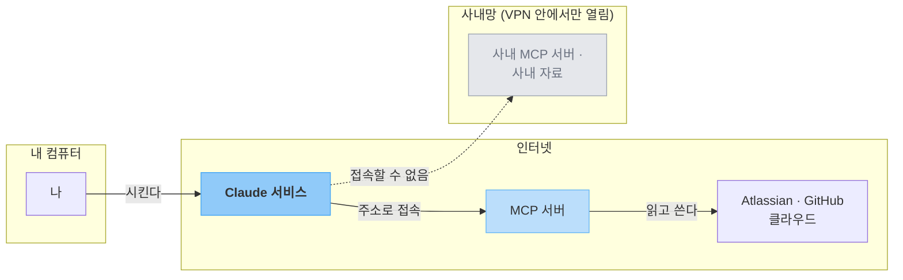
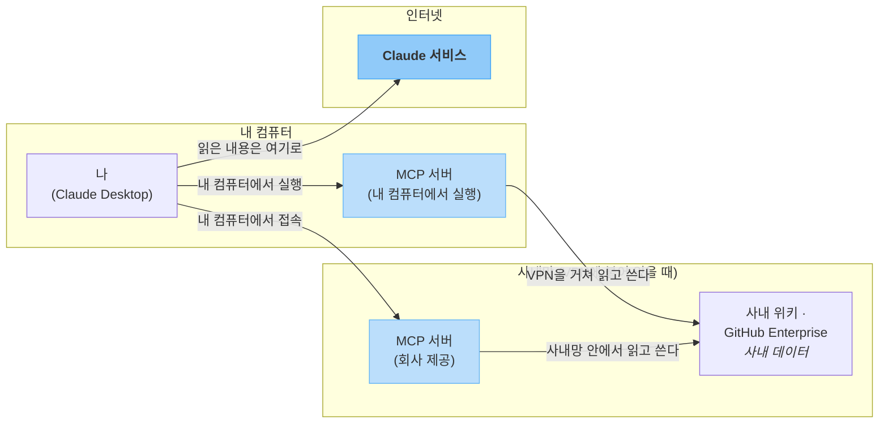

# MCP 서버 이용하기

> 기본 커넥터 목록에 **없는** 도구·자료를 연결하는 방법입니다. 서버를 만드는 이야기가 아니라, **이미 제공되고 있는 것 중 선택하여 등록하여 사용하는 것**입니다.

[기본 커넥터](connectors.md)는 편하지만 목록에 있는 서비스만 연결할 수 있습니다. 목록에 없는 도구가 필요할 때 쓰는 것이 **MCP 서버**입니다. 누군가 만들어 공개해 둔 연결 통로를 내 Claude에 **등록하여 사용하는 방식**이라, 고를 수 있는 폭이 훨씬 넓은 대신 **무엇을 고르고 무엇을 허용할지 직접 판단**해야 합니다.

이 페이지에서는 커넥터와의 차이, 등록 절차, 믿을 만한 서버를 고르는 기준, 잘 안 될 때 확인할 것을 다룹니다. MCP 서버를 **직접 만드는 일은 다루지 않습니다.** 여기서는 이용하는 것까지만 다루고 있습니다.

---

## 커넥터와 무엇이 다른가요 { #vs-connector }

!!! info "화면에서는 둘 다 「커넥터」입니다"
    서버 주소를 넣어 등록하는 화면은 앞 페이지에서 본 **사용자 지정 → 커넥터** 그대로입니다. 거기서 목록에 있는 서비스를 고르면 기본 커넥터, **`+`** → **사용자 정의 커넥터 추가**로 주소를 넣으면 이 페이지의 방식입니다. 새 기능이 아니라 **같은 화면에서 등록하는 방법만 다른 것**입니다. 내 컴퓨터에 설치하는 방식은 메뉴가 따로 있습니다 (→ [원격과 로컬](#remote-vs-local)).

    앞 페이지의 기본 커넥터도 **같은 MCP로 동작합니다.** 기술이 다른 게 아니라, 찾아서 등록하는 방법이 다를 뿐입니다.

    MCP가 무엇인지는 1부 [기본 용어와 범위 — 외부 컨텍스트](../basics.md#external-context)에 정의돼 있습니다. 여기서는 그 정의를 그대로 쓰고 다시 설명하지 않습니다.

차이는 딱 한 줄입니다. **기본 커넥터는 준비된 목록에서 고르고, 이 페이지의 방식은 그 목록에 없는 것을 다른 경로로 직접 찾아 등록합니다.** 아래 표와 이 페이지에서 「MCP 서버」라고 할 때는 그중 **기본 커넥터 목록에 준비돼 있지 않은 쪽**을 가리킵니다.

| 구분 | 기본 커넥터 | MCP 서버 |
|---|---|---|
| **어떻게 연결하나** | 목록에서 서비스를 고름 | 서버 주소를 넣거나, 확장 프로그램을 설치해 직접 등록 |
| **누가 확인했나** | 목록 안에서도 검토 수준이 갈림 | **아무도 검토하지 않은 곳도 등록 가능** |
| **고를 수 있는 폭** | 준비된 서비스 | 훨씬 넓음 (Claude가 지원하는 연결 방식에 한해) |
| **내 판단의 몫** | 어떤 권한을 넘길지 | 어떤 권한을 넘길지 **+ 이 서버를 믿을 수 있는지** |

늘어난 폭만큼 판단도 내 쪽으로 넘어옵니다. 그래서 순서는 하나뿐입니다. **커넥터 목록에 있으면 그걸 쓰고, 없을 때만 이쪽을 봅니다.**

!!! note "목록에 있다고 다 같은 수준으로 검토된 것은 아닙니다"
    커넥터 목록에는 Anthropic이 보안·안정성까지 살펴본 항목과, 자동 검사만 통과하고 **자세한 검토는 받지 않은** 항목이 섞여 있습니다. 뒤쪽에는 목록과 설정 화면에 별도 표시가 붙고, 연결하기 전에 자세한 검토를 거치지 않았다는 안내가 한 번 뜹니다.

    표시가 다르다고 동작이 달라지는 것은 아닙니다. 달라지는 것은 **내가 얼마나 확인해야 하는가**입니다. 검토 표시가 없는 항목은 목록에 있더라도 만든 곳이 어디인지 한 번 더 보고 연결하세요.

    표시의 종류와 기준은 [Connector verification](https://claude.com/docs/connectors/verification)에 정리돼 있습니다 (영문). 화면의 표시 이름이 바뀌면 이 문서가 기준입니다.

---

## 어디에 설정하느냐가 갈림길입니다 { #remote-vs-local }

방식은 흔히 **원격**과 **로컬**로 부릅니다. 이름만 보면 서버가 어디에 위치하느냐의 문제 같지만, 실제로 판가름하는 것은 **설정을 어디에 두느냐**입니다. 거기서 **누가 접속하는지**가 정해지고, 그것이 무엇에 접근할 수 있는지를 결정합니다.

!!! note "내 계정에 등록 — Anthropic 쪽에서 접속합니다"
    앞에서 본 **사용자 지정 → 커넥터** 화면에 주소를 넣는 방식입니다. 등록이 내 계정에 저장되어 웹·데스크톱·모바일 어디서나 같은 연결을 씁니다.

    **누가 접속하나**: Anthropic 서버입니다. 내 컴퓨터는 시키기만 합니다.

    **접근 범위**: 인터넷에서 열려 있는 주소까지입니다. 내 컴퓨터 안의 파일이나, 사내망 안에서만 열리는 주소에는 접근하지 못합니다.

!!! note "내 컴퓨터에 설정 — 내 컴퓨터에서 접속합니다"
    **설정 → 확장 프로그램**으로 설치하는 방식입니다. 설치한 컴퓨터에서 Claude Desktop을 열었을 때만 동작하고, 다른 기기에서 쓰려면 거기서 다시 설치합니다.

    **누가 접속하나**: 내 컴퓨터입니다.

    **접근 범위**: 내 컴퓨터에서 열 수 있는 자료라면 모두입니다. VPN을 켜야 열리는 사내 자료도, 이 컴퓨터 안에서만 열리는 자료도 여기 들어갑니다.

!!! info "내 컴퓨터에 설정한다고 서버까지 내 컴퓨터에 있는 것은 아닙니다"
    가장 헷갈리는 지점입니다. **설정을 두는 위치**와 **서버가 실행되는 위치**는 별개입니다.

    - **설정도 내 컴퓨터, 서버도 내 컴퓨터**: 설치한 프로그램이 통째로 내 기기에서 실행되는 경우
    - **설정은 내 컴퓨터, 서버는 다른 곳의 주소**: 설정만 내 기기에 두고, 접속은 내 컴퓨터에서 그 주소로 나갑니다

    두 번째가 **회사 사내망 MCP 서버**를 쓰는 방식입니다. 접속이 내 컴퓨터에서 나가니, VPN이 붙어 있으면 사내 주소에 접근할 수 있습니다.

연결이 어디를 거치는지 그려 보면 차이가 분명해집니다.

**내 계정에 등록했을 때**

내 컴퓨터는 시키기만 할 뿐이고, 실제 접속은 Anthropic 쪽에서 시작합니다. 그래서 조건은 하나입니다: **그 주소가 인터넷에서 열려 있는가.** 사내망 주소는 내가 VPN에 붙어 있어도 접근하지 못합니다. 접속하는 쪽이 내 컴퓨터가 아니기 때문입니다.

**내 컴퓨터에 설정했을 때**

접속이 내 컴퓨터에서 나가니, **내가 열 수 있는 자료는 모두 범위 안**입니다. 내 컴퓨터에서 실행되는 서버(왼쪽)든, 사내망에 있는 회사 서버(가운데)든 같습니다.

다만 Claude 서비스로 향하는 화살표를 보세요. 읽은 내용은 결국 그쪽으로 올라갑니다. 내 컴퓨터에 설정했다고 자료가 내 컴퓨터 안에만 머무는 것이 아닙니다 (→ 이 절 아래 주의 박스).

!!! info "회사 자료를 연결할 때 — 임직원"
    회사가 사내 자료용 MCP 서버를 마련해 제공하는 경우가 있습니다. 사내 위키, 온프레미스로 운영하는 Atlassian·GitHub Enterprise 같은 것들입니다. **방법은 회사가 정해서 안내합니다.**

    - **회사가 확장 프로그램으로 배포**: 목록에서 찾아 설치하거나, 회사가 준 파일로 설치합니다.
    - **회사가 서버 주소를 안내**: 안내받은 대로 내 컴퓨터 설정에 등록합니다.

    어느 쪽이든 **담당 부서 안내를 그대로 따르세요.** 주소·계정·설치 파일을 임의로 구해 쓰지 않습니다. 연결이 되지 않을 때도 설정을 바꿔 보기 전에 먼저 문의하는 편이 빠릅니다.

    커넥터 화면에 사내 주소를 직접 넣는 방식은 대개 되지 않습니다. 그쪽은 Anthropic 쪽에서 접속하므로, 회사가 인터넷에서 접근할 수 있도록 따로 열어 둔 경우에만 연결됩니다.

!!! example "내 컴퓨터에 설정해야 되는 일은 이런 때입니다"
    계정 등록으로 안 되는 자료는 **인터넷 밖에 있는 자료**입니다. 비개발자에게 해당하는 경우는 사실상 하나입니다.

    - **사내망 안에서만 열리는 자료**: 회사 네트워크나 VPN을 켜야 열리는 사내 위키·파일 서버

    **내 폴더의 파일은 여기 들어가지 않습니다.** 파일을 읽고 쓰는 일은 MCP 서버 없이 [폴더 연결](../intro.md#claude-cowork)로 됩니다.

    이 밖에 내 컴퓨터에 설정하는 연결은 개발 도구를 연결하는 쪽이 대부분이라 이 시리즈에서는 다루지 않습니다.

    반대로 인터넷에 열려 있는 서비스라면 계정에 등록하는 쪽이 편합니다. 내 컴퓨터에 설치할 것이 없고, 기기를 옮겨도 그대로 쓸 수 있습니다.

!!! tip "방식은 내가 고르는 것이 아니라 만든 쪽이 정해서 내놓습니다"
    같은 도구라도 주소로만 나온 것이 있고, 확장 프로그램으로만 나온 것이 있습니다. 그러니 쓰려는 도구가 **어느 방식으로 나와 있는지부터** 봅니다. 둘 다 있다면 내 컴퓨터에 설치하지 않는 쪽이 손이 덜 갑니다.

    둘을 같이 써도 됩니다. 사내 위키의 자료를 확장 프로그램으로 읽고, 정리한 결과를 계정에 등록해 둔 업무 도구에 올리는 식입니다.

    제품마다 지원 범위가 다르니 1부 [도구와 제품 — 기능 비교](../intro.md#claude-comparison) 표도 함께 보세요.

!!! warning "내 컴퓨터에 설정해도 자료는 Claude 서비스로 보내져 처리됩니다"
    설정과 서버가 내 컴퓨터에 있더라도, Claude가 읽은 내용은 대화에 붙여 넣은 자료와 **똑같이** Claude 서비스로 보내져 처리됩니다. 밖으로 나가면 안 되는 자료라면 내 컴퓨터에서 실행된다고 안심할 것이 아니라, 처음부터 연결 대상에서 빼는 것이 맞습니다 (→ [보안 및 개인정보 가이드 — 외부 연결](../security-guide.md#external-connection)).

공식 안내: [데스크톱 및 웹 커넥터를 사용하는 시기](https://support.claude.com/ko/articles/11725091) · [원격 MCP를 사용하여 사용자 정의 커넥터 시작하기](https://support.claude.com/ko/articles/11175166)

---

## 등록하는 순서 { #how-to-register }

### 내 계정에 등록 — 커넥터 화면에 주소를 넣기 { #register-remote }

1. **사용자 지정 → 커넥터**로 들어갑니다. 기본 커넥터를 관리하던 그 화면입니다.
2. **`+`** 를 누르고 **사용자 정의 커넥터 추가**를 고릅니다.
3. **서버 주소를 붙여 넣습니다.** 이 주소는 서버를 공개한 쪽이 안내합니다 (→ [고르는 기준](#choosing)).
4. **추가**를 눌러 등록을 마칩니다.
5. 목록에 생긴 커넥터에서 **연결**을 눌러 로그인·권한 승인을 진행합니다. 확인할 것은 기본 커넥터와 같습니다 (→ [승인 화면에서 확인할 것](connectors.md#approval-screen)).
6. 대화창 `+` 버튼 → **커넥터**에서 **토글을 켜야** 그 대화에서 쓰입니다.

!!! info "회사 플랜이라면 관리자가 먼저 열어 줘야 합니다"
    Team·Enterprise 플랜에서는 **조직 소유자만** 사용자 정의 커넥터를 조직에 추가할 수 있습니다. 소유자가 **조직 설정 → 커넥터**에서 추가하고 나면, 구성원은 **사용자 지정 → 커넥터** 목록에서 그 커넥터를 찾아 **연결**만 누르면 됩니다. 이렇게 추가되는 커넥터에는 회사가 사내 자료용으로 운영하는 서버도 들어갑니다.

    구성원 각자가 자기 계정으로 인증하므로, **각자 원래 가진 권한 범위 안에서만** 동작합니다. 목록에 없다면 아직 조직에 추가되지 않은 것이니 담당 부서에 문의하세요.

!!! note "고급 설정은 지나쳐도 됩니다"
    주소를 넣는 화면에 **고급 설정**이 함께 보이지만, 대부분은 손댈 일이 없습니다. 서버를 공개한 쪽이 별도 값을 안내한 경우에만 채우면 됩니다.

    등록한 커넥터는 **수정이 안 됩니다.** 주소를 잘못 넣었다면 제거하고 다시 추가하세요.

### 내 컴퓨터에 설정 — 확장 프로그램 설치 { #register-local }

이 문서에서는 Claude Desktop 기준으로 설명합니다. 설정 파일을 직접 만질 필요가 없습니다.

!!! note "설치하는 것은 앱이 아니라, 앱 안에 얹는 프로그램입니다"
    Claude Desktop 앱은 이미 설치돼 있다고 보고, 그 **안에 확장 프로그램 하나를 더 얹는** 절차입니다. 앱을 새로 설치하는 일이 아닙니다.

    「설정」이라는 말도 아래에서 두 번 나오는데, 가리키는 것이 다릅니다.

    - **설정 → 확장 프로그램** (1번): Claude Desktop의 **메뉴 이름**입니다. 확장 프로그램을 찾아 설치하는 장소입니다.
    - **설정값** (4번): 설치한 **확장 프로그램이 동작하는 데 필요한 값**입니다. 프로그램마다 다르고, 채울 것이 없는 프로그램도 있습니다.

1. Claude Desktop에서 **설정 → 확장 프로그램**으로 들어갑니다.
2. **확장 프로그램 찾아보기**를 눌러 목록을 봅니다.
3. 쓸 것을 고르고 **설치**를 누릅니다.
4. 필요한 설정값(예: 서비스에서 발급받은 열쇠 값)을 화면 안내대로 채웁니다.
5. 설치가 끝나면 대화에서 자동으로 쓸 수 있게 됩니다.

!!! note "설치하는 형태가 두 가지입니다"
    위 2번처럼 **목록에서 찾아 설치**하는 것이 기본입니다. 이와 별개로 확장 프로그램을 **파일 하나로 포장한 형태**(MCPB)도 있어서, 회사나 만든 곳이 그 파일을 주면 받아서 설치합니다. 목록에 없는 사내용 도구가 이렇게 배포되기도 합니다.

    설치한 뒤에는 둘 다 같습니다. 어느 쪽이든 **만든 곳이 믿을 만한지 먼저 확인**하세요.

!!! warning "확장 프로그램은 내 컴퓨터에서 실행되는 프로그램입니다"
    설치한 확장 프로그램은 **일반 프로그램과 같은 권한으로 내 컴퓨터에서 실행됩니다.** 목록에서 골랐더라도 새 프로그램을 설치하는 것과 같은 관점으로 판단하세요. 만든 곳이 믿을 만한지 확인하고(기준은 [믿을 만한 서버 고르기](#choosing)와 같습니다), 회사 컴퓨터라면 회사의 프로그램 설치 규정을 그대로 따릅니다.

!!! tip "열쇠 값(토큰)을 만들 때는 필요한 만큼만"
    4번에서 채우는 **열쇠 값**은 서비스가 "이 사람이 맞다"고 확인하는 데 쓰는 문자열입니다. 흔히 토큰·API 키라고 부릅니다. 비밀번호와 달리 **여러 개를 만들 수 있고, 필요 없어지면 하나씩 지울 수 있습니다.**

    만드는 화면에서 **무엇을 할 수 있는지 골라 주는 서비스가 많습니다.** 고를 수 있다면 지금 필요한 것만 남기세요. 앞 페이지 [승인 화면에서 확인할 것](connectors.md#approval-screen)에서 하던 판단을 열쇠 값을 발급할 때 미리 하는 것이고, 기준도 [연결 보안 — 맡기는 권한은 최소로](../security-guide.md#external-connection)와 같습니다.

    - **범위**: 이 연결이 실제로 건드릴 자료만 고릅니다 (계정 전체 대신 저장소 하나, 스페이스 하나)
    - **권한**: 읽기로 되는 일이면 쓰기는 빼 둡니다
    - **기간**: 만료일을 고를 수 있으면 짧게 잡고, 필요할 때 다시 발급합니다

    고를 수 없는 서비스도 있습니다. 그때는 발급한 열쇠 값이 **내 계정 전체를 여는 값**이라는 뜻이니, 쓰지 않게 되면 발급 화면에서 지우는 것까지 한 묶음으로 생각하세요.

!!! warning "열쇠 값은 대화창에 붙여넣지 않습니다"
    설정 칸에 넣는 것과 대화에 붙여넣는 것은 다릅니다. **설정 칸은 연결을 세우는 곳**이고, **대화창은 자료가 오가는 곳**입니다. 열쇠 값은 [절대 입력하면 안 되는 정보](../security-guide.md#never-input)의 「인증 정보」에 해당하니, 확장 프로그램을 설정할 때 말고는 어디에도 넣지 마세요.

!!! tip "먼저 목록부터 둘러보세요"
    주소를 직접 넣기 전에, 필요한 것이 이미 목록에 있는지부터 봅니다. 계정에 등록하는 쪽은 **사용자 지정 → 커넥터**의 **`+` → 찾아보기**에서 앞 페이지의 기본 커넥터 목록을, 내 컴퓨터에 설정하는 쪽은 위에서 본 **설정 → 확장 프로그램**에서 확장 프로그램 목록을 볼 수 있습니다. 서로 다른 목록이지만, 어느 쪽이든 주소를 직접 넣는 것보다 안전한 출발점입니다.

    **필요한 것이 이 목록에 있다면 주소를 직접 넣을 이유가 없습니다.** 다만 목록에 있다는 것과 검토를 마쳤다는 것은 다르니, [검토 표시](#vs-connector)를 함께 보세요.

공식 안내: [원격 MCP를 사용하여 사용자 정의 커넥터 시작하기](https://support.claude.com/ko/articles/11175166) · [Claude Desktop에서 로컬 MCP 서버 시작하기](https://support.claude.com/ko/articles/10949351)

---

## 믿을 만한 서버 고르기 { #choosing }

목록에서 고를 때는 검토 표시가 확인의 일부를 대신해 줍니다. 주소를 직접 넣어 등록할 때는 검토를 마쳤다는 표시가 붙지 않으니, **확인이 전부 내 몫**이 됩니다. 등록 전에 다섯 가지만 보세요.

| 확인할 것 | 무엇을 보나요 |
|---|---|
| **목록의 검토 표시** | 목록에서 고르는 경우, 자세한 검토를 마친 항목인지 자동 검사만 거친 항목인지 (→ [위 설명](#vs-connector)) |
| **누가 만들었나** | 그 서비스를 만든 회사가 직접 공개한 것인가, 제3자가 만든 것인가 |
| **주소가 공식인가** | 그 회사 공식 문서·홈페이지에 적힌 주소인가. 사내 서버라면 담당 부서가 안내한 주소인가. 채팅·메일로 받은 주소는 한 번 더 확인 |
| **어떤 권한을 요구하나** | 승인 화면에 나오는 범위가 하려는 일에 비해 넓지 않은가 |
| **쓰기가 꼭 필요한가** | 읽기만으로 되는 일이라면 쓰기는 허용하지 않기 |

!!! warning "서버가 응답하는 내용에 지시가 섞여 있을 수 있습니다"
    AI는 서버에서 받아 온 내용을 읽고 다음 행동을 정합니다. 그 내용 안에 *"이 파일도 함께 보내라"* 같은 문장이 숨어 있으면, AI가 그것을 사용자의 지시로 착각할 수 있습니다. 이런 수법을 **프롬프트 주입**이라고 부릅니다.

    Claude에는 이를 막는 보호 장치가 있지만 완전하지는 않습니다. **믿을 수 있는 곳에서 만든 서버만 등록하는 것**이 가장 확실한 방어입니다.

!!! warning "「항상 허용」은 마지막에 누르세요"
    작업 중 AI가 도구 사용 승인을 물어볼 때 **항상 허용**을 고르면 이후로는 묻지 않습니다. 편하지만, 그만큼 무슨 일이 일어나는지 보지 못하게 됩니다. **처음 몇 번은 매번 읽고 승인**하면서 그 서버가 실제로 무엇을 하는지 확인한 뒤에 결정하세요.

    지금 하는 일과 관계없는 도구는 꺼 두는 편이 안전하고 결과도 깔끔합니다.

!!! warning "회사에서는 쓸 수 있는 서버가 미리 정해져 있을 수 있습니다"
    위 다섯 가지는 내가 직접 고를 때의 기준입니다. 회사 자료를 다루는 환경이라면 **그 판단에 앞서 회사가 정한 범위**가 있습니다. 허용 목록이 있으면 그 안에서 고르고, 사내에 서버 등록·승인 절차가 있으면 그 절차가 먼저입니다.

    직접 등록하는 방식은 검토하는 사람이 나뿐이라, 잘못 고르면 **회사 자료가 어디로 나가는지 회사도 나도 모르는 상태**가 됩니다. 기준이 있는지부터 담당 부서에 확인하세요.

    회사 자료가 오가는 연결의 기준은 [보안 및 개인정보 가이드 — 외부 연결](../security-guide.md#external-connection)에 정리돼 있습니다.

---

## 연결한 뒤에 할 일 { #after-connect }

등록은 시작일 뿐이고, 쓰는 동안 확인해야 할 것이 남습니다.

- **무엇을 읽고 썼는지 물어보기**: 결과만 받지 말고 "어느 자료를 봤는지" 함께 물으면 확인이 쉬워집니다.
- **쓰기 작업은 결과를 직접 열어 보기**: 문서 생성·항목 수정처럼 흔적이 남는 일은 실제 화면에서 확인합니다.
- **안 쓰는 서버는 끊기**: 기본 커넥터와 같은 화면에서 정리합니다 (→ [연결을 점검하고 끊기](connectors.md#manage-disconnect)).

!!! abstract "판단이 늘어난 만큼 검토도 늘어납니다"
    MCP 서버는 커넥터보다 폭이 넓고, 넓어진 만큼 AI가 예상 밖의 자료에 접근할 여지도 커집니다. [메타 원칙 ③ AI 결과물 검토·이해 의무](../index.md#meta-principles)가 가장 중요해지는 곳입니다.

    편의가 늘어난 만큼 검토를 줄이는 게 아니라, **늘어난 편의에 비례해 검토도 늘린다**고 생각하는 편이 맞습니다.

---

## 잘 안 될 때 { #troubleshooting }

| 증상 | 확인할 것 |
|---|---|
| 대화에서 서버가 안 쓰임 | 대화창 `+` → **커넥터**에서 **토글이 켜져 있는지** |
| 목록에 커넥터가 안 보임 | 회사 플랜이라면 **조직 소유자가 먼저 추가**했는지 |
| 커넥터 화면에 주소를 넣었는데 연결 실패 | 그 주소가 **인터넷에서 열려 있는지**. 이 방식은 접속이 내 컴퓨터가 아니라 **Anthropic 쪽에서 시작**하므로, 사내망 주소는 내 컴퓨터에서 열리더라도 연결되지 않습니다. 사내 서버라면 회사 안내대로 **내 컴퓨터에 설정**하는 방식을 쓰세요 (→ [어디에 설정하느냐](#remote-vs-local)) |
| 주소를 잘못 넣음 | 등록한 커넥터는 수정이 안 됩니다. **제거 후 다시 추가**하세요 |
| 확장 프로그램은 설치됐는데 도구가 없음 | Claude Desktop을 **다시 시작**하고, 설정에서 **비어 있는 필수 항목**이 없는지 확인 |

---

## 만드는 일은 다루지 않습니다 { #out-of-scope }

!!! note "여기서 다루는 것은 이용하는 것까지입니다"
    MCP 서버를 **직접 만드는 일**은 코드 작성과 서버 운영이 따르는 개발자 영역이라 여기서 다루지 않습니다. 1부에서 [애플리케이션을 범위 밖으로 둔 것](../basics.md#three-forms)과 같은 기준입니다.

    관심이 생겼다면 개발자용 공식 문서인 [MCP 안내](https://docs.claude.com/ko/docs/agents-and-tools/mcp)에서 이어 갈 수 있습니다.

비개발자에게 필요한 것은 **고르는 눈**입니다. 만드는 법을 몰라도, 무엇을 고르고 어디까지 허용할지 정할 수 있으면 충분합니다.

---

## 다음으로 { #next }

2부에서 다루는 두 갈래를 모두 지났습니다.

- 대부분의 업무 자료는 [기본 커넥터](connectors.md)로 해결됩니다. 먼저 그쪽 목록을 확인하세요.
- 목록에 없는 도구가 필요할 때, 이 페이지의 기준으로 골라 등록하면 됩니다.
- 회사 자료를 다루기 전에 [보안 및 개인정보 가이드 — 외부 연결](../security-guide.md#external-connection)을 한 번 읽어 두세요.

연결은 **한 번에 다 열어 두는 것보다, 지금 하는 일에 필요한 하나부터 연결하는 편**이 훨씬 잘 굴러갑니다. 1부에서 골라 둔 반복 작업이 있다면, 그 작업이 어떤 자료를 필요로 하는지부터 짚어 보세요 (→ [2부 개요](index.md)).
