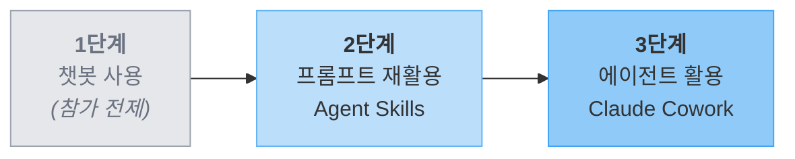
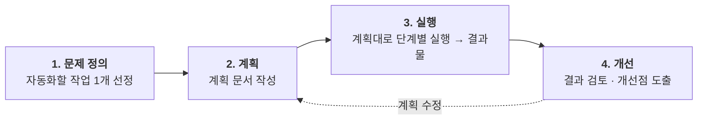

# AI 활용 교육

> 비개발자를 위한 AI 활용 교육 사이트입니다.

---

## Who — 누구를 위한 교육인가요? { #who }

이 교육은 **챗봇 AI를 한 번이라도 써 본 적이 있는 분**을 대상으로 합니다. 이제 단순한 질의응답을 넘어, AI를 본인의 업무나 학습에 **좀 더 적극적으로 활용**하고 싶은 분에게 적합합니다.

### 교육 대상

| 트랙 | 어떤 분인가요? |
|------|--------------|
| **임직원(비개발자)** | 사내 AI 도구를 사용할 수 있는 직장인 |
| **비개발자 학생·일반인** | 학습·생활에 AI를 더 활용하고 싶은 분 |

!!! info "공통 전제 + 자가 진단"
    두 트랙 모두 **챗봇 AI(Claude·Gemini·ChatGPT 등)를 써 본 경험**이 있다고 가정합니다. 아래 3문항에 모두 **Yes**로 답할 수 있다면 1단계는 통과한 상태입니다.

    - [ ] 챗봇 AI에 한 번이라도 질문하고 답을 받아본 적이 있다
    - [ ] 질문이 잘 안 통할 때 표현을 바꿔서 다시 물어본 경험이 있다
    - [ ] AI의 답이 부정확하거나 부족하다고 느낀 적이 있다

    경험이 전혀 없다면 먼저 챗봇 AI를 몇 차례 사용해 본 뒤 참가하시길 권장합니다.

!!! warning "학생 트랙 범위 안내"
    **개발 진로를 희망하는 학생**은 본 교육의 대상이 아닙니다. 개발에 특화된 별도 교육을 수강하시기를 권장합니다.

### 사전지식

교육이 요구하는 것과 요구하지 않는 것을 구분해 안내합니다.

!!! success "요구합니다"
    - 기본 컴퓨터 조작 (파일 업로드·다운로드, 웹 브라우저 사용)
    - 기본적인 웹 검색
    - 챗봇 AI와 짧은 대화를 해 본 경험

!!! failure "요구하지 않습니다"
    - 프로그래밍·코딩 지식
    - 프롬프트 엔지니어링 이론
    - 특정 AI 도구의 고급 기능 숙련도

### 준비사항 { #preparation }

실습에 쓰이는 AI 도구와 추가 준비물은 실습 유형에 따라 달라질 수 있습니다. 필요한 경우 **강사가 교육 전에 별도로 안내**하므로, 아래 기본 준비물을 먼저 갖춰 주세요.

!!! warning "필수 — Claude 유료 요금제가 필요합니다"
    본 교육의 **모든 실습은 Claude에서 진행**되며, Claude Cowork·Claude Code 사용을 위해 **Claude Pro 이상 유료 요금제가 반드시 필요합니다.**

    - 요금제 안내: [Claude 요금제](https://claude.com/pricing)
    - 계정 생성과 결제는 **교육 시작 전에 미리** 완료해 주세요

!!! info "참가자가 준비"
    - 개인 노트북 (웹 브라우저가 원활히 동작하는 환경)
    - 본인이 반복하는 업무·학습 작업 **1개 아이디어** (실습 주제로 사용)
    - **Claude Pro 이상 계정** (위 경고 박스 참조)
    - **Claude Desktop 설치** (Claude Cowork·Code 사용에 필요)
    - (임직원 트랙) 사내 AI 도구 로그인 사전 확인 — 교육 시작 전에 강사가 안내합니다

!!! note "강사가 준비 (참가자는 신경 쓰지 않아도 됩니다)"
    - 실습용 **가상 데이터** (개인정보가 포함되지 않은 샘플)
    - 실습 가이드 자료 및 진행 슬라이드

---

## Why — 왜 AI 활용을 배워야 할까요?

### AI 활용을 배워야 하는 이유

!!! tip "① 시간 절약"
    **나의 1시간은 얼마입니까?**

    매일 반복되는 하루 1시간을 아낄 수 있으면 1년에 250시간입니다. (연평균 근무일수 250일 가정)

    가장 소중한 자원은 시간입니다.

!!! warning "② 직업적 생존"
    **AI는 나를 대체하지 않습니다. AI를 잘 쓰는 사람이 나를 대체합니다.**

    채용·평가·성과의 기준선이 빠르게 이동하고 있습니다.

!!! success "③ 능력의 확장"
    **이제 코딩을 몰라도, 나의 일을 자동화할 수 있습니다.**

    대규모 시스템은 어려울 수 있지만, 본인 업무·학습·일상에 쓰는 **개인용 자동화(소프트웨어)**는 비개발자에게도 열렸습니다.

### 소프트웨어가 만드는 가치

우리가 매일 쓰는 소프트웨어는 세 가지 방식으로 가치를 만들어 왔습니다.

- **기능 제공**: 이전에는 할 수 없거나 어려웠던 일을 가능하게 합니다 (예: 실시간 번역, 네비게이션)
- **시간 절약**: 사람이 직접 하면 오래 걸리던 일을 짧은 시간에 처리합니다 (예: 기차표 예매, 인터넷 뱅킹)
- **비용 감소**: 사람·장소·이동 등에 드는 비용을 줄여줍니다 (예: 인터넷 뱅킹으로 창구 인력 절감, 키오스크, 화상회의로 출장비 감소)

> AI가 등장하면서 이 가치를 만드는 길이 **비개발자에게도 열렸습니다.**

---

## What — 이 교육에서 얻어갈 것

### 교육 목표

> **1개라도 실제로 반복해서 쓸 수 있는 것을 만든다.**

이 교육의 목표는 AI에 대한 이론 학습이 아닙니다. 교육이 끝난 뒤에도 **본인의 업무나 일상에서 반복적으로 활용할 수 있는 결과물**을 최소 1개 이상 만들어 가는 것이 목표입니다.

!!! example "출발점 예시"
    **본인이 매주 반복하는 30분짜리 작업 1개**가 좋은 출발점입니다.

### 매번 시키기 vs 소프트웨어로 만들기

AI를 활용하는 데에는 크게 두 가지 접근이 있습니다.

!!! abstract "① 직접 지시 (= 매번 시키기)"
    AI에게 그때그때 작업을 지시

    **적합**: 1회성·탐색·변동 큰 작업

!!! tip "② 소프트웨어로 만들기 (본 교육이 강조하는 쪽)"
    AI로 작은 소프트웨어(Skill·에이전트 활용)를 만들어 활용

    **적합**: 반복·일관성·재사용이 필요한 작업

**왜 이 교육이 ②번을 강조하는지** 한 단계씩 따라가 봅시다.

!!! note "[1] 출발은 누구나 같다"
    "AI에게 매번 새로 시키기"도 좋은 출발점입니다. 처음부터 본인의 챗봇이나 자동화 도구를 만드는 사람은 없습니다.

!!! note "[2] 한 번으로 끝나지 않는 일들도 많다"
    매주 반복되는 보고서, 매번 비슷한 회의록, 매학기 반복되는 학습 정리…

    **본인이 매일·매주 하는 일을 떠올려 보세요. 반복되는 일이 생각보다 많습니다.**

!!! note "[3] 반복인데 매번 처음부터 시키면 비용이 누적된다"
    - **매번 같은 지시를 다시 입력** (시간 누적)
    - **매번 결과가 조금씩 다름** (챗봇이 매번 답이 살짝 다른 그 느낌 — 품질 변동)
    - **매번 검수·수정** (이중 비용)

!!! success "[4] 그래서 — 한 번 만들고 100번 쓰는 게 합리적"
    반복되는 일에는 **본인 일에 맞는 작은 소프트웨어를 직접 만드는 것**이 답입니다.

    이것이 본 교육이 목표하는 결과입니다 — **비개발자도 자기 일에 필요한 소프트웨어를 만든다.**

!!! quote "핵심: 비개발자도 소프트웨어를 만든다"
    ❌ "AI에게 매번 시킨다"

    ✅ **"AI로 나만의 소프트웨어를 만들어 반복 자동화한다"**

### AI 활용 3단계와 내 위치 { #stage-model }

본 교육에서는 AI 활용을 다음 3단계로 구분해 설명합니다. 참가자는 대체로 **1단계는 통과한 상태**에서 교육에 참여하며, 본 교육은 **2단계와 3단계**에 초점을 맞춥니다.

| 단계 | 무엇을 하나요? | 대표 도구·기능 | 본 교육에서 |
|------|-------------|--------------|------------|
| **1단계 — 챗봇 사용** | 단발성 대화로 답을 얻음 | Claude·Gemini·ChatGPT 웹 챗봇 | **참가 전제** (이미 경험) |
| **2단계 — 프롬프트 재활용** | 반복 사용 가능한 맞춤 프롬프트·챗봇을 자산으로 만듦 | **Agent Skills 기초**, Claude Projects | **2단계용 실습 진행** |
| **3단계 — 에이전트 활용** | 로컬 파일·작업을 자동화하는 에이전트를 운영함 | **Claude Cowork**, Claude Code | **3단계용 실습 진행** |

!!! example "1단계 — 매번 새로 묻기"
    "고객 문의 이메일에 정중하고 친근한 톤으로, 짧게 답장해줘…"

    → 다음 답장 작성 시 같은 지시를 처음부터 다시 입력

!!! success "2단계 — Skill로 묶어 재사용"
    "고객 답장" Skill을 1번 만들어두고 호출만으로 동일 톤 유지

    → 새 답장은 본문 핵심만 입력하면 끝

!!! tip "왜 단계가 이어지나요?"
    2단계에서 익히는 **프롬프트 재활용·Agent Skills** 개념은 3단계 Claude Cowork에서도 그대로 재활용됩니다. 단계가 올라가도 배운 개념이 이어져 학습 효율이 높습니다.

### 어떤 결과물을 만들 수 있나요?

| 트랙 | 2단계 실습 결과물 예시 | 3단계 실습 결과물 예시 |
|------|--------------------|--------------------|
| 임직원(비개발자) | 반복 보고서 자동 작성 템플릿, 데이터 정리·변환 워크플로우 | 로컬 파일을 일괄 정리·변환하는 에이전트 |
| 비개발자 학생·일반인 | AI 오답노트, 자동 문제 출제기, 엑셀 데이터 관리 템플릿 | 학습 자료를 로컬 폴더 단위로 정리·요약하는 에이전트 |

!!! example "1단계 — AI에게 묻기"
    "다운로드 폴더에 쌓인 파일 정리하는 방법 알려줘"

    → AI는 방법을 알려주고, 실제 정리는 사용자가 직접

!!! success "2·3단계 — AI에게 일 맡기기"
    "다운로드 폴더의 PDF는 documents/, 이미지는 pictures/로 옮겨줘"

    → AI가 직접 파일을 옮기고 결과만 보고

---

## How — 어떻게 진행되나요?

### 실습 접근법: 계획 → 실행

이 교육은 긴 이론 학습 대신 **계획 문서를 작성한 뒤 단계별로 실행**하는 방식으로 진행됩니다.

!!! info "왜 계획부터 세우나요?"
    그냥 챗봇에 막 물어보는 것과 무엇이 다른지 궁금할 수 있습니다. 계획을 먼저 세우면 다음 세 가지 이점이 있습니다.

    - **생각이 정리·구체화됩니다** — 머릿속의 모호한 요구가 글로 쓰면 명확해집니다.
    - **AI가 더 정확히 이해합니다** — 깨끗하게 정리된 계획으로 시작하면 답이 일관되고 대화가 길어지지 않습니다.
    - **시간·비용도 절약됩니다** — AI가 잘못 이해해서 다시 작업하면, **작업 시간이 손쉽게 두 배가 됩니다.**

    > 사람도 의사소통이 잘못되면 비용이 큽니다. AI에게도 마찬가지죠.

!!! example "막연한 프롬프트"
    "이 보고서 요약해줘"

    → AI가 임의로 분량·관점을 잡음, 매번 결과가 들쭉날쭉

!!! success "구조화된 프롬프트"
    "이 보고서를 3줄로 요약. 1줄은 결론, 2~3줄은 근거. 수치는 그대로 유지."

    → 매번 같은 형식의 일관된 결과

### 대상별 실행 계획

각 트랙에서 **2단계와 3단계 실습을 각각 준비**합니다. 아래는 **실습 예시**이며, 참가자의 사전 경험과 목표에 맞춰 강사가 구체적인 실습 경로를 안내합니다.

#### 임직원(비개발자)

- **2단계 실습 예시**: 반복 보고서 자동 작성, 엑셀·CSV 데이터 정리·변환 등을 **Agent Skills**로 자산화
- **3단계 실습 예시**: **Claude Cowork**로 로컬 파일을 일괄 처리하거나 문서 폴더를 자동 정리

#### 비개발자 학생·일반인

- **2단계 실습 예시**: AI 오답노트, 자동 문제 출제기, 엑셀 데이터 관리 템플릿 등을 **Agent Skills**로 구축
- **3단계 실습 예시**: **Claude Cowork**로 수업 자료·학습 노트를 로컬 폴더 단위로 정리·요약

!!! info "실습 상세 가이드 안내"
    각 실습의 **상세 시나리오·절차**는 별도 페이지로 제공될 예정입니다. 본 페이지에서는 실습의 유형과 단계 매핑만 안내합니다.

---

## 함께 읽어보세요

- [보안 및 개인정보 가이드](security-guide.md) — AI 사용 시 꼭 알아야 할 보안 원칙
- [교육 운영 가이드](operation-guide.md) — 교육 운영자를 위한 준비·운영·개선 가이드
- **자주 묻는 질문(FAQ)** — 추후 추가 예정
