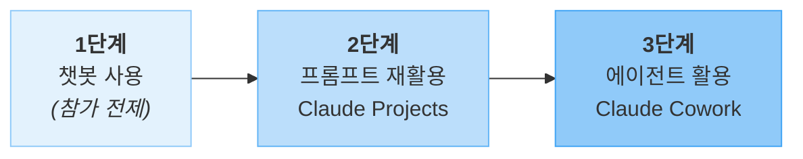
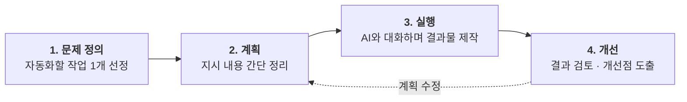

# AI 활용 교육

> 비개발자를 위한 AI 활용 교육 사이트입니다.

---

## Why — 왜 AI를 배워야 할까요?

### 소프트웨어가 만드는 가치

우리가 매일 쓰는 소프트웨어는 세 가지 방식으로 가치를 만듭니다.

- **기능 제공**: 이전에는 불가능했던 일을 가능하게 합니다 (예: 실시간 번역, 자동 요약)
- **시간 절약**: 수작업으로 30분 걸리던 일을 몇 초 만에 처리합니다 (예: 데이터 정리, 보고서 서식 변환)
- **비용 감소**: 외부 의뢰나 전문 인력 없이도 결과물을 만들어냅니다 (예: 간단한 이미지 편집, 문서 번역)

### AI가 바꾸는 것

소프트웨어를 만드는 **대부분의 경우** 지금까지는 프로그래밍 언어를 배워야 했습니다. AI는 이 진입장벽을 크게 낮춰줍니다.

- 코딩을 몰라도 **자연어(일상 언어)로 지시**하면 결과물을 얻을 수 있습니다
- 복잡한 도구를 익히지 않아도 **대화형으로 작업**을 진행할 수 있습니다
- 전문가 수준의 결과물은 아니더라도 **실용적인 수준의 산출물**을 직접 만들 수 있습니다

> 핵심은 "AI가 일을 대신 해준다"가 아니라, **"AI 덕분에 내가 직접 할 수 있게 된다"** 는 것입니다.

---

## Who — 누구를 위한 교육인가요? { #who }

이 교육은 **챗봇 AI를 한 번이라도 써 본 적이 있는 분**을 대상으로 합니다. 이제 단순한 질의응답을 넘어, AI를 본인의 업무나 학습에 **좀 더 적극적으로 활용**하고 싶은 분에게 적합합니다.

### 대상자 프로필

| 트랙 | 어떤 분인가요? |
|------|--------------|
| **임직원(비개발자)** | 사내 AI 도구를 사용할 수 있는 직장인 |
| **비개발자 학생·일반인** | 학습·생활에 AI를 더 활용하고 싶은 분 |

!!! info "공통 전제"
    두 트랙 모두 **챗봇 AI(Claude·Gemini·ChatGPT 등)를 써 본 경험**이 있다고 가정합니다. 경험이 전혀 없다면 먼저 하나를 몇 차례 사용해 본 뒤 참가하시길 권장합니다.

!!! warning "학생 트랙 범위 안내"
    **개발 진로를 희망하는 학생**은 본 교육의 대상이 아닙니다. 프로그래밍·개발에 특화된 별도 교육을 수강하시기를 권장합니다.

### AI 활용 3단계와 내 위치 { #stage-model }

본 교육에서는 AI 활용을 다음 3단계로 구분해 설명합니다. 참가자는 대체로 **1단계는 통과한 상태**에서 교육에 참여하며, 본 교육은 **2단계와 3단계**에 초점을 맞춥니다.

| 단계 | 무엇을 하나요? | 대표 도구·기능 | 본 교육에서 |
|------|-------------|--------------|------------|
| **1단계 — 챗봇 사용** | 단발성 대화로 답을 얻음 | Claude·Gemini·ChatGPT 웹 챗봇 | **참가 전제** (이미 경험) |
| **2단계 — 프롬프트 재활용** | 반복 사용 가능한 맞춤 챗봇·프롬프트를 자산으로 만듦 | **Claude Projects**, Agent Skills 기초 | **2단계용 실습 진행** |
| **3단계 — 에이전트 활용** | 로컬 파일·작업을 자동화하는 에이전트를 운영함 | **Claude Cowork**, Claude Code | **3단계용 실습 진행** |

!!! tip "왜 단계가 이어지나요?"
    2단계에서 익히는 **프롬프트 재활용·Agent Skills** 개념은 3단계 Claude Cowork에서도 그대로 재활용됩니다. 단계가 올라가도 배운 개념이 이어져 학습 효율이 높습니다.

### 사전지식

교육이 요구하는 것과 요구하지 않는 것을 구분해 안내합니다.

!!! success "요구합니다"
    - 기본 컴퓨터 조작 (파일 업로드·다운로드, 웹 브라우저 사용)
    - 기본적인 웹 검색
    - 챗봇 AI와 짧은 대화를 해 본 경험

!!! failure "요구하지 않습니다"
    - 프로그래밍·코딩 지식
    - 프롬프트 엔지니어링 이론
    - 특정 AI 도구의 고급 기능 숙련도

### 준비사항 { #preparation }

실습에 쓰이는 AI 도구와 추가 준비물은 실습 유형에 따라 달라질 수 있습니다. 필요한 경우 **강사가 교육 전에 별도로 안내**하므로, 아래 기본 준비물을 먼저 갖춰 주세요.

!!! warning "필수 — Claude 유료 요금제가 필요합니다"
    본 교육의 **모든 실습은 Claude에서 진행**되며, Claude Projects·Claude Cowork·Claude Code 사용을 위해 **Claude Pro 이상 유료 요금제가 반드시 필요합니다.**

    - 요금제 안내: [Claude 요금제](https://claude.com/pricing)
    - 계정 생성과 결제는 **교육 시작 전에 미리** 완료해 주세요

#### 참가자가 준비할 것

- [ ] 개인 노트북 (웹 브라우저가 원활히 동작하는 환경)
- [ ] 본인이 반복하는 업무·학습 작업 **1개 아이디어** (실습 주제로 사용)
- [ ] **Claude Pro 이상 계정** (위 경고 박스 참조)
- [ ] (임직원 트랙) 사내 AI 도구 로그인 사전 확인 — 교육 시작 전에 강사가 안내합니다

#### 강사가 준비합니다 (참가자는 신경 쓰지 않아도 됩니다)

- 실습용 **가상 데이터** (개인정보가 포함되지 않은 샘플)
- 실습 가이드 자료 및 진행 슬라이드

---

## What — 이 교육에서 얻어갈 것

### 교육 목표

> **1개라도 실제로 반복해서 쓸 수 있는 것을 만든다.**

이 교육의 목표는 AI에 대한 이론 학습이 아닙니다. 교육이 끝난 뒤에도 **본인의 업무나 일상에서 반복적으로 활용할 수 있는 결과물**을 최소 1개 이상 만들어 가는 것이 목표입니다.

### 어떤 결과물을 만들 수 있나요?

| 트랙 | 2단계 실습 결과물 예시 | 3단계 실습 결과물 예시 |
|------|--------------------|--------------------|
| 임직원(비개발자) | 반복 보고서 자동 작성 템플릿, 데이터 정리·변환 워크플로우 | 로컬 파일을 일괄 정리·변환하는 에이전트 |
| 비개발자 학생·일반인 | AI 오답노트, 자동 문제 출제기, 엑셀 데이터 관리 템플릿 | 학습 자료를 로컬 폴더 단위로 정리·요약하는 에이전트 |

---

## How — 어떻게 진행되나요?

### 실습 접근법: 계획 → 실행

이 교육은 긴 이론 강의 대신 **"최소한의 계획을 세우고 바로 실행"** 하는 방식으로 진행됩니다.

### 대상별 실행 계획

각 트랙에서 **2단계와 3단계 실습을 각각 준비**합니다. 참가자의 사전 경험과 목표에 맞춰 강사가 실습 경로를 안내합니다.

#### 임직원(비개발자)

- **2단계 실습**: 반복 보고서 자동 작성, 엑셀·CSV 데이터 정리·변환 등을 **Claude Projects**로 자산화
- **3단계 실습**: **Claude Cowork**로 로컬 파일을 일괄 처리하거나 문서 폴더를 자동 정리

#### 비개발자 학생·일반인

- **2단계 실습**: AI 오답노트, 자동 문제 출제기, 엑셀 데이터 관리 템플릿 등을 **Claude Projects**로 구축
- **3단계 실습**: **Claude Cowork**로 수업 자료·학습 노트를 로컬 폴더 단위로 정리·요약

!!! info "실습 상세 가이드 안내"
    각 실습의 **상세 시나리오·절차**는 별도 페이지로 제공될 예정입니다. 본 페이지에서는 실습의 유형과 단계 매핑만 안내합니다.

---

## 함께 읽어보세요

- [보안 및 개인정보 가이드](security-guide.md) — AI 사용 시 꼭 알아야 할 보안 원칙
- [교육 운영 가이드](operation-guide.md) — 교육 운영자를 위한 준비·운영·개선 가이드
- **자주 묻는 질문(FAQ)** — 추후 추가 예정
