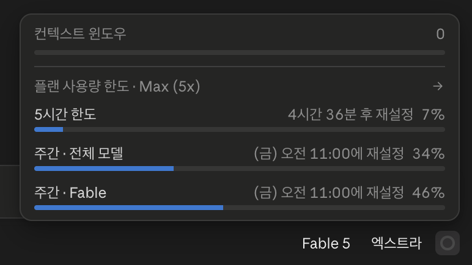
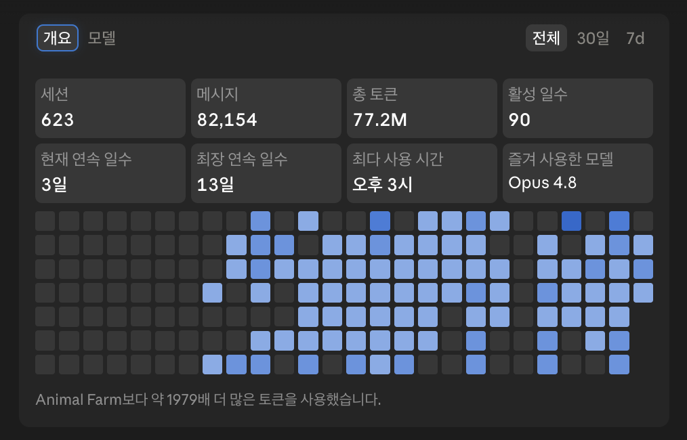
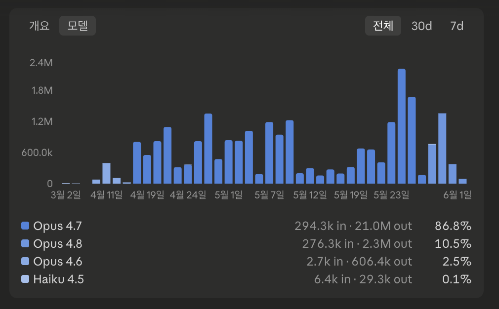

# AI 도구와 제품 — 생성형 AI 지형과 Claude

> 생성형 AI 시장의 큰 그림과, 본 교육에서 쓰는 도구(Claude 생태계)를 한자리에 모은 페이지입니다.
> 도구 선택·기능 비교·사용량 확인이 필요할 때 펼쳐 보세요. 용어가 낯설면 [기본 용어와 범위](basics.md)를 먼저 봐도 됩니다.

---

## 생성형 AI 소개

!!! note "용어 안내"
    이 페이지에서 «챗봇», «에이전트»는 모두 **AI 챗봇**, **AI 에이전트**를 짧게 쓴 표기입니다. 두 사용 방식이 각각 무엇인지는 [기본 용어 — 챗봇 vs 에이전트](basics.md#chatbot-vs-agent)에서 정의합니다.

### 대표 제품 — Claude · Gemini · ChatGPT { #products }

생성형 AI는 글·코드·이미지처럼 **새로운 결과물을 만들어내는 AI**를 말합니다. 그중 대화형 제품은 다음 3종이 가장 널리 알려져 있습니다.

| 제품 | 만든 곳 | 특징 한 줄 |
|------|---------|------------|
| **Claude** | Anthropic | 긴 글·문서 처리와 코딩·에이전트 작업에 강점 |
| **Gemini** | Google | Google 검색·Workspace와 자연스럽게 연동 |
| **ChatGPT** | OpenAI | 가장 널리 알려진 대화형 AI. 음성·이미지 멀티모달 강세 |

!!! info "본 교육은 Claude로 진행합니다"
    실습은 **Claude 단독**으로 운영합니다. 챗봇 사용 경험(1단계)은 어떤 제품이든 비슷한 감각을 줄 수 있어 본인이 익숙한 도구로 시작해도 괜찮습니다. 다만 본 교육의 **2·3단계 실습은 Claude의 자산화·에이전트 기능**을 활용하므로 도구는 Claude로 통일합니다 (자세한 배경은 [홈 — 준비사항](index.md#preparation) 참조).

!!! tip "어느 제품이 가장 좋나요?"
    제품마다 강점이 다르고, 같은 제품도 모델·기능이 매달 빠르게 바뀝니다. **'정답 하나'를 고르는 시점은 지났습니다.** 업무·환경에 맞춰 1~2개를 꾸준히 익히는 편이 실용적입니다.

#### 챗봇만 알지 마세요 — 같은 회사에 코딩 에이전트도 있습니다

같은 회사가 만든 챗봇과 코딩 에이전트는 **짝으로 묶여** 있습니다. 챗봇은 익숙해도 에이전트 쪽은 잘 모르는 경우가 많은데, **본격적인 자동화 무대는 이쪽**입니다.

| 회사      | 챗봇 (보통 아는 것) | 코딩 에이전트                    |
|-----------|--------------------|----------------------------------|
| Anthropic | Claude             | **Claude Code**                  |
| Google    | Gemini             | **Antigravity**                  |
| OpenAI    | ChatGPT            | **Codex**                        |

Anthropic은 비개발자용 에이전트 **Claude Cowork**도 함께 제공합니다. 본 교육 3단계 실습은 **Claude Cowork**로 진행하며, Claude Code는 비개발자에게 진입 장벽이 있어 보조 도구로만 안내합니다 (자세한 내용은 아래 [Claude 소개](#claude) 참조).

---

## Claude 소개 { #claude }

본 교육에서 사용하는 도구는 모두 Claude 생태계 안에 있습니다. **챗봇·에이전트가 한 묶음**으로 제공되어 [3단계 모델](index.md#stage-model) 전체가 동일한 환경에서 자연스럽게 이어집니다.

| 제품              | 무엇                          | 본 교육에서의 단계                      |
|-------------------|-------------------------------|--------------------------------------|
| **claude.ai**     | 웹·모바일 대화형 챗봇            | 1단계 (참가 전제)                     |
| **Claude Cowork** | 데스크톱 환경의 범용 에이전트    | **3단계 본격 실습**                  |
| **Claude Code**   | 터미널·IDE 코딩 특화 에이전트   | 3단계 보조 도구 (옵션 안내)          |

> 세 제품 모두 **유료 플랜**이 필요합니다 — 개인은 **Claude Pro 이상**, 임직원은 **회사 Team·Enterprise**(개인 플랜 사용 금지). Cowork·Code 사용에는 **Claude Desktop 설치**가 전제됩니다. [홈 — 준비사항](index.md#preparation) 참조.

---

### 기능 비교 — 한눈에 { #claude-comparison }

세 제품의 능력 차이를 한 표로 정리합니다. **로컬 파일·터미널 접근 여부**가 챗봇과 에이전트를 가르는 핵심 분기선입니다.

| 기능 | claude.ai | Claude Cowork | Claude Code |
|:-----|:---------:|:-------------:|:-----------:|
| 웹 검색 | ✓ | ✓ | ✓ |
| 대화에 파일 업로드 | ✓ | ✓ | ✓ |
| 파일·시스템 접근 | ✗ | △ 연결 폴더만 | ✓ 전체 |
| 터미널 명령 실행 | ✗ | △ 격리 VM | ✓ 전체 |
| Agent Skills | ✓ | ✓ | ✓ |
| 외부 도구·데이터 연결 (커넥터·MCP 서버) | ✓ 원격 연결 | ✓ 원격 연결 | ✓ 전체 |
| 외부 API 호출 | ✗ | △ 송신 정책 | ✓ 전체 |

> **범례**: ✓ 지원 · △ 제한적·조건부 · ✗ 미지원

> 연결을 실제로 잇는 방법은 **[2부 — 도구·데이터 연결](connect/index.md)** 에서 다룹니다. 클라우드 서비스를 잇는 **원격 연결**은 웹·데스크톱 어디서나 같지만, **내 컴퓨터 안의 자료**를 잇는 로컬 확장 프로그램은 **Claude Desktop 앱**에서 설치합니다 (→ [2부 — 원격과 로컬](connect/mcp-servers.md#remote-vs-local)).

---

### 모델 비교 — Fable · Opus · Sonnet · Haiku { #claude-models }

Claude는 한 모델이 아니라 **여러 라인업**으로 구성됩니다. claude.ai·Cowork·Code 어디에서나 동일한 라인업을 공유하며, 사용 화면에서 직접 고를 수 있습니다. 기존 세 라인업 **위에** 최상위 모델 **Fable**이 더해졌습니다 — 기존 라인업을 대체하는 게 아니라 한 층이 추가된 것입니다.

| 라인업     | 한 줄 포지션                          | 어울리는 상황                                                 |
|------------|---------------------------------------|---------------------------------------------------------------|
| **Fable**  | 가장 똑똑함 — 최상위 (새로 추가)       | 가장 어려운 문제 의논, 오래 걸리는 대규모 자율 작업           |
| **Opus**   | 깊은 추론의 기본 (추론 강함, 속도는 보통) | 본인도 잘 모르는 주제 의논, 깊은 분석, 다단계 에이전트 작업    |
| **Sonnet** | 똑똑함과 빠름의 균형 — 일상 업무 기본  | 글 다듬기, 검색·요약·찾아바꾸기 같은 지시 이행 작업            |
| **Haiku**  | 가장 빠름 (가벼운 작업·반복)          | 짧은 답이면 충분한 단순 질문, 동일 패턴 반복                  |

!!! tip "어느 모델을 쓸까?"
    기준은 **추론이 얼마나 필요한가**입니다. 본인도 잘 모르는 주제를 함께 풀어 가야 한다면 **Opus**, 검색·찾아바꾸기·요약처럼 지시 이행이 핵심이라면 **Sonnet**으로 충분합니다. 헷갈리면 Sonnet으로 시작해 추론이 더 필요할 때 Opus로 옮기면 됩니다 (Anthropic도 [복잡한 작업이라면 Opus 시작을 권장](https://platform.claude.com/docs/ko/about-claude/models/overview)). **Fable**은 그 위의 선택지입니다 — Opus로도 부족한 가장 어려운 문제나 장시간 자율 작업에서 고려하세요.

> 라인업은 비교적 안정적으로 유지되지만, 이번 Fable처럼 새 라인업이 더해지기도 하고 버전 번호(예: Fable **5**, Opus **4.8**, Sonnet **4.6**, Haiku **4.5**)는 자주 갱신됩니다. 최신 사양과 플랜별 제공 조건은 [Anthropic 공식 모델 안내](https://platform.claude.com/docs/ko/about-claude/models/overview)에서 확인할 수 있습니다.

---

### claude.ai (Chat) — 1단계의 시작점 { #claude-ai }

웹·모바일 브라우저에서 바로 쓰는 대화형 챗봇입니다. 빠른 질문, 정보 정리, 글 다듬기 같은 **1회성 작업**에 적합합니다.

!!! abstract "본 교육에서의 위치"
    **1단계 (참가 전제)** — 이미 익숙한 사용 방식입니다. claude.ai 안에서 **Projects·Skills** 기능을 활용하면 [2단계(프롬프트 재활용)](index.md#stage-model)로 넘어가는 무대로도 사용됩니다.

---

### Claude Cowork — 3단계 본격 무대 { #claude-cowork }

데스크톱 환경에서 **AI가 직접 파일을 열고 작업을 수행**하는 에이전트입니다. 반복 작업 자동화, 로컬 파일 일괄 처리, 여러 단계로 이어지는 워크플로우에 적합합니다.

!!! tip "본 교육에서의 위치"
    **3단계 본격 실습 도구** — 비개발자 친화적 인터페이스로, 본 교육의 3단계 실습은 Cowork으로 진행합니다. 사용에는 [Claude Desktop 설치](index.md#preparation)가 필요합니다.

!!! info "Cowork의 보호 모델"
    [Anthropic 공식 안내](https://support.claude.com/ko/articles/13345190-claude-cowork-%EC%8B%9C%EC%9E%91%ED%95%98%EA%B8%B0)에 따르면 Cowork는 **계층화된 보호**로 실행됩니다.

    - **코드 실행 격리**: Claude가 작성한 셸 명령 및 코드는 메인 운영 체제와 분리된 격리된 가상 머신(VM) 내에서 실행됩니다.
    - **제어된 파일 및 네트워크 액세스**: Claude는 연결한 폴더의 파일만 읽고 쓸 수 있으며, 네트워크 액세스는 구성한 송신 설정을 따릅니다.

---

### Claude Code — 3단계 보조 도구 { #claude-code }

터미널·IDE에서 동작하는 **코딩 특화 에이전트**입니다 ([앞 표의 회사별 코딩 에이전트](#products) 중 Anthropic 항목). 본격적인 코딩·자동화 스크립트 작성에 적합합니다.

!!! note "본 교육에서의 위치"
    **3단계 보조 도구·옵션** — 명령줄 인터페이스 진입 장벽이 있어 본 교육에서는 **옵션 안내**로만 다룹니다. 핵심 실습 무대는 Cowork이며, Code는 관심 있는 분께 한 단계 더 깊은 길로 제시됩니다.

---

### 사용량 확인 방법 { #claude-usage }

Pro·Max 플랜에는 시간·기간별 한도가 있습니다. 사용 현황은 **두 가지 화면**으로 봅니다. *한도 숫자*(설정)와 *누적 사용량*(Code 탭)입니다.

#### ① 한도 숫자 — 설정 → 사용량 (Settings → Usage)

**claude.ai 웹**과 **Claude Desktop** 모두 같은 화면에서 확인합니다.

| 화면 항목 | 의미 |
|-----------|------|
| 현재 세션 (Current session) | 5시간 세션 한도 중 사용한 양과 남은 시간 |
| 주간 한도 (Weekly usage limit reset) | Opus / 그 외 모델별 다음 주간 초기화 시점 |

#### ② 누적 사용량 — Claude Desktop의 Code 탭 → 사용량 링

Claude Desktop을 연 다음 좌측의 **Code** 탭을 선택하고, 화면 우측 하단의 **사용량 링**(현재 모델 표시 옆)을 클릭하면 짧은 요약 화면이 먼저 펼쳐집니다.

여기서 화살표(→)를 눌러 들어가면 전체 사용량 화면이 열리고, **개요·모델** 두 탭에서 더 자세히 볼 수 있습니다.

**개요 — 누적 사용량 한눈에 (세션·메시지·토큰·연속 일수·즐겨 사용한 모델)**

**모델 — 일별·모델별 토큰 분포**

추론이 많이 필요한 작업과 단순 지시 이행은 같은 시간에도 토큰 차이가 큽니다. 모델별 비율(Fable·Opus·Sonnet·Haiku)을 보며 **작업 성격에 맞춰 모델을 골라**(→ [모델 비교](#claude-models)) 직접 차이를 체감해 보세요.

*이미지는 Claude Desktop UI가 바뀌면 옛 화면일 수 있어요. 본 페이지가 캡처 갱신 책임 자리입니다.*

!!! tip "Cowork은 채팅보다 한도 소비가 큽니다"
    [공식 안내](https://support.claude.com/ko/articles/11647753) — *"Cowork에서의 작업은 Claude와 채팅하는 것보다 사용량을 더 많이 소비합니다."* 멀티 스텝·도구 호출이 많기 때문입니다. 단순한 질문·정리는 chat, 본격 작업만 Cowork으로 분리하면 한도가 오래 갑니다.

**한도에 도달했다면** — 5시간 세션 초기화를 기다리거나, 플랜을 상향하거나, [추가 사용량 구매](https://support.claude.com/ko/articles/12429409)로 이어서 사용합니다. claude.ai · Cowork · Claude Code는 **하나의 한도 풀**을 함께 씁니다.

!!! info "Claude Code 사용량 확인 (옵션)"
    터미널 세션 안에서 `/usage` 로 Pro·Max 플랜 한도 사용량을, `/extra-usage` 로 추가 사용량 관리를 확인합니다 ([Pro 또는 Max 플랜으로 Claude Code 사용하기](https://support.claude.com/ko/articles/11145838)).

> 공식 안내: [Claude Code Desktop — 사용량 확인하기](https://code.claude.com/docs/ko/desktop#check-usage)

---

## 공식 문서·참고 자료 { #official-references }

본 교육 이후에도 Claude를 더 익히고 싶을 때 참고하면 좋은 공식 자료입니다 (한국어 페이지 우선).

### 시작하기

- [Claude 모델 안내](https://docs.claude.com/ko/docs/about-claude/models/overview) — 라인업·최신 사양·버전별 차이
- [Claude Cowork 시작하기](https://support.claude.com/ko/articles/13345190) — 프로젝트 단위 작업 사용법
- [Claude Code 안내](https://docs.claude.com/ko/docs/claude-code/overview) — 터미널·IDE에서 쓰는 코딩 에이전트
- [Anthropic Learn](https://www.anthropic.com/learn) — 프롬프트 작성·활용 가이드 모음 *(영문만 제공)*

### 자산화·확장

- [Projects(프로젝트)란 무엇입니까](https://support.claude.com/ko/articles/9517075) — 자료·지침을 묶어 재사용
- [스킬이란 무엇인가요](https://support.claude.com/ko/articles/12512176) — 반복 작업을 스킬로 자산화
- [MCP 안내](https://docs.claude.com/ko/docs/agents-and-tools/mcp) — MCP 서버를 **직접 만들 때** 보는 개발자용 문서. 이용하는 방법은 [2부 — MCP 서버 이용하기](connect/mcp-servers.md)로 충분합니다

### 운영·지원

- [Anthropic 플랜](https://www.anthropic.com/pricing) — 플랜 비교·가격 *(영문만 제공)*
- [공식 Support 홈](https://support.claude.com/ko/) — 한국어 도움말 모음
- [Claude 상태(Status)](https://status.claude.com/) — 서비스 장애·점검 확인

---

## 함께 읽어보세요

- [홈 — 본 교육의 Why·What·How](index.md)
- [홈 — 준비사항](index.md#preparation) — Claude Pro·Desktop 설치 등 사전 준비
- [홈 — 3단계 모델](index.md#stage-model) — 본 교육이 다루는 학습 사다리
- [2부 — 도구·데이터 연결](connect/index.md) — 커넥터·MCP 서버로 외부 자료를 잇기
- [보안 및 개인정보 가이드](security-guide.md)
