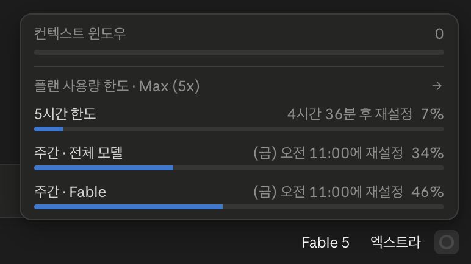
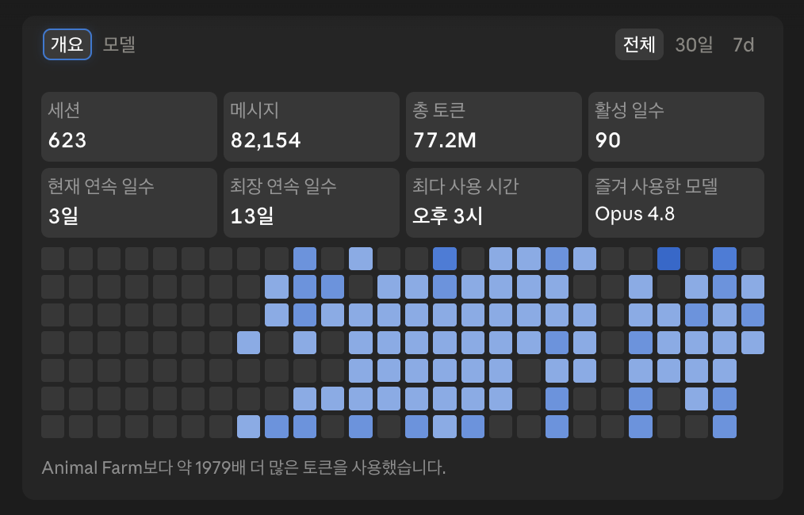
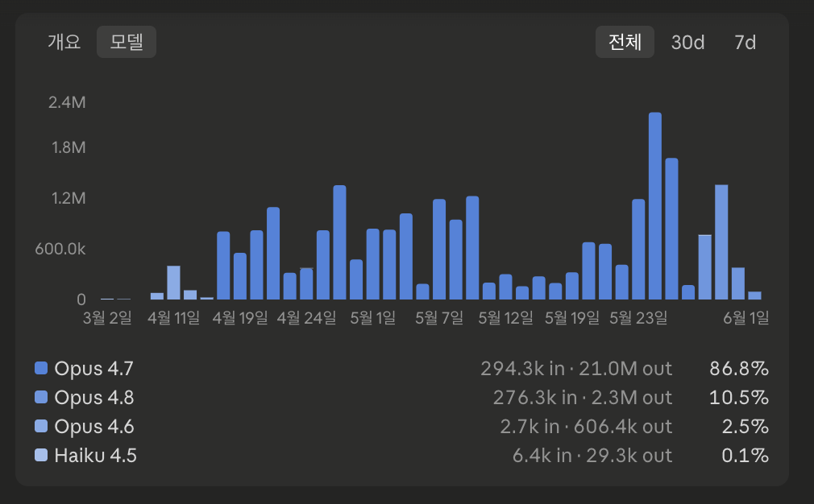

# AI 도구와 제품 ― 생성형 AI 지형과 Claude

> 생성형 AI 시장의 큰 그림과, 본 교육에서 쓰는 도구(Claude 생태계)를 한데 모은 페이지입니다.
> 도구 선택·기능 비교·사용량 확인이 필요할 때 펼쳐 보세요. 용어가 낯설면 [기본 용어와 범위](basics.md)를 먼저 봐도 됩니다.

---

## 생성형 AI 소개

!!! note "용어 안내"
    이 페이지에서 «챗봇», «에이전트»는 모두 **AI 챗봇**, **AI 에이전트**를 짧게 쓴 표기입니다. 두 사용 방식이 각각 무엇인지는 [기본 용어 ― 챗봇 vs 에이전트](basics.md#chatbot-vs-agent)에서 정의합니다.

### 대표 제품 ― Claude · ChatGPT · Gemini { #products }

생성형 AI는 글·코드·이미지처럼 **새로운 결과물을 만들어내는 AI**를 말합니다. 그중 대화형 제품은 다음 3종이 가장 널리 알려져 있습니다.

| 제품 | 만든 곳 | 특징 한 줄 |
|------|---------|------------|
| **Claude** | Anthropic | 긴 글·문서 처리와 코딩·에이전트 작업에 강점 |
| **ChatGPT** | OpenAI | 가장 널리 알려진 대화형 AI. 음성·이미지 멀티모달 강세 |
| **Gemini** | Google | Google 검색·Workspace와 자연스럽게 연동 |

어느 제품이 가장 좋은지 궁금하실 텐데, 제품마다 강점이 다르고 같은 제품도 모델·기능이 매달 빠르게 바뀝니다. **'정답 하나'를 고르는 시점은 지났습니다.** 업무·환경에 맞춰 1~2개를 꾸준히 익히는 편이 실용적입니다.

본 교육의 실습은 **Claude 단독**으로 운영합니다. 챗봇 사용 경험(1단계)은 어떤 제품이든 비슷한 감각을 줄 수 있어 본인이 익숙한 도구로 시작해도 괜찮습니다. 다만 본 교육의 **2·3단계 실습은 Claude의 자산화·에이전트 기능**을 활용하므로 도구는 Claude로 통일합니다 (자세한 배경은 [홈 ― 준비사항](index.md#preparation) 참조).

#### 챗봇만 알지 마세요 ― 같은 회사에 코딩 에이전트도 있습니다

같은 회사가 만든 챗봇과 코딩 에이전트는 **짝으로 묶여** 있습니다. 챗봇은 익숙해도 에이전트 쪽은 잘 모르는 경우가 많은데, **본격적인 자동화 무대는 이쪽**입니다.

| 회사      | 챗봇 (보통 아는 것) | 코딩 에이전트                    |
|-----------|--------------------|----------------------------------|
| Anthropic | Claude             | **Claude Code**                  |
| OpenAI    | ChatGPT            | **Codex**                        |
| Google    | Gemini             | **Antigravity**                  |

Anthropic은 비개발자용 에이전트 **Claude Cowork**도 함께 제공합니다. 본 교육 3단계 실습은 **Claude Cowork**로 진행하며, Claude Code는 비개발자에게 진입 장벽이 있어 보조 도구로만 안내합니다 (자세한 내용은 아래 [Claude 소개](#claude) 참조).

---

## Claude 소개 { #claude }

본 교육에서 사용하는 도구는 모두 Claude 생태계 안에 있습니다. **챗봇·에이전트가 한 묶음**으로 제공되어 [3단계 모델](index.md#stage-model) 전체가 동일한 환경에서 자연스럽게 이어집니다.

| 제품              | 무엇                          | 본 교육에서의 단계                      |
|-------------------|-------------------------------|--------------------------------------|
| **claude.ai**     | 웹·모바일 대화형 챗봇            | 1단계 (참가 전제)                     |
| **Claude Cowork** | 파일·도구를 직접 다루는 범용 에이전트 | **3단계 본격 실습**                  |
| **Claude Code**   | 터미널·IDE 코딩 특화 에이전트   | 3단계 보조 도구 (옵션 안내)          |

> 본 교육의 **Cowork·Code 실습에 유료 플랜**이 필요합니다. 개인은 **Claude Pro 이상**, 임직원은 **회사 Team·Enterprise**입니다 (개인 플랜 사용 금지). **Claude Desktop 설치**는 모든 실습에 필요합니다. [홈 ― 준비사항](index.md#preparation) 참조.

---

### 기능 비교 ― 한눈에 { #claude-comparison }

세 제품의 능력 차이를 한 표로 정리합니다. **로컬 파일·터미널 접근 여부**가 챗봇과 에이전트를 가르는 핵심 분기선입니다.

| 기능 | claude.ai | Claude Cowork | Claude Code |
|:-----|:---------:|:-------------:|:-----------:|
| 웹 검색 | ✓ | ✓ | ✓ |
| 대화에 파일 업로드 | ✓ | ✓ | ✓ |
| 파일·시스템 접근 | ✗ | △ 연결 폴더만 | ✓ 전체 |
| 터미널 명령 실행 | ✗ | △ 격리 VM | ✓ 전체 |
| Agent Skills | ✓ | ✓ | ✓ |
| 외부 도구·데이터 연결 (커넥터·MCP 서버) | ✓ 원격 · ✗ 로컬 | ✓ 원격 · △ 로컬 | ✓ 전체 |
| 외부 API 호출 | ✗ | △ 송신 정책 | ✓ 전체 |

> **범례**: ✓ 지원 · △ 제한적·조건부 · ✗ 미지원

표의 **✓ 원격 · △ 로컬**은 **연결할 MCP 서버가 어디에서 실행되느냐**의 구분입니다.

- **원격**은 서버가 **내 컴퓨터 밖**에서 실행되는 경우 전부로, 기본 커넥터로 연결하는 서비스도, 인터넷에 공개된 MCP 서버도, 회사가 **사내망**에 제공하는 MCP 서버도 모두 여기에 속합니다.
- **로컬**은 서버가 **내 컴퓨터 안**에서 실행되는 경우로, 쓰려는 컴퓨터마다 설치해야 합니다. 브라우저로 쓰는 claude.ai 웹은 내 컴퓨터에서 서버를 실행할 수 없어 쓸 수 없고(✗), Claude Desktop의 Cowork에서는 조건부로 쓸 수 있으며(△), Claude Code는 지원합니다(✓).

서버가 어디에서 실행되느냐와 별개로 **설정을 어디에 두느냐**의 구분이 따로 있습니다. 두 구분이 어떻게 맞물리는지는 **[2부 ― 어디에 설정하느냐](connect/mcp-servers.md#remote-vs-local)** 에서 다룹니다.

---

### 모델 비교 ― Fable · Opus · Sonnet · Haiku { #claude-models }

Claude는 한 모델이 아니라 **여러 라인업**으로 구성됩니다. claude.ai·Cowork·Code 어디에서나 동일한 라인업을 공유하며, 사용 화면에서 직접 고를 수 있습니다. 기존 세 라인업 **위에** 최상위 모델 **Fable**이 더해졌습니다. 기존 라인업을 대체하는 게 아니라 한 층이 추가된 것입니다.

| 라인업     | 한 줄 포지션                          | 어울리는 상황                                                 |
|------------|---------------------------------------|---------------------------------------------------------------|
| **Fable**  | 가장 똑똑함 (최상위, 새로 추가)        | 가장 어려운 문제 의논, 오래 걸리는 대규모 자율 작업           |
| **Opus**   | 깊은 추론의 기본 (추론 강함, 속도는 보통) | 본인도 잘 모르는 주제 의논, 깊은 분석, 다단계 에이전트 작업    |
| **Sonnet** | 똑똑함과 빠름의 균형 (일상 업무 기본)  | 글 다듬기, 검색·요약·찾아바꾸기 같은 지시 이행 작업            |
| **Haiku**  | 가장 빠름 (가벼운 작업·반복)          | 짧은 답이면 충분한 단순 질문, 동일 패턴 반복                  |

!!! tip "어느 모델을 쓸까?"
    기준은 **추론이 얼마나 필요한가**입니다. 본인도 잘 모르는 주제를 함께 풀어 가야 한다면 **Opus**, 검색·찾아바꾸기·요약처럼 지시 이행이 핵심이라면 **Sonnet**으로 충분합니다. 헷갈리면 **Opus**로 시작하세요. Anthropic도 [어떤 모델을 쓸지 확실하지 않다면 대부분의 작업은 Opus 5.5로 시작하라고 권장](https://platform.claude.com/docs/ko/models/overview)합니다. **Fable**은 그 위의 선택지입니다. Opus로도 부족한 가장 어려운 문제나 장시간 자율 작업에서 고려하세요.

> 라인업은 비교적 안정적으로 유지되지만, 이번 Fable처럼 새 라인업이 더해지기도 하고 버전 번호(예: Fable 5.1, Opus 5.5, Sonnet 5.5, Haiku 4.5)는 자주 갱신됩니다. 최신 사양과 플랜별 제공 조건은 [Anthropic 공식 모델 안내](https://platform.claude.com/docs/ko/models/overview)에서 확인할 수 있습니다.

---

### 노력 수준(effort) ― 같은 모델이 얼마나 공들일지 { #claude-effort }

모델을 고르는 일이 **누구에게 맡길지**를 정하는 것이라면, **노력 수준**(effort)은 같은 모델이 **얼마나 공들여 일할지**를 정하는 조절 장치입니다. 모델 선택과는 따로 정합니다. 같은 모델이라도 effort를 올리면 답하기 전에 더 깊이 생각하고, 결과를 스스로 확인하고, 놓치기 쉬운 예외 상황까지 점검하는 일이 늘어납니다.

| 단계 | 어떻게 일하나 |
|------|---------------|
| `low`    | 빠르고 간결하게 답합니다. 아낀 만큼 품질이 조금 떨어질 수 있고, 쉬운 문제는 생각을 건너뛰기도 합니다 |
| `medium` | 속도·사용량·품질 사이에서 균형을 맞춥니다 |
| `high`   | 필요한 만큼 충분히 생각하고 확인합니다 |
| `xhigh`  | 30분 이상 걸리는 긴 작업을 위해 `high`보다 더 늘린 단계입니다 |
| `max`    | 사용량을 아끼지 않고 최대로 공들입니다 |

> 단계 이름은 Claude 기준입니다. OpenAI(ChatGPT)에도 비슷한 단계가 있고, 이보다 낮은 단계(`none` · `minimal`)도 있습니다.

단계를 올리면 같은 일이라도 **더 오래 걸리고 사용량도 늘어납니다**. 걸리는 시간은 작업에 따라 크게 달라지므로, 아래 숫자는 차이의 규모를 보여 주는 예시로만 보세요. Claude 블로그에 실린 글의 예시에서는 Claude Code로 Fable 5.1에게 같은 작업(웹페이지에 숨겨 들어오는 위험한 코드를 걸러 내는 프로그램 만들기)을 맡겼더니, `low`에서는 약 2분, 높은 단계에서는 약 33분이 걸렸습니다. 높은 단계에서는 만든 프로그램을 여러 방식으로 직접 공격해 보며 빈틈을 찾는 확인 작업이 더해졌습니다 ([Spending your effort](https://claude.dev/blog/spending-your-effort/)).

모델마다 effort를 따로 정하지 않았을 때 쓰는 **기본 단계**가 있습니다.

| 모델 | 기본 단계 |
|------|-----------|
| Fable 5.1  | `high` |
| Opus 5.5   | `medium` |
| Sonnet 5.5 | `high` |
| Haiku 4.5  | effort를 지원하지 않음 |

위 값은 [Claude 공식 문서](https://platform.claude.com/docs/ko/build-with-claude/effort)의 기본값입니다. Claude Code에서는 Sonnet 5.5도 `medium`으로 시작하고, claude.ai에서는 단계를 고르는 메뉴에 모델별 기본 단계가 표시됩니다.

단계는 claude.ai·Claude Desktop에서는 입력창 옆 모델 이름을 누르면 나오는 메뉴에서, Claude Code에서는 `/effort` 명령으로 바꿉니다. 플랜이나 회사 설정에 따라 고를 수 있는 단계가 제한될 수 있습니다 ([모델·effort 설정 바꾸기](https://support.claude.com/ko/articles/8664678)).

!!! note "effort를 쓸 때 알아 둘 점"
    - **모델마다 고를 수 있는 단계와 기본값이 다릅니다.** 모든 모델이 다섯 단계를 다 지원하지는 않고, Haiku 4.5처럼 effort를 고를 수 없는 모델도 있습니다.
    - **같은 단계 이름이라도 모델마다 생각하는 양이 다릅니다.** 다른 모델에서 쓰던 단계를 그대로 옮기기보다 결과를 보며 조절하세요.
    - **effort는 정확한 상한이 아니라 공들이는 정도를 알리는 신호입니다.** 낮은 단계에서도 충분히 어려운 문제라면 생각을 하고, 다만 같은 문제를 높은 단계에서 풀 때보다 덜 생각합니다.

단계를 올릴수록 사용량이 빨리 찹니다. 지금까지 얼마나 썼는지는 [사용량 확인 방법](#claude-usage)에서 볼 수 있습니다.

---

### claude.ai (Chat) ― 1단계의 시작점 { #claude-ai }

웹·모바일 브라우저에서 바로 쓰는 대화형 챗봇입니다. 빠른 질문, 정보 정리, 글 다듬기 같은 **1회성 작업**에 적합합니다. 본 교육은 이 사용 방식에 이미 익숙한 상태를 **참가 전제**로 합니다.

---

### Claude Cowork ― 3단계 본격 무대 { #claude-cowork }

**AI가 직접 파일을 열고 작업을 수행**하는 에이전트입니다. 반복 작업 자동화, 로컬 파일 일괄 처리, 여러 단계로 이어지는 워크플로우에 적합합니다.

작업 세션은 클라우드에서 실행되어 웹·데스크톱·모바일 어디서나 이어서 볼 수 있습니다. 다만 **내 컴퓨터의 파일을 직접 다루는 일과 내 컴퓨터에 설정하는 연결은 데스크톱 앱에서만** 됩니다 (→ [기능 비교](#claude-comparison)). 실습에서 이 두 가지를 쓰므로 [Claude Desktop 설치](index.md#preparation)가 참가 조건입니다.

내 컴퓨터의 파일을 다룰 때는 작업할 **폴더를 하나 골라 Cowork에 여는데**, 이것을 **폴더 연결**이라고 합니다. Claude는 이렇게 연결한 폴더 안의 파일만 읽고 쓸 수 있습니다.

!!! note "Cowork의 보호 모델"
    [Anthropic 공식 안내](https://support.claude.com/ko/articles/13345190-claude-cowork-%EC%8B%9C%EC%9E%91%ED%95%98%EA%B8%B0)에 따르면 Cowork는 **계층화된 보호**로 실행됩니다.

    - **코드 실행 격리**: Claude가 작성한 셸 명령 및 코드는 메인 운영 체제와 분리된 격리된 가상 머신(VM) 내에서 실행됩니다.
    - **제어된 파일 및 네트워크 액세스**: Claude는 연결한 폴더의 파일만 읽고 쓸 수 있으며, 네트워크 액세스는 구성한 송신 설정을 따릅니다.

---

### Claude Code ― 3단계 보조 도구 { #claude-code }

터미널·IDE에서 동작하는 **코딩 특화 에이전트**입니다 ([앞 표의 회사별 코딩 에이전트](#products) 중 Anthropic 항목). 본격적인 코딩·자동화 스크립트 작성에 적합합니다. 명령줄 인터페이스 진입 장벽이 있어 본 교육에서는 **옵션 안내**로만 다루며, 참가에 필요하지는 않습니다.

---

### 사용량 확인 방법 { #claude-usage }

Pro·Max·Team 플랜에는 시간·기간별 한도가 있습니다. 사용 현황은 **두 가지 화면**으로 봅니다. *한도 숫자*(설정)와 *누적 사용량*(Code 탭)입니다.

#### ① 한도 숫자 ― 설정 → 사용량 (Settings → Usage)

**claude.ai 웹**과 **Claude Desktop** 모두 같은 화면에서 확인합니다.

| 화면 항목 | 의미 |
|-----------|------|
| 5시간 한도 | 전체 모델 기준 사용한 양과 다음 재설정까지 남은 시간 |
| 주간 한도 | 전체 모델 기준 사용한 양과 다음 재설정 시점 |

#### ② 누적 사용량 ― Claude Desktop의 Code 탭 → 사용량 링

Claude Desktop을 연 다음 좌측의 **Code** 탭을 선택하고, 화면 우측 하단의 **사용량 링**(현재 모델 표시 옆)을 클릭하면 짧은 요약 화면이 먼저 펼쳐집니다.

여기서 화살표(→)를 눌러 들어가면 전체 사용량 화면이 열리고, **개요·모델** 두 탭에서 더 자세히 볼 수 있습니다.

**개요: 누적 사용량 한눈에 (세션·메시지·토큰·연속 일수·즐겨 사용한 모델)**

**모델: 일별·모델별 토큰 분포**

추론이 많이 필요한 작업과 단순 지시 이행은 같은 시간에도 토큰 차이가 큽니다. 모델별 비율(Fable·Opus·Sonnet·Haiku)을 보며 **작업 성격에 맞춰 모델과 effort를 골라**(→ [모델 비교](#claude-models) · [노력 수준](#claude-effort)) 직접 차이를 체감해 보세요.

*이미지는 Claude Desktop UI가 바뀌면 옛 화면일 수 있어요. 캡처 갱신은 본 페이지가 맡습니다.*

!!! tip "Cowork은 채팅보다 한도 소비가 큽니다"
    [공식 안내](https://support.claude.com/ko/articles/11647753): *"Cowork에서의 작업은 Claude와 채팅하는 것보다 사용량을 더 많이 소비합니다."* 멀티 스텝·도구 호출이 많기 때문입니다. 단순한 질문·정리는 chat, 본격 작업만 Cowork으로 분리하면 한도가 오래 갑니다.

**한도에 도달했다면**: 5시간 한도 초기화를 기다리거나, 플랜을 상향하거나, [추가 사용량 구매](https://support.claude.com/ko/articles/12429409)로 이어서 사용합니다. claude.ai · Cowork · Claude Code는 **하나의 한도 풀**을 함께 씁니다.

!!! note "Claude Code 사용량 확인 (옵션)"
    터미널 세션 안에서 `/usage` 로 플랜 한도 사용량을, `/extra-usage` 로 추가 사용량 관리를 확인합니다. 플랜별 안내는 아래 공식 문서를 참고하세요.

    - [Pro 또는 Max 플랜으로 Claude Code 사용하기](https://support.claude.com/ko/articles/11145838)
    - [팀 또는 엔터프라이즈 플랜으로 Claude Code 사용하기](https://support.claude.com/ko/articles/11845131)

> 공식 안내: [Claude Code Desktop ― 사용량 확인하기](https://code.claude.com/docs/ko/desktop#check-usage)

---

## 공식 문서·참고 자료 { #official-references }

본 교육 이후에도 Claude를 더 익히고 싶을 때 참고하면 좋은 공식 자료입니다 (한국어 페이지 우선).

### 시작하기

- [Claude 모델 안내](https://docs.claude.com/ko/docs/about-claude/models/overview): 라인업·최신 사양·버전별 차이
- [Claude Cowork 시작하기](https://support.claude.com/ko/articles/13345190): 프로젝트 단위 작업 사용법
- [Claude Code 안내](https://docs.claude.com/ko/docs/claude-code/overview): 터미널·IDE에서 쓰는 코딩 에이전트
- [Claude Academy](https://academy.claude.com/): 제품별 학습 가이드와 강좌 모음

### 자산화·확장

- [스킬이란 무엇인가요](https://support.claude.com/ko/articles/12512176): 반복 작업을 Skill로 자산화
- [MCP 안내](https://claude.com/docs/connectors/building/mcp): MCP 서버를 **직접 만들 때** 보는 개발자용 문서(영문). 이용하는 방법은 [2부 ― MCP 서버 이용하기](connect/mcp-servers.md)로 충분합니다

### 운영·지원

- [Claude 플랜](https://claude.com/pricing): 플랜 비교·가격
- [공식 Support 홈](https://support.claude.com/ko/): 한국어 도움말 모음
- [Claude 상태(Status)](https://status.claude.com/): 서비스 장애·점검 확인

---

## 함께 읽어보세요

- [홈 ― 본 교육의 Why·What·How](index.md)
- [홈 ― 준비사항](index.md#preparation): Claude Pro·Desktop 설치 등 사전 준비
- [홈 ― 3단계 모델](index.md#stage-model): 본 교육이 다루는 AI 활용 단계 구분
- [2부 ― 도구·데이터 연결](connect/index.md): 커넥터·MCP 서버로 외부 자료를 연결하기
- [보안 및 개인정보 가이드](security-guide.md)
