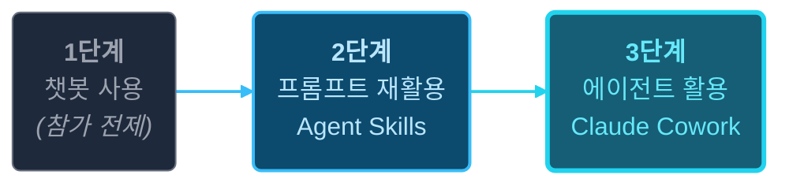
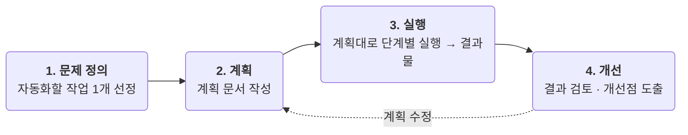

# AI 활용 온보딩

비개발자를 위한 AI 활용 교육

  <a href="https://github.com/scroogy-dev/ai-onboarding" target="_blank" class="slidev-icon-btn">
    <carbon:logo-github />
  </a>

<!--
환영 인사 + 본 교육의 청중(비개발자 임직원·학생/일반인)을 명확히 호명.
청중이 챗봇 AI 사용 경험은 있다는 가정을 환기 — 1단계는 통과한 상태에서 시작한다는 점을 자연스럽게 깐다.
-->

---
layout: default
---

# 오늘의 흐름

01

Who

누구를 위한 교육인가

02

Why

왜 AI 활용을 배워야 하나

03

What

얻어갈 것 — 결과물 1개

04

How

어떻게 진행되나

05

보안

안전한 AI 사용

<!--
오늘 90분 교육의 전체 흐름을 한눈에 보여주는 신호등.
docs SSoT의 H2 위계(Who → Why → What → How)와 정합 — 청중 정의 → 동기 부여 → 본 교육이 약속하는 것 → 진행 방식 순.
복잡한 다이어그램보다 간결한 목차 한 장으로 정렬.
-->

---
layout: section
---

# Who

누구를 위한 교육인가요?

---

# 교육 대상

이 교육은 **챗봇 AI를 한 번이라도 써 본 적이 있는 분**을 대상으로 합니다.

단순한 질의응답을 넘어, AI를 본인의 업무·학습에 **좀 더 적극적으로 활용**하고 싶은 분에게 적합합니다.

| 트랙 | 어떤 분인가요? |
|------|--------------|
| **임직원(비개발자)** | 사내 AI 도구를 사용할 수 있는 직장인 |
| **비개발자 학생·일반인** | 학습·생활에 AI를 더 활용하고 싶은 분 |

---

# 1단계 통과 — 공통 전제 + 자가 진단

두 트랙 모두 **챗봇 AI를 써 본 경험**이 있다고 가정합니다.
아래 3문항에 모두 **Yes**로 답할 수 있다면 **1단계는 통과한 상태**입니다.

☐

챗봇 AI에 한 번이라도 질문하고 답을 받아본 적이 있다

☐

질문이 잘 안 통할 때 표현을 바꿔서 다시 물어본 경험이 있다

☐

AI의 답이 부정확하거나 부족하다고 느낀 적이 있다

경험이 전혀 없다면 먼저 챗봇 AI를 몇 차례 사용해 본 뒤 참가하시길 권장합니다.

<!--
공통 전제(통보)를 자가 진단(능동 체크)과 결합 — 학습자가 자기 위치를 직접 인식.
"3문항 다 Yes" = 1단계 통과 — 본 교육이 2·3단계 초점이라는 What 섹션 흐름과 연결.
-->

---

# 학생 트랙 범위 안내

⚠️ **개발 진로를 희망하는 학생**은 본 교육의 **대상이 아닙니다.**

프로그래밍·개발에 특화된 별도 교육을 수강하시기를 권장합니다.

---

# 사전지식

✅ 요구합니다

- 기본 컴퓨터 조작 (파일 업·다운로드, 웹 브라우저)
- 기본적인 웹 검색
- 챗봇 AI와 짧은 대화를 해 본 경험

❌ 요구하지 않습니다

- 프로그래밍·코딩 지식
- 프롬프트 엔지니어링 이론
- 특정 AI 도구의 고급 기능 숙련도

---

# 준비사항 — Claude Pro 필수

⚠️ 본 교육의 **모든 실습은 Claude에서 진행**되며,
Claude Cowork · Code 사용을 위해
**Claude Pro 이상 유료 요금제가 반드시 필요합니다.**

- 요금제 안내: [claude.com/pricing](https://claude.com/pricing)
- 계정 생성·결제는 **교육 시작 전**에 미리 완료해 주세요

---

# 준비물 분담

**참가자가 준비**

- 개인 노트북 (웹 브라우저)
- 본인이 반복하는 업무·학습 작업 **1개 아이디어**
- **Claude Pro 이상 계정**
- **Claude Desktop 설치**
- (임직원) 사내 AI 도구 로그인 사전 확인

**강사가 준비** (참가자는 신경 쓰지 않아도 됩니다)

- 실습용 **가상 데이터** (개인정보 미포함)
- 실습 가이드 자료
- 진행 슬라이드

---
layout: section
---

# Why

왜 AI 활용을 배워야 할까요?

---
layout: center
class: text-center
---

AI 활용을 배워야 하는 이유 ①

# 시간 절약

나의 1시간은 얼마입니까?

매일 반복되는 하루 1시간을 아낄 수 있으면 **1년에 250시간**입니다.

(연평균 근무일수 250일 가정)

가장 소중한 자원은 <strong>시간</strong>입니다.

<!--
N-1 ① 시간 절약 — 즉각 효용 카피.
"하루 1시간 × 250일 = 250시간" 누적 환산은 비개발자 청중에게 가장 빠르게 와닿는 동기.
도발 톤 보존 — "당신의 1시간은 얼마입니까" 질문형으로 청중을 자기 시간 가치 계산에 끌어들임.
-->

---
layout: center
class: text-center
---

AI 활용을 배워야 하는 이유 ②

# 직업적 생존

AI는 나를 대체하지 않습니다. 
AI를 잘 쓰는 사람이 나를 대체합니다.

채용·평가·성과의 <strong>기준선</strong>이 빠르게 이동하고 있습니다.

<!--
N-1 ② 직업적 생존 — 위기감 카피.
임직원·학생 무관 통용. 학생도 취준·평가 맥락에서 체감 가능.
"AI를 잘 쓰는 사람이 나를 대체합니다" — 도발 톤 그대로 유지. 청중이 잠깐 멈칫하는 자리.
F-1 합의: 트랙 분리 없이 동일 강도.
-->

---
layout: center
class: text-center
---

AI 활용을 배워야 하는 이유 ③

# 능력의 확장

이제 코딩을 몰라도, 나의 일을 자동화할 수 있습니다.

대규모 시스템은 어려울 수 있지만,
본인 업무·학습·일상에 쓰는 
<strong>개인용 자동화(소프트웨어)</strong>는 비개발자에게도 열렸습니다.

<!--
N-1 ③ 능력의 확장 — 해결책 카피. 본 교육 본질 메시지(ADR-0005)의 직접 표현.
"자신의" 한정으로 대규모 개발 오해 회피 — "개인용 자동화" 명시.
다음 슬라이드(소프트웨어가 만드는 가치)로 자연 연결: "왜 이게 가치 있나" → 가치 3축으로.
-->

---

# 소프트웨어가 만드는 가치

우리가 매일 쓰는 소프트웨어는 **세 가지 방식**으로 가치를 만듭니다.

기능 제공

할 수 없거나 어려웠던 일을 **가능하게**

실시간 번역 · 네비게이션

시간 절약

사람이 하면 오래 걸리던 일을 **짧은 시간에**

기차표 예매 · 인터넷 뱅킹

비용 감소

사람·장소·이동 등에 드는 **비용 절감**

인터넷 뱅킹 (창구 인력 절감) · 키오스크 · 화상회의 (출장비 감소)

AI가 등장하면서 이 가치를 만드는 길이 <strong>비개발자에게도 열렸습니다.</strong>

<!--
W1 보존 (위계 ↓) — 개인 동기(N-1) 다음의 거시 배경.
마무리 한 줄("비개발자에게도 열렸습니다")은 W2 진입장벽 메시지를 흡수한 것 — 다음 What 섹션 본질 메시지로 자연 연결.
도구 우회 표현 회피, "소프트웨어"는 정직 사용.
-->

---
layout: section
---

# What

이 교육에서 얻어갈 것

---
layout: center
class: text-center
---

교육 목표

# 1개라도 실제로 반복해서 쓸 수 있는 것을 만든다

이론 학습이 아닌, 교육 후에도 활용 가능한 **결과물 1개**

💡 출발점은 <strong>본인이 매주 반복하는 30분짜리 작업 1개</strong>가 좋습니다.

<!--
이 교육 전체가 약속하는 단 하나의 결과물.
"많이 배우는 것"이 아니라 "1개를 끝까지 만드는 것"이 목표라는 점을 분명히 전달.
출발점 예시 한 줄(30분짜리 작업)로 "어떤 1개?"의 모호함을 손에 잡히는 단위로 구체화 (D-6).
이 약속 하나에 모든 실습 설계가 정렬되어 있다.
-->

---

# 어떤 접근을 쓸까요? — 결정 룰

① 직접 지시 (= 매번 시키기)

AI에게 그때그때 작업을 지시

**적합**: 1회성·탐색·변동 큰 작업

② 소프트웨어로 만들기 (본 교육이 강조하는 쪽)

AI로 작은 소프트웨어(Skill·에이전트 활용)를 만들어 활용

**적합**: 반복·일관성·재사용이 필요한 작업

<strong>왜 이 교육이 ②번을 강조하는지</strong> 한 단계씩 따라가 봅시다.

<!--
ADR-0005 본질 메시지 못박는 자리 — "도구화"의 근거를 결정 룰로 압축.
"특성: 매번 결과가 다름 / 동일한 품질로 반복 보장"은 다음 사다리 슬라이드 [3]·[4]가 결과형으로 다루므로 카드에서는 제거 — 결정 룰은 "언제 ①/언제 ②"의 분기 가이드 역할에 집중.
사다리 슬라이드로 자연 연결.
-->

---

# 매번 시키기 vs 소프트웨어로 만들기

[1]
출발은 누구나 같다

"AI에게 매번 새로 시키기"도 좋은 출발점 — 처음부터 본인의 챗봇이나 자동화 도구를 만드는 사람은 없습니다.

[2]
한 번으로 끝나지 않는 일들도 많다

매주 보고서, 매번 회의록, 매학기 학습 정리 — <strong>본인이 매일·매주 하는 일을 떠올려 보세요.</strong>

[3]
반복인데 매번 처음부터 시키면 비용이 누적된다

같은 지시 다시 입력 (시간) · 매번 결과가 조금씩 다름 (챗봇이 매번 답이 살짝 다른 그 느낌 — 품질 변동) · 매번 검수·수정 (이중 비용)

[4]
한 번 만들고 100번 쓰는 게 합리적

반복되는 일에는 <strong>본인 일에 맞는 작은 소프트웨어를 직접 만드는 것</strong>이 답입니다 — 비개발자도 자기 일에 필요한 소프트웨어를 만든다.

<!--
N-2 사다리 — F-2 합의 반영. ADR-0005 결과형 우회를 [3]에 자연 결합.
[3] ② "매번 결과가 조금씩 다름"은 LLM 비결정성을 결과형으로만 우회 — 메커니즘 노출 회피.
[4]는 W2가 가졌던 "비개발자도 작은 소프트웨어 만든다" 메시지를 흡수한 ADR-0005 본질 메시지의 못박는 자리.
다음 슬라이드(핵심 박스)로 한 번 더 정점.
-->

---
layout: center
class: text-center
---

# 핵심: 비개발자도 소프트웨어를 만든다

"AI에게 매번 시킨다" ❌

↓

"AI로 나만의 소프트웨어를 만들어 반복 자동화한다" ✅

<!--
ADR-0005 본질 메시지 못 ② 가시화 자리 — 사다리 [4] 결론을 한 화면으로 압축.
docs의 W3 quote 박스에 1:1 정합. ❌/✅ 시각 비교가 청중 인지에 박힘.
-->

---

# AI 활용 3단계와 내 위치

본 교육에서는 AI 활용을 다음 3단계로 구분해 설명합니다.

참가자는 대체로 **1단계는 통과한 상태**로 참여하며, 본 교육은 **2·3단계**에 초점을 맞춥니다.

<!--
ADR-0001의 핵심 모델 — 본 교육이 다루는 결과물의 단계.
What 섹션에 위치한 이유: 학습자 분류가 아니라 "교육이 다루는 범위·산출물의 단계"이기 때문.
다음 슬라이드(상세표)로 이어 단계별 차이를 풀어 설명.
2→3단계로 갈수록 "AI에게 시키는 일의 자동화 폭"이 넓어진다는 점을 강조.
-->

---

# 3단계 상세

| 단계 | 무엇을 하나요? | 대표 도구·기능 | 본 교육에서 |
|------|-------------|--------------|------------|
| **1단계 — 챗봇&nbsp;사용** | 단발성 대화로 답을 얻음 | Claude·Gemini·ChatGPT 웹&nbsp;챗봇 | **참가&nbsp;전제** (이미&nbsp;경험) |
| **2단계 — 프롬프트&nbsp;재활용** | 반복 사용 가능한 맞춤 프롬프트·챗봇을 자산으로 만듦 | **Agent&nbsp;Skills&nbsp;기초**, Claude&nbsp;Projects | **2단계&nbsp;실습** |
| **3단계 — 에이전트&nbsp;활용** | 로컬 파일·작업을 자동화하는 에이전트를&nbsp;운영함 | **Claude&nbsp;Cowork**, Claude&nbsp;Code | **3단계&nbsp;실습** |

> 💡 2단계에서 익히는 **프롬프트 재활용·Agent Skills** 개념은 3단계에서도 그대로 재활용됩니다.

---

# 1단계 vs 2단계 — 매번 vs 재사용

1단계 — 매번 새로 묻기

"고객 문의 이메일에 정중하고 친근한 톤으로, 짧게 답장해줘…"

→ 다음 답장도 **같은 지시를 처음부터 다시 입력**

2단계 — Skill로 묶어 재사용

"고객 답장" Skill을 1번 만들어두고
**호출만으로 동일 톤 유지**

→ 새 답장은 **본문 핵심만** 입력하면 끝

<!--
1↔2단계 차이의 첫 만남. "프롬프트 재활용" 추상어를 "이메일 답장 톤" 일상 작업에 연결.
청중에게 "지금 본인은 어디에 있나"를 자가 평가시키는 자리 — 자가 진단 슬라이드와 호응.
-->

---

# 어떤 결과물을 만들 수 있나요?

| 트랙 | 2단계 실습 결과물 예시 | 3단계 실습 결과물 예시 |
|------|--------------------|--------------------|
| 임직원 (비개발자) | 반복 보고서 자동 작성 템플릿, 데이터 정리·변환 워크플로우 | 로컬 파일을 일괄 정리·변환하는 에이전트 |
| 비개발자 학생·일반인 | AI 오답노트, 자동 문제 출제기, 엑셀 데이터 관리 템플릿 | 학습 자료를 로컬 폴더 단위로 정리·요약하는 에이전트 |

---

# 1·2단계 vs 3단계 — 묻기 vs 일 맡기기

1단계 — AI에게 묻기

"다운로드 폴더에 쌓인 파일 정리하는 방법 알려줘"

→ AI는 **방법만 알려주고**,
실제 정리는 사용자가 직접

2·3단계 — AI에게 일 맡기기

"다운로드 폴더의 PDF는 documents/, 이미지는 pictures/로 옮겨줘"

→ AI가 **직접 파일을 옮기고** 결과만 보고

<!--
1·2 → 3단계 차이의 핵심 — "AI가 일을 직접 수행한다"는 점.
폴더 정리는 비개발자 청중이 본인 PC에서 매번 미루는 일이라 공감 진입이 쉬움.
-->

---
layout: section
---

# How

어떻게 진행되나요?

---

# 실습 접근법: 계획 → 실행

긴 이론 학습 대신 **계획 문서를 작성한 뒤 단계별로 실행**

---

# 왜 계획부터 세우나요?

그냥 챗봇에 막 물어보는 것과 **무엇이 다른가** — 세 가지 이점이 있습니다.

01

생각이 정리·구체화됩니다

머릿속의 모호한 요구가 글로 쓰면 명확해집니다.

02

AI가 더 정확히 이해합니다

깨끗하게 정리된 계획으로 시작하면 답이 일관되고 대화가 길어지지 않습니다.

03

시간·비용도 절약됩니다

AI가 잘못 이해해서 다시 작업하면, <strong>작업 시간이 손쉽게 두 배가 됩니다.</strong>

"사람도 의사소통이 잘못되면 비용이 큽니다. AI에게도 마찬가지죠."

<!--
"그냥 챗봇에 물어보면 되는데 왜 계획?"이라는 학습자 의문에 대한 답.
LLM 메커니즘(컨텍스트·토큰)은 의도적으로 빼고 결과형으로 우회 — ADR-0005 원칙.
03번 톤다운(D-9): "다시 작업하는 비용이 의외로 큽니다" → "작업 시간이 손쉽게 두 배가 됩니다"로 결과형·구체화.
-->

---

# 막연한 vs 구조화된 프롬프트

막연한 프롬프트

"이 보고서 요약해줘"

→ AI가 **임의로 분량·관점**을 잡음
**매번 결과가 들쭉날쭉**

구조화된 프롬프트

"이 보고서를 3줄로 요약.
1줄은 결론, 2~3줄은 근거.
수치는 그대로 유지."

→ 매번 **같은 형식**의 일관된 결과

<!--
"계획 → 실행" 흐름과 직결 — 좋은 계획(구조화)이 좋은 결과를 부른다는 것.
청중이 평소 챗봇을 쓰는 방식("막연한 프롬프트")의 한계를 자기 경험으로 떠올리게 함.
-->

---

# 임직원 (비개발자) 실습

### 2단계 (예시) — Agent Skills로 자산화

- 반복 보고서 자동 작성
- 엑셀·CSV 데이터 정리·변환

### 3단계 (예시) — Claude Cowork로 로컬 자동화

- 로컬 파일 일괄 처리
- 문서 폴더 자동 정리

---

# 비개발자 학생·일반인 실습

### 2단계 (예시) — Agent Skills로 학습 자산화

- AI 오답노트
- 자동 문제 출제기
- 엑셀 데이터 관리 템플릿

### 3단계 (예시) — Claude Cowork로 학습 자료 자동화

- 수업 자료·학습 노트를 로컬 폴더 단위로 정리·요약

---

# 실행 안내

각 트랙에서 **2·3단계 실습을 각각 준비**합니다.
참가자의 사전 경험과 목표에 맞춰 강사가 실습 경로를 안내합니다.

> 💡 각 실습의 **상세 시나리오·절차**는 별도 페이지로 제공될 예정입니다.

---
layout: section
---

# 보안 및 개인정보

AI 도구를 안전하게 쓰기 위한 핵심 원칙

<!--
docs/security-guide.md의 핵심 메시지를 발표 청중에게 전달하는 섹션 (Issue #12).
본 흐름(Who/Why/What/How)이 끝난 뒤 마지막 강조 메시지로 배치 — docs nav에서 security-guide가
본 콘텐츠와 나란히 놓인 독립 페이지인 위상과 정렬.
-->

---

# 공통 원칙 — 트랙 무관 동일

⚠️ **AI에 입력하는 모든 내용은 "누군가 볼 수 있다"고 가정하세요.**

엔터프라이즈 환경이라도 이 기본 태도는 유지합니다.

도구·버전은 계속 바뀌지만 **보안 원칙은 동일**합니다.
입력 단계에서 민감한 정보를 넣지 않는 것이 가장 확실한 보호 방법입니다.

---

# 절대 입력하면 안 되는 정보

| 구분 | 예시 |
|------|------|
| **개인 식별 정보** | 주민등록번호, 여권번호, 운전면허번호 |
| **금융 정보** | 카드번호, 계좌번호 |
| **인증 정보** | 비밀번호, API 키, 인증 토큰 |
| **타인의 개인정보** | 타인 이름·연락처 조합, 동의받지 않은 타인 사진 |

> 위 정보는 **트랙 무관 공통 금지** — 엔터프라이즈 환경에서도 동일하게 적용

---

# 결과물 검증 · 문제 발생 시

**AI 결과물 검증**

- 사실 확인 필요한 내용(뉴스·통계·법률·의학)은 **원본 출처 별도 확인**
- 외부 공유 전 **회사·기관·학교 기준에 맞는 검토**
- AI 산출물에 **사내·개인정보 포함 여부** 한 번 더 점검

**문제 발생 시**

- **임직원**: 회사의 **보안사고 신고 프로세스**에 따름
- **학생·일반인**: 해당 AI의 **대화 삭제·히스토리 비활성화** 즉시 사용

> AI 환각(hallucination)으로 잘못된 사실을 그럴듯하게 만들어내는 경우가 있으므로 검증은 필수

---

# 임직원 — 엔터프라이즈 AI는 안전한가?

회사 AI 도구는 **회사가 별도 계약을 맺고 운영하는 환경**입니다.

- **데이터 학습 제외** — 입력 내용이 모델 학습에 사용되지 않음
- **데이터 격리** — 우리 회사 데이터는 다른 회사와 분리되어 처리
- **접근 통제** — 회사 계정으로만 접근, 사용 이력 관리

위 세 가지 보호 장치는 "입력한 내용이 처리되는 방식"에 대한 것이며,
**"무엇을 입력해도 안전하다"는 뜻이 아닙니다.**

---

# 임직원 — 그래도 지켜야 할 것

1. **대외비·기밀 문서 보안 등급 확인** — 사내 AI 사용 허용 등급인지 보안 정책 따르기
2. **개인정보 포함 데이터는 가리거나 빼고 입력** — 전문 용어로 **"비식별 처리"**
3. **결과물 외부 공유 주의** — 사내 정보 포함 여부 검토 후 공유

회사 계약은 <strong>데이터가 처리되는 방식</strong>만 보호합니다 — <strong>입력하는 정보의 책임은 여전히 본인에게</strong> 있습니다.

**비식별 처리 예시**

- `홍길동 (010-1234-5678)` → `A고객 (○○○-○○○○-○○○○)`
- 고객번호 열은 일련번호로 치환

> 💡 한 줄 요약: 사내 AI는 안전하게 설계되어 있지만, **"입력 전에 한 번 더 생각하기"** 습관은 여전히 중요

---

# 학생·일반인 — 무료 AI 도구의 특성

무료로 제공되는 AI 도구는 엔터프라이즈 환경과 **다릅니다.**

- 입력 내용이 **서비스 개선에 활용**될 수 있음 — 예: 본인이 입력한 대화가 **다른 사람을 위한 학습 데이터로 쓰일 수 있음**
- 대화 내용이 **서버에 저장**될 수 있음
- 보안 수준이 **유료·기업용보다 낮을 수** 있음

본 교육 실습은 **Claude Pro(유료)** 를 사용하지만,
평소 쓰는 다른 무료 AI에도 **같은 원칙이 적용**됩니다.

---

# 학생·일반인 — 꼭 지켜야 할 4가지

**1. 내 개인정보 X**

이름·전화번호·주소·학번 입력 금지.
"내 이름은 OOO이고 OO학교 다녀" 같은 자연스러운 노출도 주의.

**2. 타인 정보 X**

친구·가족·선생님의 이름·연락처 입력 금지.
동의받지 않은 타인 사진(단체 사진 등) 업로드 금지.

**3. 사진 속 개인정보 확인**

이름표·학생증·배경 주소판이 보이지 않는지 확인 후 업로드.

**4. 서비스 약관 확인**

특히 **"입력 데이터가 학습에 활용되는지"** 항목은 한 번은 확인.

> 💡 한 줄 요약: 무료 AI는 편리하지만, **"나와 다른 사람의 개인정보는 절대 입력하지 않기"**

---

# 정리 — 트랙별 적용

| 원칙 | 임직원 | 학생·일반인 |
|------|:--------:|:------------:|
| 개인 식별 정보 입력 금지 | ✅ | ✅ |
| 타인 개인정보 입력 금지 | ✅ | ✅ |
| 사진 속 개인정보 확인 | ✅ | ✅ |
| 비식별 처리 | ✅ | ✅ |
| AI 결과물 원본 검증 | ✅ | ✅ |
| AI 결과물 외부 공유 전 검토 | ✅ | ✅ |
| 문서 보안 등급 확인 | ✅ (사내 문서) | — |
| 서비스 약관 확인 | — (회사가 계약) | ✅ |

범례: ✅ 반드시 준수 / — 해당 없음 또는 트랙 특성상 적용 수준이 다름

---
layout: end
---

# 감사합니다

<!--
Q&A 시간 안내. 질문이 있으면 끝나고 강사에게 직접 또는 사후 채널로 받겠다고 안내.
-->

