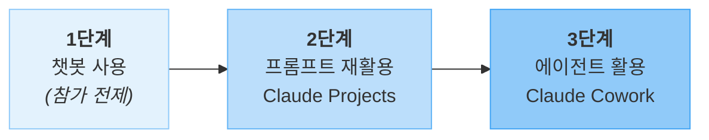
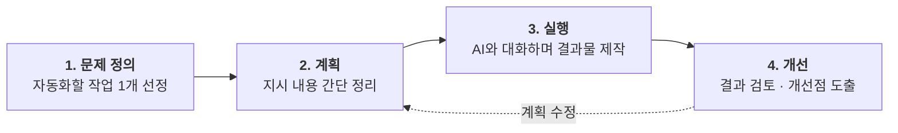

# AI 활용 온보딩

비개발자를 위한 AI 활용 교육

  <a href="https://github.com/scroogy-dev/ai-onboarding" target="_blank" class="slidev-icon-btn">
    <carbon:logo-github />
  </a>

<!--
환영 인사 + 본 교육의 청중(비개발자 임직원·학생/일반인)을 명확히 호명.
청중이 챗봇 AI 사용 경험은 있다는 가정을 환기 — 1단계는 통과한 상태에서 시작한다는 점을 자연스럽게 깐다.
-->

---
layout: section
---

# Why

왜 AI를 배워야 할까요?

---

# 소프트웨어가 만드는 가치

우리가 매일 쓰는 소프트웨어는 **세 가지 방식**으로 가치를 만듭니다.

- **기능 제공** — 이전에는 불가능했던 일을 가능하게 함
  - 예: 실시간 번역, 자동 요약
- **시간 절약** — 수작업 30분이 몇 초로
  - 예: 데이터 정리, 보고서 서식 변환
- **비용 감소** — 외부 의뢰·전문 인력 없이도 결과물 생성
  - 예: 간단한 이미지 편집, 문서 번역

---

# AI가 바꾸는 것

소프트웨어를 만드는 **대부분의 경우** 지금까지는 프로그래밍 언어를 배워야 했습니다.
**AI는 이 진입장벽을 크게 낮춥니다.**

- 코딩을 몰라도 **자연어(일상 언어)로 지시**하면 결과물을 얻을 수 있음
- 복잡한 도구를 익히지 않아도 **대화형으로 작업**을 진행할 수 있음
- 전문가 수준은 아니더라도 **실용적인 산출물**을 직접 만들 수 있음

---
layout: statement
---

# 핵심은 도구의 역할 변화

"AI가 일을 대신 해준다" ❌

→ **"AI 덕분에 내가 직접 할 수 있게 된다"** ✅

---
layout: section
---

# Who

누구를 위한 교육인가요?

---

# 교육 대상

이 교육은 **챗봇 AI를 한 번이라도 써 본 적이 있는 분**을 대상으로 합니다.

단순한 질의응답을 넘어, AI를 본인의 업무·학습에 **좀 더 적극적으로 활용**하고 싶은 분에게 적합합니다.

| 트랙 | 어떤 분인가요? |
|------|--------------|
| **임직원(비개발자)** | 사내 AI 도구를 사용할 수 있는 직장인 |
| **비개발자 학생·일반인** | 학습·생활에 AI를 더 활용하고 싶은 분 |

> 두 트랙 모두 챗봇 AI(Claude·Gemini·ChatGPT 등)를 써 본 경험이 있다고 가정합니다.

---

# 학생 트랙 범위 안내

⚠️ **개발 진로를 희망하는 학생**은 본 교육의 **대상이 아닙니다.**

프로그래밍·개발에 특화된 별도 교육을 수강하시기를 권장합니다.

---

# AI 활용 3단계와 내 위치

본 교육에서는 AI 활용을 다음 3단계로 구분해 설명합니다.

참가자는 대체로 **1단계는 통과한 상태**로 참여하며, 본 교육은 **2·3단계**에 초점을 맞춥니다.

<!--
ADR-0001의 핵심 모델 — 본 교육의 기준점이 되는 슬라이드.
청중에게 "본인이 지금 몇 단계인지" 자가 평가를 유도. 다음 슬라이드(상세표)로 이어 단계별 차이를 풀어 설명.
2→3단계로 갈수록 "AI에게 시키는 일의 자동화 폭"이 넓어진다는 점을 강조.
-->

---

# 3단계 상세

| 단계 | 무엇을 하나요? | 대표 도구·기능 | 본 교육에서 |
|------|-------------|--------------|------------|
| **1단계 — 챗봇&nbsp;사용** | 단발성 대화로 답을 얻음 | Claude·Gemini·ChatGPT 웹&nbsp;챗봇 | **참가&nbsp;전제** |
| **2단계 — 프롬프트&nbsp;재활용** | 맞춤 챗봇·프롬프트를 자산으로 만듦 | **Claude&nbsp;Projects**, Agent&nbsp;Skills&nbsp;기초 | **2단계&nbsp;실습** |
| **3단계 — 에이전트&nbsp;활용** | 로컬 파일·작업을 자동화하는 에이전트&nbsp;운영 | **Claude&nbsp;Cowork**, Claude&nbsp;Code | **3단계&nbsp;실습** |

> 💡 2단계에서 익히는 **프롬프트 재활용·Agent Skills** 개념은 3단계에서도 그대로 재활용됩니다.

---

# 사전지식

### ✅ 요구합니다

- 기본 컴퓨터 조작 (파일 업·다운로드, 웹 브라우저)
- 기본적인 웹 검색
- 챗봇 AI와 짧은 대화를 해 본 경험

### ❌ 요구하지 않습니다

- 프로그래밍·코딩 지식
- 프롬프트 엔지니어링 이론
- 특정 AI 도구의 고급 기능 숙련도

---

# 준비사항 — Claude Pro 필수

⚠️ 본 교육의 **모든 실습은 Claude에서 진행**되며,
Claude Projects · Cowork · Code 사용을 위해
**Claude Pro 이상 유료 요금제가 반드시 필요합니다.**

- 요금제 안내: [claude.com/pricing](https://claude.com/pricing)
- 계정 생성·결제는 **교육 시작 전**에 미리 완료해 주세요

---

# 준비물 분담

### 참가자가 준비

- 개인 노트북 (웹 브라우저)
- 본인이 반복하는 업무·학습 작업 **1개 아이디어**
- **Claude Pro 이상 계정**
- (임직원) 사내 AI 도구 로그인 사전 확인

### 강사가 준비

- 실습용 **가상 데이터** (개인정보 미포함)
- 실습 가이드 자료
- 진행 슬라이드

---
layout: section
---

# What

이 교육에서 얻어갈 것

---
layout: center
class: text-center
---

교육 목표

# 1개라도 실제로 반복해서 쓸 수 있는 것을 만든다

이론 학습이 아닌, 교육 후에도 활용 가능한 **결과물 1개**

<!--
이 교육 전체가 약속하는 단 하나의 결과물.
"많이 배우는 것"이 아니라 "1개를 끝까지 만드는 것"이 목표라는 점을 분명히 전달.
이 약속 하나에 모든 실습 설계가 정렬되어 있다.
-->

---

# 어떤 결과물을 만들 수 있나요?

| 트랙 | 2단계 실습 결과물 예시 | 3단계 실습 결과물 예시 |
|------|--------------------|--------------------|
| 임직원 (비개발자) | 반복 보고서 자동 작성 템플릿, 데이터 정리·변환 워크플로우 | 로컬 파일을 일괄 정리·변환하는 에이전트 |
| 비개발자 학생·일반인 | AI 오답노트, 자동 문제 출제기, 엑셀 데이터 관리 템플릿 | 학습 자료를 로컬 폴더 단위로 정리·요약하는 에이전트 |

---
layout: section
---

# How

어떻게 진행되나요?

---

# 실습 접근법: 계획 → 실행

긴 이론 강의 대신 **"최소한의 계획을 세우고 바로 실행"**

---

# 임직원 (비개발자) 실습

### 2단계 — Claude Projects로 자산화

- 반복 보고서 자동 작성
- 엑셀·CSV 데이터 정리·변환

### 3단계 — Claude Cowork로 로컬 자동화

- 로컬 파일 일괄 처리
- 문서 폴더 자동 정리

---

# 비개발자 학생·일반인 실습

### 2단계 — Claude Projects로 학습 자산화

- AI 오답노트
- 자동 문제 출제기
- 엑셀 데이터 관리 템플릿

### 3단계 — Claude Cowork로 학습 자료 자동화

- 수업 자료·학습 노트를 로컬 폴더 단위로 정리·요약

---

# 실행 안내

각 트랙에서 **2·3단계 실습을 각각 준비**합니다.
참가자의 사전 경험과 목표에 맞춰 강사가 실습 경로를 안내합니다.

> 💡 각 실습의 **상세 시나리오·절차**는 별도 페이지로 제공될 예정입니다.

---
layout: end
---

# 감사합니다

<!--
Q&A 시간 안내. 질문이 있으면 끝나고 강사에게 직접 또는 사후 채널로 받겠다고 안내.
-->

