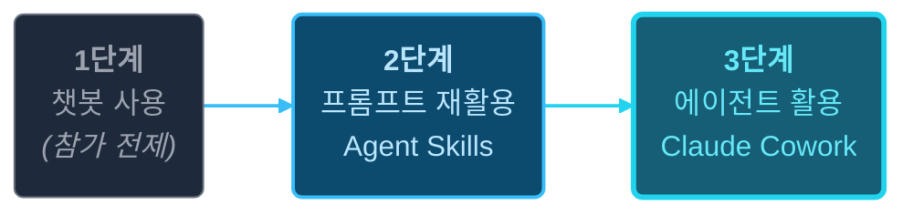
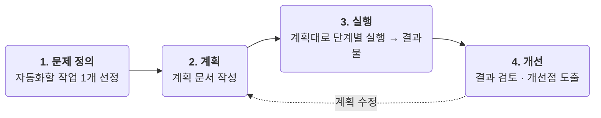

# AI 활용 온보딩

비개발자를 위한 AI 활용 교육

  <a href="https://github.com/scroogy-dev/ai-onboarding" target="_blank" class="slidev-icon-btn">
    <carbon:logo-github />
  </a>

<!--
환영 인사 + 본 교육의 청중(비개발자 임직원·학생/일반인)을 명확히 호명.
청중이 챗봇 AI 사용 경험은 있다는 가정을 환기 ― 1단계는 통과한 상태에서 시작한다는 점을 자연스럽게 깐다.
-->

---
layout: default
---

# 오늘의 흐름

01

Who

누구를 위한 교육인가

02

Why

왜 AI 활용을 배워야 하나

03

기본 용어와 범위

챗봇·에이전트, 모델+하네스

04

도구와 제품

생성형 AI 지형과 Claude

05

What

얻어갈 것 ― 스스로 만드는 능력

06

How

어떻게 진행되나

07

보안

안전한 AI 사용

<!--
오늘 90분 교육의 전체 흐름을 한눈에 보여주는 신호등.
docs SSoT 정합 ― Who → Why → [기본 용어와 범위 → 도구와 제품] → What → How → 보안. 개념(basics)·도구(intro)는 docs에선 별도 참조 페이지지만, 선형 강의에선 What·How가 기대는 어휘라 Why와 What 사이에 먼저 깐다.
복잡한 다이어그램보다 간결한 목차 한 장으로 정렬.
-->

---
layout: section
---

# Who

누구를 위한 교육인가요?

---

# 교육 대상

이 교육은 **챗봇 AI를 한 번이라도 써 본 적이 있는 분**을 대상으로 합니다.

단순한 질의응답을 넘어, AI를 본인의 업무·학습에 **좀 더 적극적으로 활용**하고 싶은 분에게 적합합니다.

| 트랙 | 어떤 분인가요? |
|------|--------------|
| **임직원(비개발자)** | 사내 AI 도구를 사용할 수 있는 직장인 |
| **비개발자 학생·일반인** | 학습·생활에 AI를 더 활용하고 싶은 분 |

---

# 공통 전제 + 자가 진단

두 트랙 모두 **챗봇 AI를 써 본 경험**이 있다고 가정합니다.
아래 3문항에 모두 **Yes**로 답할 수 있다면 **본 교육에 참여하실 수 있습니다.**

☐

챗봇 AI에 한 번이라도 질문하고 답을 받아본 적이 있다

☐

질문이 잘 안 통할 때 표현을 바꿔서 다시 물어본 경험이 있다

☐

AI의 답이 부정확하거나 부족하다고 느낀 적이 있다

경험이 전혀 없다면 먼저 챗봇 AI를 몇 차례 사용해 본 뒤 참가하시길 권장합니다.

<!--
공통 전제(통보)를 자가 진단(능동 체크)과 결합 ― 학습자가 자기 위치를 직접 인식.
"3문항 다 Yes" = 1단계 통과 ― 본 교육이 2·3단계 초점이라는 What 섹션 흐름과 연결.
-->

---

# 학생 트랙 범위 안내

⚠️ **개발 진로를 희망하는 학생**은 본 교육의 **대상이 아닙니다.**

프로그래밍·개발에 특화된 별도 교육을 수강하시기를 권장합니다.

---

# 본 교육이 강화하는 역량 ― 개인

AI 활용으로 강화할 수 있는 역량은 **세 갈래**입니다.

- **개인 역량 강화** ― 본인의 업무·학습·일상 효율 *(본 교육의 초점)*
- **조직 역량 강화** ― 팀·전사 차원의 AI 도입·거버넌스
- **제품·서비스 역량 강화** ― 자사 제품·서비스에 AI 기능을 제품화

본 교육은 **개인 역량 강화**에 집중합니다. 조직 도입·제품화는 본 교육 범위 밖입니다.

---

# 사전지식

✅ 요구합니다

- 기본 컴퓨터 조작 (파일 업·다운로드, 웹 브라우저)
- 기본적인 웹 검색
- 챗봇 AI와 짧은 대화를 해 본 경험

❌ 요구하지 않습니다

- 프로그래밍·코딩 지식
- 프롬프트·컨텍스트·하네스 엔지니어링 이론
- 특정 AI 도구의 고급 기능 숙련도

---

# 준비사항 ― 유료 플랜 필수 (트랙별로 다름)

⚠️ 모든 실습은 Claude에서 진행 ― Cowork · Code 사용에 **유료 플랜이 반드시 필요합니다.**

**학생·일반인 (개인)**

**Claude Pro 이상** (Pro·Max) 개인 플랜

**임직원 (회사 업무)**

❌ **개인 플랜 절대 금지** (무료·유료) → **반드시 회사 Team / Enterprise**

플랜 안내: [claude.com/pricing](https://claude.com/pricing) · 계정·결제(임직원은 사내 계정 발급)는 **교육 시작 전** 완료

<!--
임직원은 개인 플랜 전부(무료·Pro·Max) 금지 ― 회사 계정으로 가입했더라도 개인 플랜이면 금지. 회사 업무·자료를 개인 플랜에서 다루지 않기 위함. 회사가 계약한 Team/Enterprise로만 진행. 배경은 보안 파트 「엔터프라이즈 AI」 슬라이드와 정합.
-->

---

# 준비물 분담

**참가자가 준비**

- 개인 노트북 (웹 브라우저)
- 본인이 반복하는 업무·학습 작업 **1개 아이디어**
- **유료 Claude 플랜** ― 개인 Pro↑ / **임직원 회사 Team·Enterprise (❌ 개인 플랜 절대 금지)**
- **Claude Desktop 설치**
- (임직원) 사내 AI 도구 로그인 사전 확인

**강사가 준비** (참가자는 신경 쓰지 않아도 됩니다)

- 실습용 **가상 데이터** (개인정보 미포함)
- 실습 가이드 자료
- 진행 슬라이드

---
layout: section
---

# Why

왜 AI 활용을 배워야 할까요?

---
layout: center
class: text-center
---

AI 활용을 배워야 하는 이유 ①

# 시간 절약

나의 1시간은 얼마입니까?

매일 반복되는 하루 1시간을 아낄 수 있으면 **1년에 250시간**입니다.

(연평균 근무일수 250일 가정)

가장 소중한 자원은 <strong>시간</strong>입니다.

<!--
N-1 ① 시간 절약 ― 즉각 효용 카피.
"하루 1시간 × 250일 = 250시간" 누적 환산은 비개발자 청중에게 가장 빠르게 와닿는 동기.
도발 톤 보존 ― "당신의 1시간은 얼마입니까" 질문형으로 청중을 자기 시간 가치 계산에 끌어들임.
-->

---
layout: center
class: text-center
---

AI 활용을 배워야 하는 이유 ②

# 직업적 생존

AI는 나를 대체하지 않습니다. 
AI를 잘 쓰는 사람이 나를 대체합니다.

채용·평가·성과의 <strong>기준선</strong>이 빠르게 이동하고 있습니다.

<!--
N-1 ② 직업적 생존 ― 위기감 카피.
임직원·학생 무관 통용. 학생도 취준·평가 맥락에서 체감 가능.
"AI를 잘 쓰는 사람이 나를 대체합니다" ― 도발 톤 그대로 유지. 청중이 잠깐 멈칫하는 자리.
F-1 합의: 트랙 분리 없이 동일 강도.
-->

---
layout: center
class: text-center
---

AI 활용을 배워야 하는 이유 ③

# 능력의 확장

이제 코딩을 몰라도, 나의 일을 자동화할 수 있습니다.

대규모 시스템은 어려울 수 있지만,
본인 업무·학습·일상에 쓰는 
<strong>개인용 자동화(소프트웨어)</strong>는 비개발자에게도 열렸습니다.

<!--
N-1 ③ 능력의 확장 ― 해결책 카피. 본 교육 본질 메시지(ADR-0005)의 직접 표현.
"자신의" 한정으로 대규모 개발 오해 회피 ― "개인용 자동화" 명시.
다음 슬라이드(소프트웨어가 만드는 가치)로 자연 연결: "왜 이게 가치 있나" → 가치 3축으로.
-->

---

# 소프트웨어가 만드는 가치

우리가 매일 쓰는 소프트웨어는 **세 가지 방식**으로 가치를 만듭니다.

기능 제공

할 수 없거나 어려웠던 일을 **가능하게**

실시간 번역 · 네비게이션

시간 절약

사람이 하면 오래 걸리던 일을 **짧은 시간에**

기차표 예매 · 인터넷 뱅킹

비용 감소

사람·장소·이동 등에 드는 **비용 절감**

인터넷 뱅킹 · 키오스크 · 화상회의

AI가 등장하면서 이 가치를 만드는 길이 <strong>비개발자에게도 열렸습니다.</strong>

<!--
W1 보존 (위계 ↓) ― 개인 동기(N-1) 다음의 거시 배경.
마무리 한 줄("비개발자에게도 열렸습니다")은 W2 진입장벽 메시지를 흡수한 것 ― 다음 What 섹션 본질 메시지로 자연 연결.
도구 우회 표현 회피, "소프트웨어"는 정직 사용.
-->

---
layout: section
---

# 기본 용어와 범위

챗봇·에이전트, 모델+하네스, 결과물의 성격

<!--
docs 「기본 용어와 범위」(basics.md) 정합 ― 개념 블록 오프너. Why → [개념 → 도구] → What 흐름의 앞단.
핵심 개념(챗봇/에이전트 · 모델+하네스 · 결과물의 성격 · 마크다운/외부컨텍스트)을 먼저 깐다.
docs S5 축 재분류(개념 vs 도구)에 맞춰 이어지는 「도구와 제품」 섹션과 분리. 선형 강의 특성상 What·How가 기대는 어휘를 여기서 먼저 깔고, What 섹션의 「3단계 모델」이 이 어휘를 학습 단계로 매핑한다.
-->

---

# 챗봇 vs 에이전트 ― 「물어보기」 vs 「맡기기」

챗봇 ― 물어보기

사람이 묻고 AI가 답합니다

실제 처리는 **사람이 직접**

**본 교육: 1단계** (참가 전제)

에이전트 ― 맡기기

AI가 직접 파일을 열고 작업

사람은 **목표만 정해 주고 검토**

**본 교육: 3단계** (Claude Cowork)

같은 일을 매번 시키지 않고 <strong>한 번 맡기게</strong> 만드는 것이 본 교육의 방향입니다.

<!--
시장 분류 차원의 「챗봇 vs 에이전트」 ― 물어보기 vs 맡기기의 차이를 여기(개념 블록)서 한 번만 정의. 단계 매핑은 What 섹션 「3단계 모델」이 1·2·3단계로 풀어냄(중복 슬라이드 제거, docs S5 "한 집" 정합).
이 슬라이드가 어휘(챗봇/에이전트)를 깔고, 구체 적용은 모델+하네스와 What 3단계로 이어짐.
-->

---

# 에이전트 = 모델 + 하네스

앞의 「챗봇 vs 에이전트」에서 본 그 <strong>에이전트</strong>는 무엇으로 이뤄져 있을까요? 딱 두 부분입니다.

모델 ― 생각하는 머리

똑똑하지만 **틀릴 수 있고**, 매번 답이 조금씩 다를 수 있는 부분.

만드는 회사는 여럿 (Anthropic·OpenAI·Google) ― 실습은 Claude.

하네스 ― 사람이 짜 둔 틀

어떤 도구·자료를 쓸지, 어떤 순서로, 결과를 어디서 확인할지.

**대부분 이미 있는 걸 고르고·잇고·정하는 일** ― 내 몫은 얇습니다.

<strong>⚠ 흔한 오해</strong> ― "에이전트끼리 알아서 회의하면 좋은 결론이 나온다" → <strong>아닙니다.</strong> 틀은 사람이 설계했고, 모델은 틀릴 수 있으며, 좋은 결론은 <strong>틀을 짠 사람 + 검토한 사람</strong>이 만듭니다.

<!--
이슈 #42 본체 ― docs/basics.md 「에이전트 = 모델 + 하네스」 슬라이드 압축.
핵심: 에이전트 자율성 오해 해소 ― 좋은 결과는 창발이 아니라 「조립 + 사람 검토」.
앞 「챗봇 vs 에이전트」(에이전트=맡기기)에서 이어짐 ― 그 에이전트가 무엇으로 이뤄졌나.
하네스 출처는 셋(회사 제품·모델 / 외부 서비스 연결 / 내 설정)이지만 슬라이드는 「사람이 짜 둔 틀」로 압축.
멀티에이전트 긍정 사례(역할 분업 + 명시적 기준 + 사람 검토)는 발화로 보충 ― 단일 에이전트로도 핵심 획득 가능.
viewport 점검 필요 ― 2카드 + 오해 박스가 한 화면에 들어가는지 사용자 확인.
-->

---

# 결과물의 성격 ― 1회성 · 스킬 · 애플리케이션

<strong>⚠ 생성형 AI는 기본적으로 비결정적입니다</strong> ― 같은 지시에도 매번 답이 조금씩 다를 수 있습니다.

| | 1회성 프롬프트 | 에이전트 스킬 *(본 교육)* | 애플리케이션 *(소프트웨어)* |
|---|---|---|---|
| **무엇** | 챗봇에 그때그때 입력하는 한 번짜리 지시 | 자주 쓰는 프롬프트·절차를 재사용 자산으로 묶음 | 코드로 작성된 프로그램 |
| **결정성** | 비결정 | 비결정 *(내부 LLM)* | 결정 |
| **결과 일관성** | 매번 결과가 조금씩 다름 | 형식·접근 보장 *(값은 다를 수 있음)* | 동일 입력 → 동일 출력 |
| **만드는 비용·누가** | 없음 ― 누구나 즉시 | 낮음 ― **비개발자도 직접** | 큼 ― 설계·코드·테스트 필요 |
| **언제 적합** | 일회성·탐색·맥락이 매번 다른 작업 | 반복되는 동일 패턴 작업 | 대규모·다수 사용자·결정적 신뢰성 |

<strong>에이전트 스킬</strong>은 두 끝점 사이 ― 비개발자가 만들 수 있는 비용 + 반복 일관성 보장

<!--
docs/basics.md 「결과물의 성격」(구 「AI 활용의 세 형태」) 슬라이드 압축 (이슈 #40) ― ADR-0002 단방향 파생. 이름 개명은 「AI 활용 3단계」와의 echo 제거(이슈 #42).
ADR-0005 §3 운용 변경 후속 ― 본문 기본은 결과형 유지, 「비결정」 메커니즘 단어 명시는 이 슬라이드 1곳에 한정(단정 박스 + 표 「결정성」 행 두 자리).
nav 위치(개념 블록): 「에이전트 = 모델 + 하네스」 직후, 「기본 용어와 범위」 카드 앞 ― docs basics 개념 순서(챗봇/에이전트 → 모델+하네스 → 결과물의 성격) 정합. 「3단계」와 다른 컷임은 뒤따르는 3단계 슬라이드에서 back-ref.
viewport 점검 필요 ― 5축×3종 표가 가로폭·세로폭에 다 들어가는지 사용자 확인.
-->

---

# 그 밖의 기본 용어 ― 마크다운 · 외부 컨텍스트

> 사이트·슬라이드에서 만나게 될 **두 용어**와, **본 강의가 다루지 않는 영역**을 한 번에 짚습니다.

마크다운

텍스트만으로 서식을 표현하는 가벼운 문서 형식. <code>.md</code>, AI 출력 포맷의 단골.

<code>#&nbsp;제목</code> → 큰 제목, <code>**굵게**</code> → **굵게**.

→ **문법 학습은 안 합니다.**

외부 컨텍스트 ― MCP·RAG

내 자료를 AI에 붙여 답하게 하는 **일반 개념**.

**MCP** (Model Context Protocol) ― 어떻게 연결. 
**RAG** (Retrieval-Augmented Generation) ― 무엇을 하느냐.

→ **설치·내부 구조 모두 범위 밖.**

사이트 페이지: <code>기본 용어와 범위</code> ― 더 자세히 짚을 수 있습니다.

<!--
docs/basics.md 「기본 용어와 범위」 페이지 1장 압축 ― ADR-0002 단방향 파생.
두 용어(마크다운 / 외부 컨텍스트)를 가로 2분할 카드로 한 슬라이드에 묶음. (바이브↔에이전틱은 docs와 함께 제거 ― 비개발자 실익 낮음)
메타 원칙 5장(②blue / ③purple / ④teal / ⑤emerald·amber)과는 색상(slate 회색조)·비중(작은 카드 2분할) 분리 ― 「원칙」이 아닌 「용어 해소·범위 밖 안내」 결.
청중 메시지: 「이 단어들이 본 강의에 나오면 멈추지 마세요. 다만 본격 학습·설치·내부 구조는 본 강의 밖입니다.」
nav 위치(개념 블록 끝): 「결과물의 성격」 직후, 도구 블록(Claude 3종) 앞. docs는 개념(기본 용어와 범위) → 도구(도구와 제품) 순으로 정합.
-->

---
layout: section
---

# 도구와 제품

생성형 AI 지형과 Claude

<!--
docs 「도구와 제품」(intro.md) 정합 ― 도구 블록 오프너. 개념 블록(기본 용어와 범위) 다음, docs S5 축 재분류(개념 vs 도구)에 맞춰 분리.
구성: 시장 지형(제품 지형) → Claude 3종 → 기능비교 → 모델 → 사용량 확인 (docs intro 순서 정합).
-->

---

# 챗봇은 다 아는데... 짝꿍 에이전트는?

| 회사 | AI 챗봇 (보통 아는 것) | AI 코딩 에이전트 |
|------|----------------------|------------------|
| **Anthropic** | **Claude** | **Claude Code** |
| Google | Gemini | Antigravity |
| OpenAI | ChatGPT | Codex |

같은 회사의 챗봇과 에이전트는 **짝으로 묶여** 있습니다 ― 청중이 챗봇은 익숙해도, **본격 자동화 무대인 에이전트** 쪽은 잘 모르는 경우가 많습니다.

> Anthropic은 비개발자용 에이전트 **Claude Cowork**도 함께 제공 ― 본 교육 3단계 본격 도구.

<!--
시장 좌표 정렬(도구 블록 오프너): 챗봇 3사는 다 아는 것, 짝꿍 에이전트가 새로 도입할 개념. 개념 블록에서 정의한 챗봇/에이전트를 실제 시장 제품으로 확장하는 자리.
표 헤더에서 「AI 챗봇」·「AI 코딩 에이전트」로 한 번 결합 안내 ― 본문은 짧은 형태(챗봇/에이전트) 유지.
본 교육이 Anthropic 짝을 쓰는 이유는 Cowork(비개발자용 에이전트)의 존재 ― 이 한 줄로 다음 슬라이드(본 교육의 도구 ― Claude 3종)로 진입.
1단계 챗봇 경험은 Claude/Gemini/ChatGPT 어느 것이든 비슷한 감각을 준다는 점은 발화로 보충.
-->

---

# 본 교육의 도구 ― Claude 3종

| 제품 | 무엇 | 본 교육 단계 |
|------|------|------------|
| **claude.ai** | 웹·모바일 챗봇 | 1단계 (참가 전제) |
| **Claude Cowork** | 데스크톱 범용 에이전트 | **3단계 본격 실습** |
| **Claude Code** | 터미널·IDE 코딩 에이전트 | 3단계 보조 (옵션) |

> Cowork·Code는 **유료 플랜 + Claude Desktop** 필요 (개인 Pro↑·임직원 회사 Team/Enterprise) ― Who 섹션의 「준비사항」 슬라이드에서 다룸.

<!--
ADR-0001 정합 ― Claude 단독·3단계 모델.
docs/intro.md의 3종 비교표를 슬라이드 압축. 「무엇 / 단계」만 한 줄.
Cowork이 3단계 본격 무대, Code는 진입 장벽이 있어 옵션 안내라는 점이 핵심.
다음 슬라이드(기능 비교)에서 「로컬 파일·터미널 접근」이 챗봇과 에이전트를 가르는 분기선임을 시각화하고, 이어 모델 라인업·사용량 확인으로 넘어간다 (docs intro 순서: 기능비교 → 모델 → 사용량 정합).
-->

---

# 기능 비교 ― 챗봇과 에이전트의 분기선

| 기능 | claude.ai | Claude Cowork | Claude Code |
|:-----|:---------:|:-------------:|:-----------:|
| 웹 검색 | ✓ | ✓ | ✓ |
| 대화에 파일 업로드 | ✓ | ✓ | ✓ |
| **파일·시스템 접근** | ✗ | △ 연결 폴더만 | ✓ 전체 |
| **터미널 명령 실행** | ✗ | △ 격리 VM | ✓ 전체 |
| Agent Skills | ✓ | ✓ | ✓ |
| MCP 연동 (외부 도구·데이터) | △ Connectors | ✓ | ✓ 전체 |
| 외부 API 호출 | ✗ | △ 송신 정책 | ✓ 전체 |

**범례**: ✓ 지원 · △ 제한적·조건부 · ✗ 미지원 &nbsp;·&nbsp; **굵은 행** = 챗봇/에이전트 분기선

<!--
docs/intro.md의 「기능 비교 ― 한눈에」(#claude-comparison) 표 슬라이드 옮김. 핵심 메시지는 「로컬 파일·터미널 접근 여부 = 챗봇과 에이전트의 분기선」.
- claude.ai: 파일·터미널·외부 API 모두 ✗ → 1단계 챗봇 영역에 머묾.
- Cowork: △ 표시는 모두 「3중 보호」 모델 ― 연결 폴더만 / 격리 VM / 송신 정책 (자세한 내용은 docs/intro.md의 「Cowork의 보호 모델」 admonition 참조).
- Code: ✓ 전체 = 개발자 환경 전체 권한 → 진입 장벽 있어 본 교육에서는 옵션 안내.
Cowork의 「△」가 「제한」이 아닌 「제어된 안전 동작」임을 발화로 보충 ― 비개발자가 가장 안전하게 에이전트를 쓸 수 있는 도구라는 메시지.
nav 위치(도구 블록): Claude 3종 직후, 모델 라인업 앞 ― docs intro 순서(기능비교 → 모델 → 사용량) 정합.
-->

---

# 모델은 어떤 걸 쓸까 ― Fable · Opus · Sonnet · Haiku

| 라인업 | 한 줄 포지션 | 어울리는 상황 |
|--------|-------------|---------------|
| **Fable** | 가장 똑똑함 ― 최상위 (새로 추가) | 가장 어려운 문제, 장시간 자율 작업 |
| **Opus** | 깊은 추론의 기본 | 본인도 잘 모르는 주제 의논, 다단계 작업 |
| **Sonnet** | 균형 ― 일상 기본 | 검색·요약·찾아바꾸기 등 지시 이행 |
| **Haiku** | 가장 빠름 | 짧은 답·반복 |

> 기준은 **추론이 얼마나 필요한가** ― 헷갈리면 Sonnet으로 시작, 추론이 더 필요하면 Opus, 가장 어려운 문제는 Fable.

버전 번호(Fable 5·Opus 4.8 등)는 자주 갱신 ― 라인업만 기억하고 최신 사양은 docs. 사용량·한도 확인은 <strong>다음 슬라이드</strong>에서.

<!--
docs/intro.md 「모델 비교 ― Fable · Opus · Sonnet · Haiku」(#claude-models)의 슬라이드 압축. 핵심 축은 「추론 vs 지시 이행」.
- Fable: 기존 세 라인업 위에 추가된 최상위 모델 (대체 아님). 가장 어려운 문제·장시간 자율 작업 ― Opus로도 부족할 때.
- Opus: 본인도 잘 모르는 주제·다단계 ― 추론이 핵심일 때.
- Sonnet: 일상 기본값. 검색·요약·찾아바꾸기 같은 지시 이행 작업.
- Haiku: 짧은 답·반복.
버전 번호(Fable 5·Opus 4.8 등)는 본문 생략 ― 라인업 시그니처가 안정, 버전은 자주 갱신되므로 docs로 위임.
사용량은 다음 슬라이드(사용량 확인)로 ― docs intro가 모델 다음에 사용량을 두는 순서와 정합.
-->

---

# Claude 사용량 확인하기

플랜 한도는 **두 화면**으로 봅니다 ― *한도 숫자*(설정)와 *누적 사용량*(Code 탭).

① 한도 숫자 ― 설정 → 사용량

claude.ai 웹·Claude Desktop 공통.

- **현재 세션** ― 5시간 한도 중 사용량·남은 시간
- **주간 한도** ― Opus / 그 외 모델별 초기화 시점

② 누적 사용량 ― Code 탭 → 사용량 링

Claude Desktop의 **Code 탭 → 사용량 링**(모델 표시 옆).

- **개요** ― 세션·메시지·토큰·연속 일수
- **모델** ― 일별·모델별(Fable·Opus·Sonnet·Haiku) 토큰 분포

🛠️ 추론이 많이 필요한 작업과 단순 지시 이행은 사용량 차이가 큽니다 ― 작업 성격에 맞춰 모델을 골라 보세요. claude.ai · Cowork · Code는 **하나의 한도 풀**을 함께 씁니다.

> 공식 안내: [Claude Code Desktop ― 사용량 확인하기](https://code.claude.com/docs/ko/desktop#check-usage) · 화면 캡처는 `docs/intro.md#claude-usage`

<!--
docs/intro.md 「사용량 확인 방법」(#claude-usage) 슬라이드 압축 ― ADR-0002 단방향 파생.
두 화면(① 한도 숫자 = 설정→사용량 / ② 누적 사용량 = Code 탭→사용량 링)으로 docs 구조와 정합.
이미지·화면 캡처는 사이트에 두고 본 슬라이드는 메시지 카드로 유지. UI 변경 시 docs/intro.md가 캡처 갱신 책임 자리.
nav 위치(도구 블록 끝): 모델 라인업 직후 ― docs intro가 기능비교 → 모델 → 사용량 순인 것과 정합. Who 「준비사항」에서 이리로 옮김(docs도 Who에선 intro로 링크만 둠).
viewport 점검 필요 ― 2카드 + 박스 + 인용구가 한 화면에 들어가는지 사용자 확인.
-->

---
layout: section
---

# What

이 교육에서 얻어갈 것

---
layout: center
class: text-center
---

교육 목표

# 반복해서 쓸 수 있는 것을 **스스로 만들 수 있게** 된다

이론 학습이 아닌, 교육 후에도 **스스로 반복 활용할 결과물을 만들 수 있는 능력**

💡 출발점은 <strong>본인이 매주 반복하는 30분 ~ 1시간짜리 작업 1개</strong>가 좋습니다.

<!--
이 교육 전체가 약속하는 단 하나의 결과물.
"많이 배우는 것"이 아니라 "스스로 만들 수 있게 되는 것"이 목표 ― 그 역량의 출발점이 1개를 끝까지 만드는 경험(docs 교육 목표 역량-중심 개정 정합).
출발점 예시 한 줄(30분짜리 작업)로 "어떤 1개?"의 모호함을 손에 잡히는 단위로 구체화 (D-6).
이 약속 하나에 모든 실습 설계가 정렬되어 있다.
-->

---

# 어떤 접근을 쓸까요? ― 결정 룰

① 직접 지시 (= 매번 시키기)

AI에게 그때그때 작업을 지시

**적합**: 일회성·탐색·맥락이 매번 다른 작업

② 소프트웨어로 만들기 (본 교육이 강조하는 쪽)

AI로 작은 소프트웨어(Skill·에이전트 활용)를 만들어 활용

**적합**: 반복·일관성·재사용이 필요한 작업

<strong>왜 이 교육이 ②번을 강조하는지</strong> 한 단계씩 따라가 봅시다.

<!--
ADR-0005 본질 메시지 못박는 자리 ― "도구화"의 근거를 결정 룰로 압축.
"특성: 매번 결과가 다름 / 동일한 품질로 반복 보장"은 다음 사다리 슬라이드 [3]·[4]가 결과형으로 다루므로 카드에서는 제거 ― 결정 룰은 "언제 ①/언제 ②"의 분기 가이드 역할에 집중.
이슈 #40 운용 변경: 본 결정 룰은 ①/② 2분기 가이드, 「기본 용어와 범위」 직후의 「AI 활용의 세 형태」 비교표 슬라이드는 ② 안에서 에이전트 스킬과 애플리케이션의 위치 비교 ― 두 자산은 다른 일을 한다.
사다리 슬라이드로 자연 연결.
-->

---

# 매번 시키기 vs 소프트웨어로 만들기

[1]
출발은 누구나 같다

"AI에게 매번 새로 시키기"도 좋은 출발점 ― 처음부터 본인의 챗봇이나 자동화 도구를 만드는 사람은 없습니다.

[2]
한 번으로 끝나지 않는 일들도 많다

매주 보고서, 매번 회의록, 매학기 학습 정리 ― <strong>본인이 매일·매주 하는 일을 떠올려 보세요.</strong>

[3]
반복인데 매번 처음부터 시키면 비용이 누적된다

같은 지시 다시 입력 (시간) · 매번 결과가 조금씩 다름 (챗봇이 매번 답이 살짝 다른 그 느낌 ― 품질 변동) · 매번 검수·수정 (이중 비용)

[4]
한 번 만들고 100번 쓰는 게 합리적

반복되는 일에는 <strong>본인 일에 맞는 작은 소프트웨어를 직접 만드는 것</strong>이 답입니다 ― 비개발자도 자기 일에 필요한 소프트웨어를 만든다.

<!--
N-2 사다리 ― F-2 합의 반영. ADR-0005 결과형 우회를 [3]에 자연 결합.
[3] ② "매번 결과가 조금씩 다름"은 본 슬라이드에서 여전히 결과형으로 우회 유지 ― 메커니즘 단어 명시는 이슈 #40 운용 변경에 따라 「AI 활용의 세 형태」 비교표 슬라이드 1곳으로 한정.
[4]는 W2가 가졌던 "비개발자도 작은 소프트웨어 만든다" 메시지를 흡수한 ADR-0005 본질 메시지의 못박는 자리.
다음 슬라이드(핵심 박스)로 한 번 더 정점.
-->

---
layout: center
class: text-center
---

# 핵심: 비개발자도 소프트웨어를 만든다

"AI에게 매번 시킨다" ❌

↓

"AI로 나만의 소프트웨어를 만들어 반복 자동화한다" ✅

<!--
ADR-0005 본질 메시지 못 ② 가시화 자리 ― 사다리 [4] 결론을 한 화면으로 압축.
docs의 W3 quote 박스에 1:1 정합. ❌/✅ 시각 비교가 청중 인지에 박힘.
-->

---

# AI 활용 3단계와 내 위치

본 교육에서는 AI 활용을 다음 3단계로 구분해 설명합니다.

```mermaid {scale: 0.85}
flowchart LR
    A("<b>1단계</b><br/>챗봇 사용<br/><i>(참가 전제)</i>")
    B("<b>2단계</b><br/>프롬프트 재활용<br/>Agent Skills")
    C("<b>3단계</b><br/>에이전트 활용<br/>Claude Cowork")
    A --> B --> C
    classDef stage1 fill:#1e293b,stroke:#6b7280,color:#9ca3af,stroke-width:1px
    classDef stage2 fill:#0c4a6e,stroke:#38bdf8,color:#bae6fd,stroke-width:2px
    classDef stage3 fill:#155e75,stroke:#22d3ee,color:#67e8f9,stroke-width:3px
    class A stage1
    class B stage2
    class C stage3
    linkStyle 0 stroke:#38bdf8,stroke-width:2px
    linkStyle 1 stroke:#22d3ee,stroke-width:2px
```

참가자는 대체로 **1단계는 통과한 상태**로 참여하며, 본 교육은 **2·3단계**에 초점을 맞춥니다.

앞의 「결과물의 성격」(결정성·비용)과는 <strong>다른 컷</strong> ― 이건 <em>내가 올라가는 학습 단계</em>입니다.

<!--
ADR-0001의 핵심 모델 ― 본 교육이 다루는 결과물의 단계.
앞 「결과물의 성격」 슬라이드와 이름·형태가 닮아 혼동되기 쉬워, 한 줄로 "다른 컷"임을 명시(학습 단계 vs 결과물 성격). docs의 「3단계 ↔ 결과물의 성격」 다리와 정합.
What 섹션에 위치한 이유: 학습자 분류가 아니라 "교육이 다루는 범위·산출물의 단계"이기 때문.
다음 슬라이드(상세표)로 이어 단계별 차이를 풀어 설명.
2→3단계로 갈수록 "AI에게 시키는 일의 자동화 폭"이 넓어진다는 점을 강조.
-->

---

# 3단계 상세

| 단계 | 무엇을 하나요? | 대표 도구·기능 | 본 교육에서 |
|------|-------------|--------------|------------|
| **1단계 ― 챗봇&nbsp;사용** | 단발성 대화로 답을 얻음 | Claude·Gemini·ChatGPT 웹&nbsp;챗봇 | **참가&nbsp;전제** (이미&nbsp;경험) |
| **2단계 ― 프롬프트&nbsp;재활용** | 반복 사용 가능한 맞춤 프롬프트·챗봇을 자산으로 만듦 | **Agent&nbsp;Skills&nbsp;기초**, Claude&nbsp;Projects | **2단계&nbsp;실습** |
| **3단계 ― 에이전트&nbsp;활용** | 로컬 파일·작업을 자동화하는 에이전트를&nbsp;운영함 | **Claude&nbsp;Cowork**, Claude&nbsp;Code | **3단계&nbsp;실습** |

> 💡 2단계에서 익히는 **프롬프트 재활용·Agent Skills** 개념은 3단계에서도 그대로 재활용됩니다.

---

# 1단계 vs 2단계 ― 매번 vs 재사용

1단계 ― 매번 새로 묻기

"고객 문의 이메일에 정중하고 친근한 톤으로, 짧게 답장해줘…"

→ 다음 답장도 **같은 지시를 처음부터 다시 입력**

2단계 ― Skill로 묶어 재사용

"고객 답장" Skill을 1번 만들어두고
**호출만으로 동일 톤 유지**

→ 새 답장은 **본문 핵심만** 입력하면 끝

<!--
1↔2단계 차이의 첫 만남. "프롬프트 재활용" 추상어를 "이메일 답장 톤" 일상 작업에 연결.
청중에게 "지금 본인은 어디에 있나"를 자가 평가시키는 자리 ― 자가 진단 슬라이드와 호응.
-->

---

# 어떤 결과물을 만들 수 있나요?

| 트랙 | 2단계 실습 결과물 예시 | 3단계 실습 결과물 예시 |
|------|--------------------|--------------------|
| 임직원 (비개발자) | 반복 보고서 자동 작성 템플릿, 데이터 정리·변환 워크플로우 | 로컬 파일을 일괄 정리·변환하는 에이전트 |
| 비개발자 학생·일반인 | AI 오답노트, 자동 문제 출제기, 엑셀 데이터 관리 템플릿 | 학습 자료를 로컬 폴더 단위로 정리·요약하는 에이전트 |

---
layout: section
---

# How

어떻게 진행되나요?

---

# 실습 접근법: 계획 → 실행

긴 이론 학습 대신 **계획 문서를 작성한 뒤 단계별로 실행**

```mermaid
flowchart LR
    A("<b>1. 문제 정의</b><br/>자동화할 작업 1개 선정")
    B("<b>2. 계획</b><br/>계획 문서 작성")
    C("<b>3. 실행</b><br/>계획대로 단계별 실행 → 결과물")
    D("<b>4. 개선</b><br/>결과 검토 · 개선점 도출")
    A --> B --> C --> D
    D -.->|계획 수정| B
```

---

# 왜 계획부터 세우나요?

그냥 챗봇에 막 물어보는 것과 **무엇이 다른가** ― 세 가지 이점이 있습니다.

01

생각이 정리·구체화됩니다

머릿속의 모호한 요구가 글로 쓰면 명확해집니다.

02

AI가 더 정확히 이해합니다

깨끗하게 정리된 계획으로 시작하면 답이 일관되고 대화가 길어지지 않습니다.

03

시간·비용도 절약됩니다

AI가 잘못 이해해서 다시 작업하면, <strong>작업 시간이 손쉽게 두 배가 됩니다.</strong>

"사람도 의사소통이 잘못되면 비용이 큽니다. AI에게도 마찬가지죠."

<!--
"그냥 챗봇에 물어보면 되는데 왜 계획?"이라는 학습자 의문에 대한 답.
LLM 메커니즘(컨텍스트·토큰)은 의도적으로 빼고 결과형으로 우회 ― ADR-0005 원칙.
03번 톤다운(D-9): "다시 작업하는 비용이 의외로 큽니다" → "작업 시간이 손쉽게 두 배가 됩니다"로 결과형·구체화.
-->

---

# 막연한 vs 구조화된 프롬프트

막연한 프롬프트

"이 보고서 요약해줘"

→ AI가 **임의로 분량·관점**을 잡음
**매번 결과가 들쭉날쭉**

구조화된 프롬프트

"이 보고서를 3줄로 요약.
1줄은 결론, 2~3줄은 근거.
수치는 그대로 유지."

→ 매번 **같은 형식**의 일관된 결과

<!--
"계획 → 실행" 흐름과 직결 ― 좋은 계획(구조화)이 좋은 결과를 부른다는 것.
청중이 평소 챗봇을 쓰는 방식("막연한 프롬프트")의 한계를 자기 경험으로 떠올리게 함.
-->

---

# AI 활용 메타 원칙

도구·실습이 바뀌어도 그대로 통하는 **시리즈 차원의 자세** 5종.

① 계획·실행

계획만 받고 검토한 뒤 실행시키기

② 데이터·뷰

내용(값)과 표현(틀)을 분리하기

③ 결과물 검토

손으로 안 쓰지만 읽고 이해는 한다

④ 컨텍스트

한 대화방을 무한히 끌고 가지 않기

⑤ 페르소나

조건부 권장 ― 본 강의의 현재 입장

<!--
docs/index.md `### AI 활용 메타 원칙` 섹션의 표지 ― ADR-0002 단방향 파생.
도구·실습이 바뀌어도 그대로 통하는 시리즈 차원의 자세 5종을 한눈에. 본문 5장 ① ② ③ ④ ⑤이 이 표지 다음에 누적.
색상 분리: ①~④ 동일 abstract 톤 계열(cyan/blue/purple/teal ― 시리즈 확립 원칙), ⑤ amber(검증 성격 ― note 톤 분리, docs admonition 종류 차이와 정합).
-->

---

# 메타 원칙 ① 계획과 실행의 분리

AI에게 한 번에 "계획 + 실행"을 맡기지 마세요. **계획만 먼저 받고, 검토한 뒤 실행시킵니다.**

1

계획만 요청

"이렇게 하려는데 계획만 짜줘"

2

계획 검토

빠진 단계·의도와 다른 곳 손보기

3

실행 요청

"좋아, 그 계획대로 진행해줘"

**계획에 최소 2가지** ― **목표(What)** · **완료의 정의(체크리스트)**
복잡하면 **실행계획(How)**, 끝난 뒤 **실행요약(결과)** 추가.

한 번에 맡기면 결과를 통제하기 어렵고, 두 번에 나누면 검토 자리가 생겨 통제권을 잃지 않습니다.

<!--
docs/index.md `### AI 활용 메타 원칙` ① 박스 압축 ― ADR-0002 단방향 파생.
기존 "실습 접근법: 계획 → 실행"·"왜 계획부터 세우나요?"·"막연한 vs 구조화된 프롬프트" 3장과 결 분리:
- 기존 3장 = 본 강의의 진행 절차·이점·예시 (구체)
- 본 슬라이드 = 시리즈 차원의 원칙·통제권 (제너럴)
같은 ①을 다른 카메라 각도에서 두 번 봄.
계획 구성 가이드(목표·완료의 정의 + 복잡 시 실행계획·실행요약)는 사용자 보강 가이드(2026-05-09)로 docs ① 박스에 들어간 부분 ― 슬라이드도 한 단락으로 호출.
-->

---

# 메타 원칙 ② 데이터와 뷰의 분리

산출물의 **내용(데이터)** 과 **표현(뷰)** 을 분리해 두세요.

데이터

값 그 자체 ― 숫자·텍스트·표·엑셀

뷰

보여주는 틀 ― 마크다운·HTML·슬라이드

한 번 잘 만든 뷰(템플릿)는 여러 데이터에 **재사용**할 수 있습니다.

섞어 두면 다음에 또 처음부터 만들어야 합니다.

실습 사례 ― <code>step01-weather</code> (날씨 값 + HTML 리포트), <code>step04-wrong-answer-note</code> (인식 엑셀 + 마크다운/HTML)

<!--
docs/index.md `### AI 활용 메타 원칙` ② 박스 압축 ― ADR-0002 단방향 파생.
step04는 카드 슬라이드 "step별 학습 포인트"의 핵심 학습 포인트로도 등장 ― 시리즈 차원에서 같은 메시지가 두 자리(원칙·실습)에서 호출.
ADR 격상 후보(이슈 #32 Task 8에서 결정) ― 데이터/뷰 분리를 별 ADR로 정책화할지 본 이슈에서 판단.
-->

---

# 메타 원칙 ③ AI 결과물 검토·이해 의무

만들기는 AI에 맡기더라도 **결과물은 본인이 직접 읽고 이해**한 상태에서 씁니다.

<strong>읽지 않은 결과물은 사용하지 않습니다</strong> ― 마크다운·HTML·엑셀·Skill 지시문 모두.

<strong>이해가 부족하면 AI에게 설명을 시킵니다</strong> ― "왜 이렇게 만들었는지·이 부분이 무슨 의미인지" 다시 묻기.

**검토의 깊이는 결과물의 영향 범위에 비례합니다.**

반복해서 쓰거나 다른 사람에게 영향을 주는 산출물일수록 깊이 있게, 1회성·프로토타입은 가볍게.

"프롬프트로만 진행"의 짝 원칙 ― 손으로 안 쓰지만 검토는 합니다. 사례: <code>step04</code>의 인식 엑셀 검수 자리.

<!--
docs/index.md `### AI 활용 메타 원칙` ③ 박스 압축 ― ADR-0002 단방향 파생.
labs/README.md·docs/labs.md의 "결과물은 반드시 읽고 이해합니다" ② 항목과도 짝 ― 시리즈 차원에서 도입(원칙)·실습(진행 원칙) 두 자리 모두 호출.
검토 깊이 차등화 단서는 비개발자 청중이 "전부 이해 못 하면 못 쓴다"로 오독하지 않도록(2026-05-09 사용자 보강 가이드).
-->

---

# 메타 원칙 ④ 컨텍스트(대화방) 관리

**컨텍스트(맥락)** = AI가 한 번의 대화에서 함께 보고 있는 모든 입력의 묶음 (메시지·문서·첨부 전부).
한 대화방을 무한히 끌고 가지 마세요. 일정 신호가 오면 **새 대화를 시작**합니다.

새 대화를 여는 신호

- 주제가 바뀔 때
- 계획 단계가 끝나고 실행 단계로 (메타 원칙 ①)
- AI가 앞 말을 잊거나 어긋날 때
- 대화가 너무 길어졌을 때

새 대화를 시작하는 방법

- **Claude.ai 챗봇·Cowork** ― 사이드바 **새 대화** 버튼
- **Claude Code** ― `/clear` 명령

옮길 때는 **회의록**처럼 핵심 결과만 압축해 가져갑니다.

참고 ― 컨텍스트 크기: <strong>모든 모델·유료 플랜 200K</strong>, Enterprise 일부 모델 <strong>500K</strong>; <strong>Claude Code 일부 모델 1M</strong> (<code>/model</code>로 선택). <a href="https://platform.claude.com/docs/ko/build-with-claude/context-windows">기술 배경</a> · <a href="https://support.claude.com/ko/articles/8606394">Claude.ai 한도</a>

<!--
docs/index.md `### AI 활용 메타 원칙` ④ 박스 압축 ― ADR-0002 단방향 파생.
사용자 보강 가이드(2026-05-09 보강 #2):
- 박스 도입부에 컨텍스트 정의 단락 신설(슬라이드는 본문 첫 줄에 흡수).
- "새 대화를 시작하는 방법" 표면별 명령(챗봇/Cowork 새 대화·Code /clear) ― 슬라이드는 두 카드 중 우측 카드로 시각 분리.
- "참고 ― 컨텍스트 크기" 인용 단락(200K/500K/1M·외부 docs 한국어 링크 2개) ― 슬라이드는 footer 작은 글자로 노출(발표 매체 특성, 본문 무게감 보존).
회의록 메타포는 우측 카드 마지막 한 줄로 압축 ― docs는 두 자리에서 풀지만 슬라이드는 한 줄.
-->

---

# 메타 원칙 ⑤ 페르소나(역할) 부여 ― 본 강의의 현재 입장

"너는 ~ 전문가야" 같은 **페르소나 부여**의 효과에 대한 본 강의 입장은 **조건부 권장**입니다.

톤·형식 지정 ― 권장 ✓

예: <em>"공식 문서 톤으로 설명해줘"</em>, <em>"초등학생도 이해할 수 있게 풀어줘"</em>

→ 같은 결과를 **일관된 형식**으로 받기 좋은 실용적 도구.

전문성 부여 ― 보수적 ⚠

예: <em>"너는 20년 경력 변호사야, 이 계약서 검토해"</em>

→ 잘못된 권위 부여로 **틀린 답을 자신 있게 말하는 위험**이 커질 수 있음.

본인 작업에서 **있을 때·없을 때 결과를 직접 비교**해 보고 결정하세요.

시리즈 차원의 더 든든한 통제권은 메타 원칙 ③ 결과물 검토에서 옵니다 ― 페르소나로 <em>기대</em>하기보다 받은 결과를 <em>읽고 검토</em>하는 쪽이 안정적.

<!--
docs/index.md `### AI 활용 메타 원칙` ⑤ 박스 압축 ― ADR-0002 단방향 파생.
docs admonition은 ① ② ③ ④ `!!! abstract`(시리즈 확립 원칙) vs ⑤ `!!! note`(검증 성격) 톤 분리 ― 슬라이드는 ① ~ ④ cyan/blue/purple/teal 동일 톤 vs ⑤ emerald(권장)·amber(보수) 두 색 카드로 결 분리. 헤더 라벨 "본 강의의 현재 입장"은 docs와 정합.
페르소나 입장 결정 ― 사용자 확정(2026-05-09): 톤·형식 권장, 전문성 부여 보수적.
-->

---

# 임직원 (비개발자) 실습

### 2단계 (예시) ― Agent Skills로 자산화

- 반복 보고서 자동 작성
- 엑셀·CSV 데이터 정리·변환

### 3단계 (예시) ― Claude Cowork로 로컬 자동화

- 로컬 파일 일괄 처리
- 문서 폴더 자동 정리

---

# 비개발자 학생·일반인 실습

### 2단계 (예시) ― Agent Skills로 학습 자산화

- 영어 단어 출제기 (`step03-voca-quiz`)
- 자녀 채점지 답안 인식·채점 (`step04-wrong-answer-note` stage 1·2)
- 파일 분류·정리 (`step02-file-classifier`)

### 3단계 (예시) ― Claude Cowork로 학습 자료 자동화

- 자녀용 학습 리포트 자동 생성 ― 마크다운·인쇄용 HTML (`step04-wrong-answer-note` stage 3)

---
layout: section
---

# 실습

손으로 따라가는 4개 step

<!--
docs nav 정합 ― `mkdocs.yml`의 top-level은 「홈 / 도입 / 실습 / 보안 / 운영」으로 실습이 도입·보안과 동급 형제다.
이 섹션 디바이더는 docs의 「실습」 페이지(`docs/labs.md`)와 위계가 맞는 자리. 본 교육 흐름(Who/Why/What/How)이 끝난 뒤 hands-on으로 진입하는 분기점.
docs/labs.md → labs/ SSoT의 단방향 파생(ADR-0002).
-->

---

# 실습 시리즈 ― 4개 step

본 교육의 hands-on 자료는 GitHub repo의 `labs/` 디렉토리에서 받을 수 있습니다.

| step | 주제 | stage | 핵심 학습 포인트 |
|------|------|:-----:|----------------|
| **[step01](https://github.com/scroogy-dev/ai-onboarding/tree/main/labs/step01-weather)** | 날씨 ― 자유응답 → 정형 → 리포트 | 1·2·3 | 텍스트 형식 통일, 파일 산출물 도약 |
| **[step02](https://github.com/scroogy-dev/ai-onboarding/tree/main/labs/step02-file-classifier)** | 파일 분류 | 1·2 | Skill 옵션(파라미터) 설계 |
| **[step03](https://github.com/scroogy-dev/ai-onboarding/tree/main/labs/step03-voca-quiz)** | 영어 단어 출제기 | 1·2 | 사진 입력·출처 충실성·외부 도구 연결 |
| **[step04](https://github.com/scroogy-dev/ai-onboarding/tree/main/labs/step04-wrong-answer-note)** | 자녀 채점지 오답노트 | 1·2·3 | 다단계 파이프라인 · 검수 자리 · 데이터/뷰 분리 |

🛠️ **진행 원칙 ― 프롬프트로만 진행합니다.** 파일·코드·템플릿을 에디터로 직접 고치지 않고, AI에게 프롬프트로 요청합니다.

> [GitHub `labs/`](https://github.com/scroogy-dev/ai-onboarding/tree/main/labs) · [zip 다운로드](https://github.com/scroogy-dev/ai-onboarding/archive/refs/heads/main.zip) · 사이트 안내: `docs/labs.md`

<!--
docs/labs.md의 시리즈 구성 표 슬라이드 압축 ― ADR-0002 단방향 파생.
풀 코스(stage 1·2·3)는 step01(입문)·step04(종합), 부분(stage 1·2)은 step02·step03 ― 각 step의 학습 목표에 맞춰 필요한 stage만 둔다.
"프롬프트로만 진행" 원칙은 시리즈 차원의 의도적 수련 ― 손으로 고치고 싶은 조바심이 곧 수련 지점이라는 더 자세한 메시지는 docs/labs.md 본문에. 슬라이드는 한 줄 핵심만.
-->

---

# step별 학습 포인트

step01 ― 날씨 (입문)

자유응답 → 정형 응답 Skill → HTML 리포트.

**stage 1·2·3 풀 코스**, 시리즈 입문.

step02 ― 파일 분류

옵션(`excel`/`image`)을 받는 Skill로 같은 작업을 분기.

**Skill 파라미터 설계**의 효익.

step03 ― 영어 단어 출제기

단어장 사진 + 옵션을 받는 출제 Skill.

**사진의 뜻 그대로 보존** + 단어별 사전 직접 링크.

step04 ― 자녀 오답노트 (종합)

채점지 사진 → 인식 엑셀 → **검수** → 자녀용 마크다운·인쇄용 HTML.

다단계 파이프라인 + 데이터/뷰 분리.

참가자의 사전 경험과 목표에 맞춰 <strong>강사가 실습 경로</strong>를 안내합니다.

<!--
4개 step의 한 줄 메시지를 카드 그리드로 정렬 ― 단순 bullet 나열 회피(memory: 의도적 강조 카드 유지, 그룹핑은 시각 구분 권장).
색상 사다리: step01 blue(입문) → step02 cyan(옵션) → step03 purple(사진) → step04 orange(파이프라인) ― 학습 단계 톤 변화.
하단 한 줄로 강사 안내 메시지(이전 「실행 안내」 슬라이드 핵심) 흡수.
-->

---
layout: section
---

# 보안 및 개인정보

AI 도구를 안전하게 쓰기 위한 핵심 원칙

<!--
docs/security-guide.md의 핵심 메시지를 발표 청중에게 전달하는 섹션 (Issue #12).
본 흐름(Who/Why/What/How)이 끝난 뒤 마지막 강조 메시지로 배치 ― docs nav에서 security-guide가
본 콘텐츠와 나란히 놓인 독립 페이지인 위상과 정렬.
-->

---

# 공통 원칙 ― 트랙 무관 동일

⚠️ **AI에 입력하는 모든 내용은 "누군가 볼 수 있다"고 가정하세요.**

엔터프라이즈 환경이라도 이 기본 태도는 유지합니다.

도구·버전은 계속 바뀌지만 **보안 원칙은 동일**합니다.
입력 단계에서 민감한 정보를 넣지 않는 것이 가장 확실한 보호 방법입니다.

---

# 절대 입력하면 안 되는 정보

| 구분 | 예시 |
|------|------|
| **개인 식별 정보** | 주민등록번호, 여권번호, 운전면허번호 |
| **금융 정보** | 카드번호, 계좌번호 |
| **인증 정보** | 비밀번호, API 키, 인증 토큰 |
| **타인의 개인정보** | 타인 이름·연락처 조합, 동의받지 않은 타인 사진 |

> 위 정보는 **트랙 무관 공통 금지** ― 엔터프라이즈 환경에서도 동일하게 적용

---

# 결과물 검증 · 문제 발생 시

**AI 결과물 검증**

- 사실 확인 필요한 내용(뉴스·통계·법률·의학)은 **원본 출처 별도 확인**
- 외부 공유 전 **회사·기관·학교 기준에 맞는 검토**
- AI 산출물에 **사내·개인정보 포함 여부** 한 번 더 점검

**문제 발생 시**

- **임직원**: 회사의 **보안사고 신고 프로세스**에 따름
- **학생·일반인**: 해당 AI의 **대화 삭제·히스토리 비활성화** 즉시 사용

> AI 환각(hallucination)으로 잘못된 사실을 그럴듯하게 만들어내는 경우가 있으므로 검증은 필수

---

# 임직원 ― 엔터프라이즈 AI는 안전한가?

회사 AI 도구는 **회사가 별도 계약을 맺고 운영하는 환경**입니다.

- **데이터 학습 제외** ― 입력 내용이 모델 학습에 사용되지 않음
- **데이터 격리** ― 우리 회사 데이터는 다른 회사와 분리되어 처리
- **접근 통제** ― 회사 계정으로만 접근, 사용 이력 관리

위 세 가지 보호 장치는 "입력한 내용이 처리되는 방식"에 대한 것이며,
**"무엇을 입력해도 안전하다"는 뜻이 아닙니다.**

---

# 임직원 ― 그래도 지켜야 할 것

1. **대외비·기밀 문서 보안 등급 확인** ― 사내 AI 사용 허용 등급인지 보안 정책 따르기
2. **개인정보 포함 데이터는 가리거나 빼고 입력** ― 전문 용어로 **"비식별 처리"**
3. **결과물 외부 공유 주의** ― 사내 정보 포함 여부 검토 후 공유

회사 계약은 <strong>데이터가 처리되는 방식</strong>만 보호합니다 ― <strong>입력하는 정보의 책임은 여전히 본인에게</strong> 있습니다.

**비식별 처리 예시**

- `홍길동 (010-1234-5678)` → `A고객 (○○○-○○○○-○○○○)`
- 고객번호 열은 일련번호로 치환

> 💡 한 줄 요약: 사내 AI는 안전하게 설계되어 있지만, **"입력 전에 한 번 더 생각하기"** 습관은 여전히 중요

---

# 학생·일반인 ― 무료 AI 도구의 특성

무료로 제공되는 AI 도구는 엔터프라이즈 환경과 **다릅니다.**

- 입력 내용이 **서비스 개선에 활용**될 수 있음 ― 예: 본인이 입력한 대화가 **다른 사람을 위한 학습 데이터로 쓰일 수 있음**
- 대화 내용이 **서버에 저장**될 수 있음
- 보안 수준이 **유료·기업용보다 낮을 수** 있음

본 교육 실습은 **유료 Claude**(개인 Pro↑·임직원 회사 Team/Enterprise)를 사용하지만,
평소 쓰는 다른 무료 AI에도 **같은 원칙이 적용**됩니다.

---

# 학생·일반인 ― 꼭 지켜야 할 4가지

**1. 내 개인정보 X**

이름·전화번호·주소·학번 입력 금지.
"내 이름은 OOO이고 OO학교 다녀" 같은 자연스러운 노출도 주의.

**2. 타인 정보 X**

친구·가족·선생님의 이름·연락처 입력 금지.
동의받지 않은 타인 사진(단체 사진 등) 업로드 금지.

**3. 사진 속 개인정보 확인**

이름표·학생증·배경 주소판이 보이지 않는지 확인 후 업로드.

**4. 서비스 약관 확인**

특히 **"입력 데이터가 학습에 활용되는지"** 항목은 한 번은 확인.

> 💡 한 줄 요약: 무료 AI는 편리하지만, **"나와 다른 사람의 개인정보는 절대 입력하지 않기"**

---

# 정리 ― 트랙별 적용

| 원칙 | 임직원 | 학생·일반인 |
|------|:--------:|:------------:|
| 개인 식별 정보 입력 금지 | ✅ | ✅ |
| 타인 개인정보 입력 금지 | ✅ | ✅ |
| 사진 속 개인정보 확인 | ✅ | ✅ |
| 비식별 처리 | ✅ | ✅ |
| AI 결과물 원본 검증 | ✅ | ✅ |
| AI 결과물 외부 공유 전 검토 | ✅ | ✅ |
| 문서 보안 등급 확인 | ✅ (사내 문서) | ― |
| 서비스 약관 확인 | ― (회사가 계약) | ✅ |

범례: ✅ 반드시 준수 / ― 해당 없음 또는 트랙 특성상 적용 수준이 다름

---

# 공식 문서·참고 자료 ― Claude를 더 알고 싶다면

**시작하기**

- [모델 안내](https://docs.claude.com/ko/docs/about-claude/models/overview)
- [Cowork 시작](https://support.claude.com/ko/articles/13345190)
- [Claude Code](https://docs.claude.com/ko/docs/claude-code/overview)
- [Anthropic Learn](https://www.anthropic.com/learn) *(영문)*

**자산화·확장**

- [Projects](https://support.claude.com/ko/articles/9517075)
- [스킬](https://support.claude.com/ko/articles/12512176)
- [MCP](https://docs.claude.com/ko/docs/agents-and-tools/mcp) *(개발자용)*

**운영·지원**

- [플랜](https://www.anthropic.com/pricing) *(영문)*
- [Support 홈](https://support.claude.com/ko/)
- [Status](https://status.claude.com/)

한국어 페이지 우선 · 자세한 안내는 <code>docs/intro.md#official-references</code>

<!--
docs/intro.md의 「공식 문서·참고 자료」 섹션 슬라이드 동기화.
3그룹·9링크를 3컬럼으로 압축. 라벨은 docs보다 짧게(예: 「Projects(프로젝트)란 무엇입니까」 → 「Projects」), 한 줄 설명은 생략하고 docs로 위임.
한국어 페이지가 부재한 항목은 *(영문)* 또는 *(개발자용)* 한 단어 라벨로 시각 구분.
-->

---
layout: end
---

# 감사합니다

<!--
Q&A 시간 안내. 질문이 있으면 끝나고 강사에게 직접 또는 사후 채널로 받겠다고 안내.
-->

